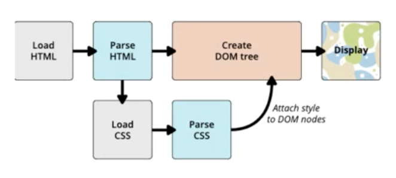
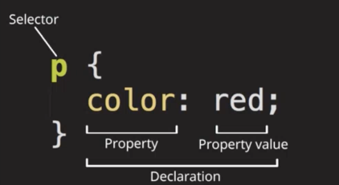
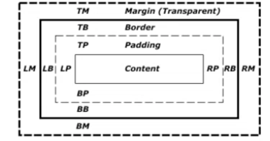
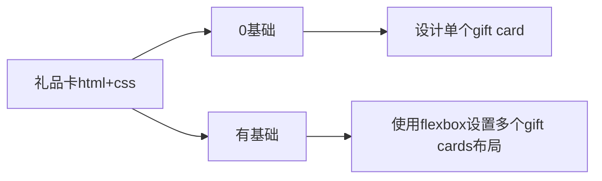

# Class Notes

## Table of Contents

- [Resources](#resources)
- [HTML & CSS Part 2](#html--css-part-2)
  - [CSS 介绍](#css介绍)
  - [CSS 工作原理](#css工作原理)
  - [CSS 如何加载的三种方法](#css如何加载的三种方法)
  - [一些快捷打法](#一些快捷打法)
  - [CSS 的优先级 (Specificity Calculator)](#css的优先级-specificity-calculator)
    - [CSS 的优先级顺序](#css的优先级顺序)
  - [CSS 语法](#css语法)
  - [CSS 选择器](#css选择器)
    - [标签选择器](#标签选择器)
    - [类选择器](#类选择器)
    - [ID 选择器](#id选择器)
    - [通配符选择器](#通配符选择器)
    - [+ 选择器](#-选择器)
    - [~ 选择器](#-选择器-1)
    - [> 选择器和后代选择器区别](#-选择器和后代选择器区别)
    - [p:last-child 和 p:last-of-type 的区别](#plast-child和plast-of-type的区别)
    - [p:only-child 和 p:only-of-type 的区别](#ponly-child和ponly-of-type的区别)
    - [not 选择器用法](#not选择器用法)
  - [CSS 字体属性](#css-字体属性)
    - [CSS 字体属性之复合属性](#css-字体属性之复合属性)
    - [CSS 文本外观之行间距](#css-文本外观之行间距)
  - [复合选择器](#复合选择器)
    - [复合选择器之子元素选择器](#复合选择器之子元素选择器)
    - [复合选择器之并集选择器](#复合选择器之并集选择器)
    - [复合选择器之链接伪类选择器](#复合选择器之链接伪类选择器)
    - [focus 伪类选择器](#focus-伪类选择器)
  - [元素显示模式转换](#元素显示模式转换)
  - [BEM 命名规范](#bem-命名规范-如何给选择器取名)
  - [Box Model](#box-model)
  - [color 命名](#color-命名)
  - [text 的属性](#text-的属性)
  - [font 的属性](#font-的属性)
    - [引用 Google Font 的两种方法](#引用-google-font-的两种方法)
  - [长度单位](#长度单位)
- [课后作业](#课后作业)
  - [制作 Gift Card](#制作-gift-card)
  - [完成 Background CSS Practice](#完成-background-css-practice)
  - [尝试写个人网站 Blog Page](#尝试写个人网站-blog-page)

## Resources

- [html&css 书写规范](https://github.com/australiaitgroup/html-css-guide)
- [css 选择器练习](https://flukeout.github.io/)
- [gift card practice resource](https://www.davidjones.com/home-and-food/dining/glassware)
- [background border practice](https://github.com/jessieyu1/intro-2-web-developmentV2/tree/main/practice/background-borders)

## HTML & CSS Part 2

### CSS 介绍

Cascading Style Sheets

- Tells a browser how to render a page.
- To style and layout web pages
- Extended with Sass/Less

**_CSS is a stylesheet language_**

### CSS 工作原理



> 在 parse css 时, 有 attributes 可以多样化 selector

### CSS 如何加载的三种方法

1. External CSS (最推荐)

   ```html
   <link rel="stylesheet" href="style.css" />
   ```

2. Internal CSS (其次)

   ```html
   <style>
     /* Your CSS here */
   </style>
   ```

3. Inline CSS (不推荐)

   > 为什么不推荐 inline css?
   >
   > - **_可复用性差: 无法像类选择器一样能在多个元素中共享, 造成代码冗余_**
   > - **_权重问题: inline css 的优先级很高, 仅次于!important, 这意味着你在维护项目时很难通过常规的 id/class 选择器做覆盖_**

### 一些快捷打法

- 注释： ctrl + /
- 多个 tag 快速打出： tag + '\*' + '你要的数量'
- 嵌套 tags 打法： tag + '>' + tag
- 平行 tag 打法： tag + '+' + tag
- tag 里面带内容： tag + '{你想要的内容}'

### CSS 的优先级 (Specificity Calculator)

两个相同的 selector 同时定义一个 property, 后面的会覆盖前面的。

> 执行顺序从上到下。
>
> 如果我们在开始定义一个**_优先度更高的_**selector, 后面**_优先级不高的_**selector 是不会覆盖前面的设置。
>
> 覆盖的意思是覆盖重复定义的 property; 不是说优先级高的会覆盖所有优先级低的。优先度低的内容如果在优先度高里面没有, 优先度低声明的这部分内容仍会生效。

#### CSS 的优先级顺序

- !Important > Inline style > ID > Class > Element > Universal
- Internal css > External css

### CSS 语法



**_更改 a 的颜色_**

```css
a {
  text-decoration: none;
  color: #ccc;
}
```

### CSS 选择器

- 标签选择器: 直接应用于 HTML 标签
- 类选择器：可在页面中多次使用（开发中使用最多）
- ID 选择器：在同一个页面只能使用一次

[练习网址](https://flukeout.github.io/)

**_可以对几个 selector 同时设置 css, 避免重复代码_**

```css
p,
.class_name,
#id_name {
  color: #000000;
}
```

#### 标签选择器

- 标签选择器 ，就是把标签名作为选择器
- 选择器的作用就是把需要的标签选出来

```css
p {
  color: green;
}
div {
  color: pink;
  font-size: 30px;
}
```

#### 类选择器

- 目标较多时，可选用 class 来调整特定目标的样式
- 同一个 class 可应用在一个或多个标签，开发最常用
- 注意 class 前面加'.'以选用这个 class

```css
.red {
  color: red;
}

.green {
  color: green;
}

.pink {
  color: pink;
}
```

```html
<ul>
  <li class="red">hello world red</li>
  <li class="red">hello world red</li>
  <li>hello world</li>
  <li class="green">hello world green</li>
  <li class="pink">hello world pink</li>
</ul>
<div class="red">hi world red</div>
```

- 一点小 tips：颜色的代码可在 google 搜'color picker'
- 快速 class 生成，快捷键：

```html
<!-- .box*3 -->
```

- 公共部分的 class 可以统一设置，特别需要的再另外增加 class 的细节

```css
.box {
  width: 100px;
  height: 100px;
  border: 1px solid #000;
}
.red {
  background-color: red;
}
.blue {
  background-color: blue;
}
```

```html
<div class="box red">red hello world</div>
<div class="box blue">blue hello world</div>
<div class="box red">red hello world</div>
```

#### ID 选择器

- 样式#定义, 结构 id 调用, 只能调用一次, 别人切勿使用
- id 优先级 > class, id 难以重用和拓展

```css
#green {
  color: green;
}
.green {
  color: lightgreen;
}
.red {
  color: red;
}
```

```html
<div id="green" class="red">coffee</div>
<div class="green">tea</div>
```

#### 通配符选择器

- 通配符：'\*' 能影响所有元素，但优先级很低，很容易被其他格式覆盖

```css
* {
  color: red;
}
li {
  color: blue;
}
.green {
  color: green;
}
```

````html
<div>hello</div>
<span class="green">world</span>
<ul>
  <li>hello world</li>
</ul>
`` ` #### + 选择器 两个子元素紧挨着, 有相同父级 ```css h1 + p { color: green;
/*修改h1后面p的字体颜色*/ }
````

#### ~ 选择器

匹配所有在 h1 后面的 p 元素, 不要求紧邻, 有相同父级

```css
h1 ~ p {
  color: green; /*修改h1后面所有的p字体颜色*/
}
```

#### > 选择器和后代选择器区别

|                div>p                |                  div p                  |
| :---------------------------------: | :-------------------------------------: |
| **p 必须是 div 的第一个直接子元素** | **匹配 div 中的所有子元素 p(可以跳跃)** |

#### p:last-child 和 p:last-of-type 的区别

|                        p:last-child                         |                p:last-of-type                 |
| :---------------------------------------------------------: | :-------------------------------------------: |
| **匹配任意父级元素最后一个子元素, 并且子元素必须是 p 标签** | **匹配任意父级元素最后一个类型为 p 的子元素** |

即使最后一个元素不是 p, 如果前面有 p 标签, last-of-type 仍能匹配到, 但 last-child 就不行

#### p:only-child 和 p:only-of-type 的区别

|                 p:only-child                 |                      p:only-of-type                      |
| :------------------------------------------: | :------------------------------------------------------: |
| **p 的父级必须只包含一个元素, 这个元素是 p** | **p 的父级只包含一个 p 元素, 但可以有其他非 p 的子元素** |

#### not 选择器用法

```css
p:not(.irrelevant) {
  font-weight: bold; /*将没有类名为irrelevant的p标签字体变粗*/
}

p > :not(strong, b.important) {
  color: green; /*将p的直接子元素中除了strong元素和有important类名的b元素字体颜色变绿*/
}
```

### CSS 字体属性

#### CSS 字体属性之复合属性

- font-style：字体样式
- font-weight：字体粗细
- font-size：字体大小
- font-family：字体

各种字体样式可以写成复合样式（合并在一行写，中间空格隔开）

```css
#text {
  font: bold 16px italic Arial;
}
```

```html
<div id="text">join our community of pet lovers</div>
```

#### CSS 文本外观之行间距

- 文字水平居中对齐, 加下划线，文字颜色

```css
.header {
  text-align: center;
  text-decoration: underline;
  color: rgb(255, 0, 255);
}
```

- 取消默认的下划线

```css
a {
  text-decoration: none;
}
```

- line height 包括上间距，下间距和文字本身高度

```css
p {
  line-height: 26px;
}
```

### 复合选择器

#### 复合选择器之子元素选择器

只对子元素第一层的元素应用样式，孙级的不管

```css
.nav > a {
  color: red;
}
```

```html
<div class="nav">
  <a href="">I'm the child</a>
  <p><a href="">I'm the grandchildren</a></p>
</div>
```

#### 复合选择器之并集选择器

```css
div,
.pig li {
  color: pink;
}
```

```html
<div class="pink">cat</div>
<p class="pink">dog</p>
<span>george</span>
<ul class="pig">
  <li>peppa pig</li>
  <li>mum</li>
  <li>dad</li>
</ul>
```

#### 复合选择器之链接伪类选择器

```css
a:link {
  color: brown;
  text-decoration: none;
}
a:visited {
  color: orange;
}
a:hover {
  color: skyblue;
}
a:active {
  color: green;
}
```

```html
<a href="#">peppa pig</a> <a href="http://www.xxxxxxxx.com">website</a>
```

#### focus 伪类选择器

```css
input:focus {
  background-color: lightblue;
  color: red;
}
```

```html
<input type="text" />
<input type="text" />
<input type="text" />
```

### 元素显示模式转换

```css
a {
  display: block;
  background-color: red;
  width: 150px;
  height: 50px;
}
div {
  display: inline;
  background-color: purple;
  width: 300px;
  height: 100px;
}
span {
  display: inline-block;
  width: 150px;
  height: 50px;
  background-color: blue;
}
```

```html
<a href="#">hello world</a>
<a href="#">hello world</a>
<div>hello world</div>
<div>hello world</div>
<span>hello world</span>
<span>hello world</span>
```

### BEM 命名规范 (如何给选择器取名)

BEM 会把每个 block 命名为 `B: block` > `E: Element` > `M: Modifier`

```html
<div class="card">
  <div class="card_img">
    
  </div>
  <div class="card_title">card title</div>
  <div class="card_description">card description</div>
  <div class="card_button">Read More</div>
</div>

<header class="header">
  
  <form class="header_search-from">
    <input class="header_search-from_input" type="input" />
    <button class="header_search-from_button" type="button"></button>
  </form>
  <div class="header_lang-switcher"></div>
</header>
```

- 不要使用元素命名, 命名要和功能有关
- 好处：可读性和可维护性好，避免命名冲突，可重用性+扩展

### Box Model

_网站上的元素都遵循 box model_



- Padding vs Border vs Margin

  - padding 是紧贴 content 的部分
  - border 是紧贴 padding 的部分
  - margin 是紧贴 border 的部分（两个相邻的 div, margin 在紧贴的 block 处会 overlap, 取最大值而不是相加）

- padding, border, margin 常见 declaration

  - padding: 10px 5px 20px 15px;
  - padding: 10px 30px;
  - border: 20px solid black;
  - border-width: 1px 1px 1px 1px;
  - border-style: solid;
  - border-color: black;
  - border-radius: 50%;
  - margin: 0 1rem;

### color 命名

不要使用 color 名，用 rgba 更精确。

### text 的属性

- text-align `对齐方式`
- text-transform `显示方式(大小写)`
- text-decoration `装饰效果`
- text-indent `缩进`

### font 的属性

- font-family `指定使用的字体 - 可以用逗号多写几个备用`
- font-size `字体大小`
- font-style `字体样式`

#### 引用 Google Font 的两种方法

1. 导入 external css

   ```html
   <head>
     <link rel="stylesheet" href="//fonts.googleapis.com/css?family=Roboto" />
   </head>
   ```

2. 在 css 文档的顶部使用@import

   ```css
   @import url("//fonts.googleapis.com/css2?family=Roboto&display=swap");
   p {
     font-family: "Roboto", sans-serif;
   }
   ```

### 长度单位

相对单位: em/rem/%/vw/vh

- em 的 font-size 基于父元素的 font-size, width/height/padding/margin 的大小基于自身的 font-size
- rem 基于 html 元素的 font-size, 与父级 font-size 无关
- % 基于父级的大小决定
- vw/vh 的取值和视图 width/height 有关

绝对单位: px

- **不**随 screen 宽度/高度, 变化而变化

## 课后作业

### 制作 Gift Card

<https://www.davidjones.com/home-and-food/dining/glassware>



### 完成 Background CSS Practice

<https://github.com/jessieyu1/intro-2-web-developmentV2/tree/main/practice/background-borders>

### 尝试写个人网站 Blog Page
