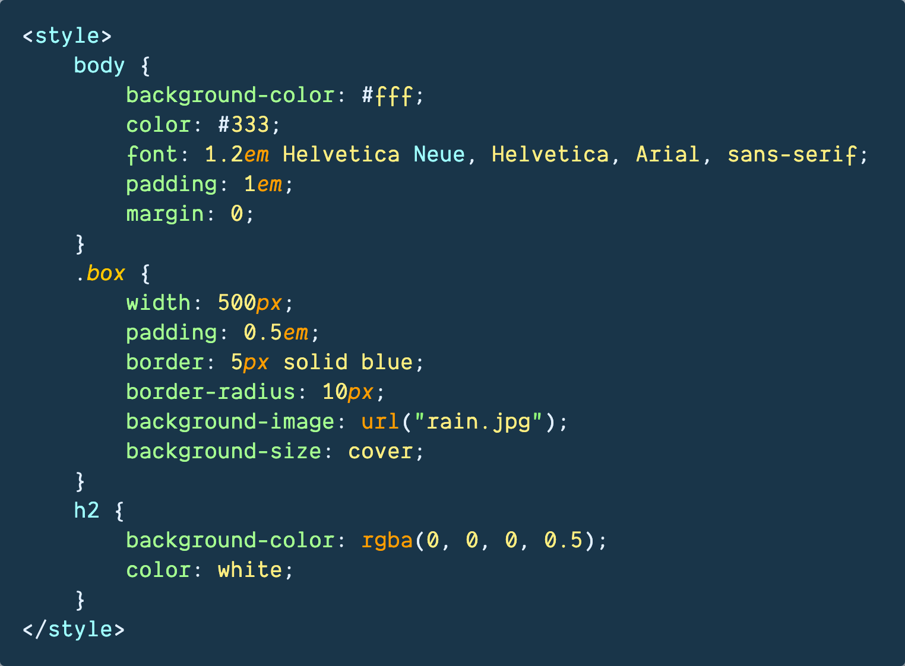
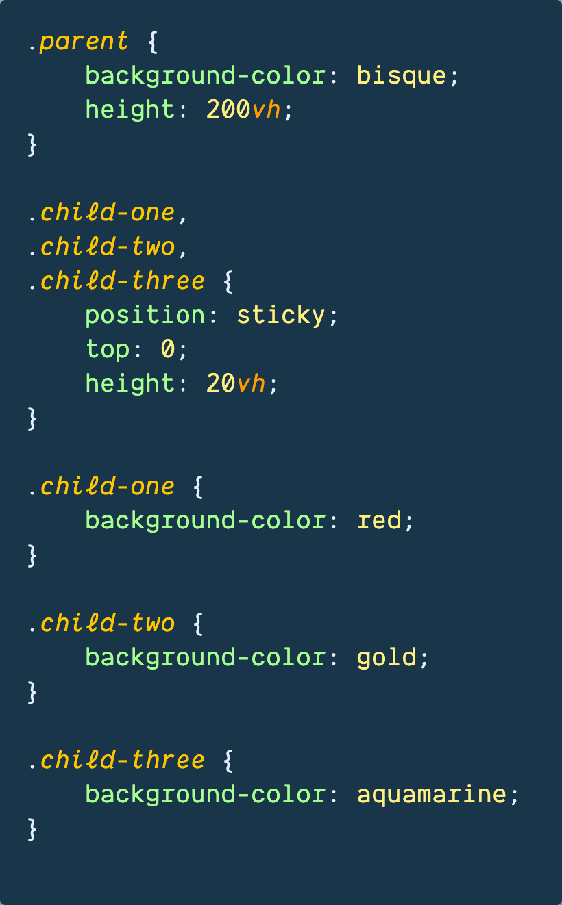
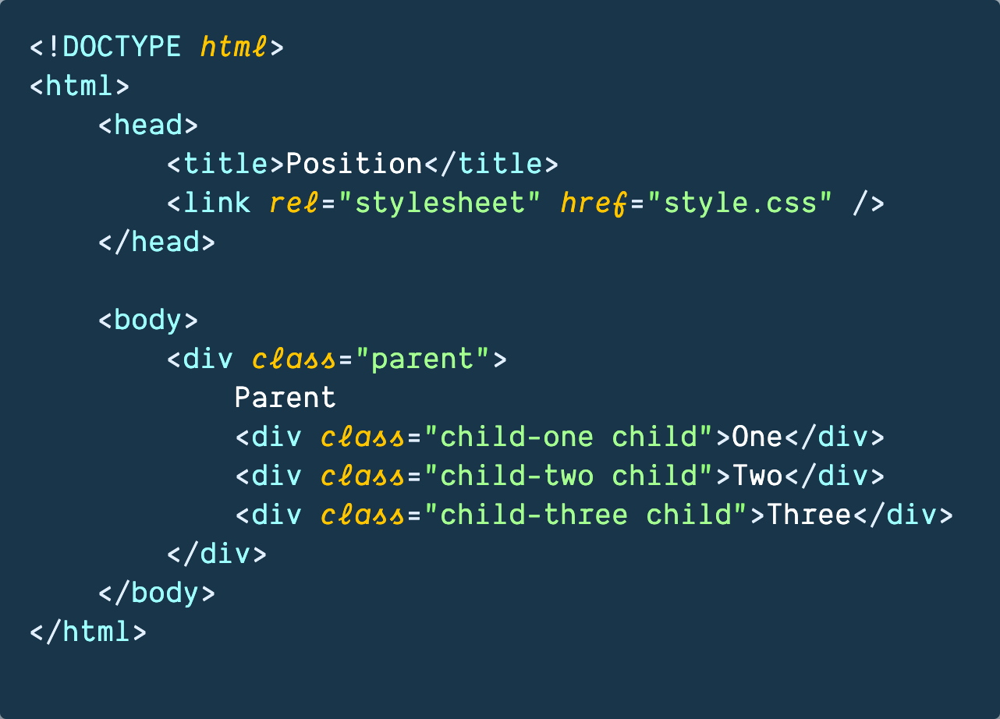
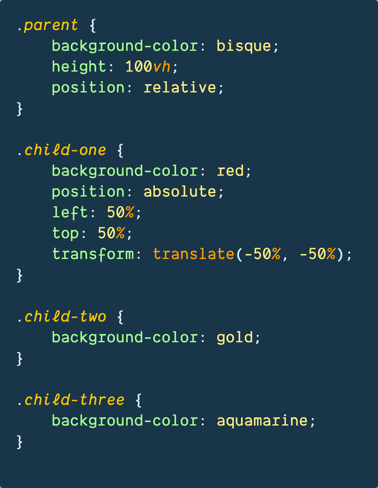
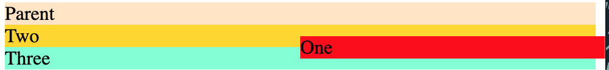
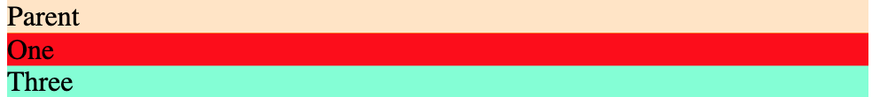
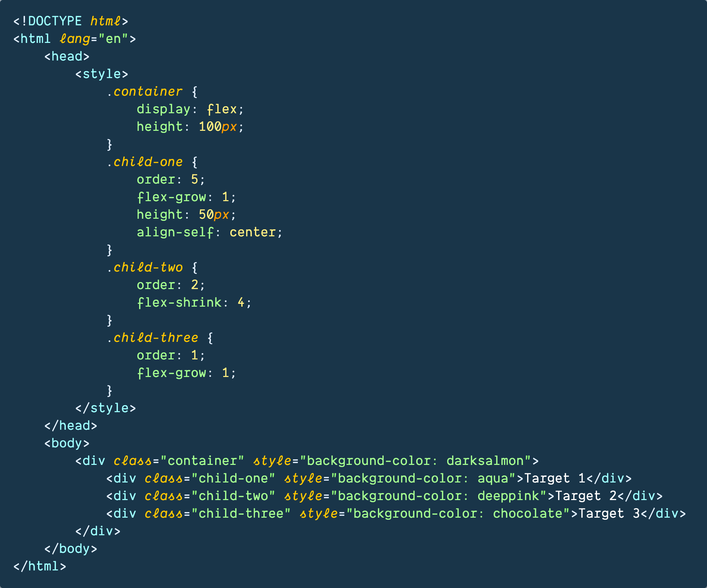

# Class Notes

## Table of Contents

- [Resources](#resources)
- [HTML & CSS Part 3](#html--css-part-3)
  - [上节课知识点复习](#上节课知识点复习)
  - [Pseudo Class Selector](#pseudo-class-selector)
    - [常见的 Pseudo Class Selector](#常见的-pseudo-class-selector)
  - [上节课作业 background and borders](#上节课作业-background-and-borders)
    - [background-size 和 object-fit](#background-size-和-object-fit)
  - [Position](#position)
    - [Position 课上代码练习](#position-课上代码练习)
    - [Position 课上代码总结](#position-课上代码总结)
  - [Flexbox 布局参考资料](#flexbox-布局参考资料)
  - [Grid 布局练习网址](#grid-布局练习网址)
  - [Responsive Design](#responsive-design)
- [作业](#作业)
  - [完成 position 练习](#完成-position-练习)
  - [Flexbox CSS 练习](#flexbox-css-练习)

## Resources

- [w3schools](https://www.w3schools.com/css/css_pseudo_classes.asp)
- [css tricks](https://css-tricks.com/snippets/css/a-guide-to-flexbox/)
- [css garden - grid](https://cssgridgarden.com/)
- [position practice](https://github.com/jessieyu1/intro-2-web-developmentV2/tree/main/practice/position/practice1)
- [blog practice](https://github.com/jessieyu1/intro-2-web-developmentV2/blob/main/PROTFOLIO/html/blog.html)
- [personal website example](https://v3.brittanychiang.com/)

## HTML & CSS Part 3

### 上节课知识点复习

1. **什么是 Box Model**

   > **_Box model is used to define how elements are rendered in a webpage. It consists of four parts: content, padding, border, and margin._**

   - Content: 多为文本或图片, 尺寸用 **width** and **height** 定义
   - Padding: content 和 border 中间的部分, 尺寸用 **padding** 定义 (_一般定义 padding 时不用负数_)
   - Border: 环绕在 padding 和 content 外, 尺寸、样式和颜色用 **border** 定义
   - Margin: 不同元素间的距离, 尺寸用 **margin** 定义 (_很多 HTML 元素有默认的 margin_)

2. **CSS Specificity**

   > !important > inline > id > class > element<br>
   > inline style > internal style

3. **CSS Basic Selector**

   > id -> #<br>
   > class -> .<br>
   > universal -> \*<br>

4. **Grid vs Flexbox**

   > Grid: 二维布局, 适合网格状布局<br>
   > Flexbox: 一维布局, 适合响应式布局

5. **CSS rule**

   > 不推荐 override css rules. 做 debugging 时, 优先 search 下 "!important".

6. **Color format in CSS**

   > rgb, hsl, hex

### Pseudo Class Selector

_语法_ -> `选择器:伪类`

> 用来实现元素的不同状态和行为,

- 鼠标点击的特效
- 鼠标悬停的特效
- 已访问过的链接的特效

#### 常见的 Pseudo Class Selector

| 伪类选择器 |       用途       |
| :--------: | :--------------: |
|   :hover   |     悬停状态     |
|  :active   |     点击状态     |
|   :focus   |     聚焦状态     |
|  :visited  | 已访问的链接状态 |


### 上节课作业 background and borders



#### background 类应用

**background-color 背景颜色**

```css
div {
  width: 200px;
  height: 200px;
  background-color: transparent;
}
.box {
  width: 200px;
  height: 200px;
  background-color: blue;
}
```

**background-image 背景图片**

```css
div {
  width: 300px;
  height: 300px;
  background-image: url(images/logo.png);
}
```

**background-repeat 背景图片平铺**

```css
/* 页面元素既可以添加背景颜色也可以添加背景图片 只不过背景图片会压住背景颜色 */
div {
  width: 300px;
  height: 300px;
  background-color: yellow;
  background-image: url(images/logo.png);
  /* background-repeat: no-repeat; */
  /* 沿着 x 轴平铺 */
  /* background-repeat: repeat-x; */
  /* 沿着 y 轴平铺 */
  background-repeat: repeat-y;
}
```

**background-position 背景位置-方位名词**

```css
/* 水平方向 left center right */
/* 垂直 top center bottom */
/* 默认顺序是水平，垂直。但两个值前后顺序无关，left top, top left 效果一样。 */
/* 如果只指定了一个方位名称，另一个省略，省略那个默认居中对齐 */
/* background-position: 方位名词; */
/* background-position: center top; */
/* background-position: right center; */
/* 如果是方位名词 right center 和 center right 效果是等价的 跟顺序没有关系 */
/* background-position: center right; */
/* 此时 水平一定是靠右侧对齐 第二个参数省略 y 轴是 垂直居中显示的 */
/* background-position: right; */
/* 此时 第一个参数一定是 top y 轴 顶部对齐 第二个参数省略 x 轴是 水平居中显示的 */
```

**background-position-case 背景位置方位名词应用一**

```css
h3 {
  width: 120px;
  height: 40px;
  line-height: 40px;
  font-size: 14px;
  font-weight: 700;
  background-image: url(images/icon.png);
  background-repeat: no-repeat;
  background-position: left center;
  /* 方位名称可以颠倒 */
  background-color: yellow;
  text-indent: 1.5rem;
}
```

**background-position 背景位置-精确单位**

```css
/* 20px 50px; x 轴一定是 20 y 轴一定是 50 */
div {
  width: 300px;
  height: 300px;
  background-color: lightblue;
  background-image: url(images/logo.png);
  background-repeat: no-repeat;
  background-position: 20px;
  /* 省略的第二个参数默认 y 轴居中 */
}
```

**background-position 背景位置-混合单位**

```css
/* 注意 x y 顺序，如果指定一个，那一定是 x */
/* 方位名词和像素单位可以混用 */
/* 20px center 顺序一定是 x y */
div {
  width: 300px;
  height: 300px;
  background-color: pink;
  background-image: url(images/logo.png);
  background-repeat: no-repeat;
  /* background-position: 20px center */
  /* 垂直是 20px，水平是居中 */
  background-position: center 20px;
}
```

**background-attachment 超大背景图片**

```css
/* 参考 https://codesandbox.io/s/mscnq */
/* background-attachment 默认值是 scroll */
body {
  background-image: url(images/bg.jpg);
  background-repeat: no-repeat;
  background-position: center top;
  color: #fff;
  font-size: 20px;
  background-attachment: fixed;
}
```

**background-shorthand 背景属性复合写法**

```css
body {
  /* 普通写法 */
  background-image: url(images/bg.jpg);
  background-repeat: no-repeat;
  background-position: center top;
  background-attachment: fixed;
  background-color: black;
  /* 复合写法 */
  background: black url(images/bg.jpg) no-repeat center top;
  color: #fff;
  font-size: 20px;
}
```

#### background-size 和 object-fit

**background-size 属性: 调整背景图片**

- `auto`: 默认值, 背景按原大小显示
- `contain`: 保留原有比例, 缩放至图片自身能完全显示出来, 但可能有空白区域
- `cover`: 保留原有比例, 铺满整个容器的宽高，而图片多出的部分则会被截掉 (类似放大镜效果)

**object-fit 属性: 用于控制可替换元素如何适应容器, 一般对象是 img/video 元素, 非常适合在响应式布局里做控制**

- `fill`: 不保证保持原有

的比例，内容拉伸填充整个内容容器

- `contain`: 保持原有尺寸比例, 内容被缩放
- `cover`: 保持原有尺寸比例, 但部分内容可能被剪切
- `none`: 被替换的内容将保持其原有的尺寸
- `scale-down`: 选 none 和 contain 尺寸小的显示
- `inherit`: 继承父级的 object-fit 属性

### Position

**Position 常用的 Property**

- `static`: 元素按照默认布局进行定位 (不脱离文档流)，不受 top、right、bottom、left 和 z-index 属性的影响

- `relative`: 元素按照默认布局进行定位 (不脱离文档流), 通过设置 top、right、bottom、left 属性，可以相对于元素在文档流中的位置进行偏移

- `absolute`: absolute 一般找最近的非 static 父级元素定位(父级大多用 relative, 子级用 absolute). 如果所有的父级都没有定义 position/所有父级是 static, 子元素会相对于浏览器窗口定位 (和 fixed 很像)

- `fixed`: fixed 元素相对于浏览器窗口进行定位 (可以理解成它的 parent 就是 viewpoint)

- `sticky`: 位置上是 relative (定义 top 等定位属性时不能超过父元素边界, 否则无效), 滚动到边界时切换成 fixed (用于导航栏, 广告悬浮). 父级不需要是非 static 的 position<br>
  **_sticky 生效的条件_**

1. 父级保留默认 overflow: visible
2. 父级有确定的高度
3. 为 sticky 的子元素设置 top 属性
4. 父元素没有 transform

<p align='center'></p>

https://github.com/ESJiang/JR16-notes/assets/43910771/b7cf21cb-920c-44c1-ba95-0b51070e4b35

#### Position 课上代码练习

<div style="display:flex; justify-content: space-between">
    
    
</div>

#### Position 课上代码总结

对于块级元素 div, 在没指定 width 和 height 时，会尽量让 width:100%/占满父级元素的宽度. 但是 height 取决于内容

一旦给块级元素 position 设置为 absolute, 明显的改变是 width 不会强制占满父级, width 取决于内容

如上图所示, 当父元素为 relative 并且子元素是 absolute. 使用 left:50%, top:50%, transform: translate(-50%, -50%), child 1 可以居中. 但是为什么推荐多写 transform: translate(-50%, -50%)呢?

> 使用 "left:50%; top:50%" 只适用于宽高确定的情况, 原理是将子元素的左上角和父元素的中心重合. 但是这种方法无法将子元素自身的中心位置和父元素的中心位置重合. translate(-50%, -50%) 会根据子元素自身宽高, 进行平移.

<div style="display: flex">
    <figure>
        
        <figcaption>未使用 transform</figcaption>
    </figure>
    <figure>
        
        <figcaption>使用 transform</figcaption>
    </figure>
</div>

### Flexbox 布局参考资料

<https://css-tricks.com/snippets/css/a-guide-to-flexbox/>

<p align='center'></p>

**box-model 盒子模型之边框**

```css
div {
  width: 300px;
  height: 200px;
  background-color: pink;
  border-width: 5px; /* 边框粗细 */
  border-style: solid; /* 边框样式 */
  border-color: blue; /* 边框颜色 */
}
```

**box-model-shorthand 盒子模型之复合写法**

```css
.box {
  width: 300px;
  height: 200px;
  /* border: 5px dashed red; */
  border-radius: 10px;
  border-top: 5px solid purple;
  border-bottom: 5px dotted purple;
}
.circle {
  width: 200px;
  height: 200px;
  background-color: burlywood;
  border-radius: 50%; /* 超过50%以后就会变成一个圆 */
}
```

**边框对盒子大小的影响**

- 边框会影响盒子的实际大小

```css
/* 我们需要一个 200*200 的盒子, 但是这个盒子有 10 像素的红色边框 */
.box {
  width: 180px;
  height: 180px;
  border: 10px dotted red;
}
/* 此时盒子的大小仍然是 200*200，但是边框占据了其中一部分的大小 */
```

**盒子模型之内边距 1**

```css
/* 注意此时盒子实际总大小会加上上下左右的 padding 边距而变大 */
div {
  width: 200px;
  height: 200px;
  background-color: pink;
  padding-top: 20px;
  padding-left: 10px;
}
```

**盒子模型之内边距 2**

```css
div {
  width: 200px;
  height: 200px;
  background-color: pink;
  /* 标准设定 padding 形式 */
  padding-left: 5px;
  padding-top: 5px;
  padding-bottom: 5px;
  padding-right: 5px;
  /* 复合设定 padding 形式 */
  padding: 5px; /* 上下左右 */
  padding: 5px 10px; /* 上下 左右 */
  padding: 5px 10px 20px; /* 上 左右 下 */
  padding: 5px 10px 20px 30px; /* 顺时针方向 */
}
```

**盒子模型之外边距 margin**

```css
/* padding 作用：调整盒子边距 */
/* margin 作用：盒子的外边距 */
.box {
  width: 200px;
  height: 200px;
  background-color: lightblue;
}
/* .box-one {
      margin-bottom: 20px;
  } */
.box-two {
  /* margin-top: 20px; */
  /* margin: 30px; 四周都设边距 */
  /* margin: 30px 50px; 上下 左右 */
}
```

**块级盒子水平居中对齐**

```css
/* 外边距可以让块级盒子水平居中，两个条件
  1.必须指定宽度
  2.左右的外边距都设置为 auto */
/* 行内和行内块元素，父级用 text-align:center 居中文字 */
.header {
  width: 800px;
  height: 200px;
  background-color: lightblue;
  margin: 20px auto;
  text-align: center;
}
.box {
  width: 200px;
  height: 200px;
  border: 5px solid #000;
  padding: 10px;
  box-sizing: border-box;
  /* 限定 box 大小 */
}
```

### Grid 布局练习网址

https://cssgridgarden.com

### Responsive Design: 在多个设备上, 获得更好的视觉体验

- Display: none (删元素)
- Flexbox-direction (改摆列方式)

```css
@media only screen and (min-width: 600px) {
  /* write your preferred declarations */
}
```

_注意: 后面的 @media 范围不能包含前面 @media 的范围, 因为这样做前面 @media 的设置会失效_

**`clamp([min], [calculated], [max])`: 在最小值和最大值时浮动(一般控制 font-size, margin, etc)**

> 好处是不需要写多个 @media 控制了, 节省代码量，维持元素间的相对关系

```css
/* 例: */
font-size: clamp(1.5rem, 2.5vw, 4rem);
/* 2.5vw 代表视窗宽度的 2.5% */
```

**`calc()`: 可以用来自动调整大小以适应其父级容器的大小**

```css
/* 可以在:root中定义变量, 直接使用var()调用 */
:root {
  --first-color: #16f;
  --second-color: #ff7;
}

#firstParagraph {
  background-color: var(--first-color);
  color: var(--second-color);
}
```

**单行文字垂直居中**

```css
p {
  width: 200px;
  height: 200px;
  line-height: 60px;
  text-align: center; /* 垂直居中关键 */
}
```

**inline-element-center 行内元素/行内块元素水平居中对齐**

```css
.header {
  width: 900px;
  height: 200px;
  background-color: lightblue;
  text-align: center;
  /* 行内元素或者行内块元素水平居中给其父元素添加 text-align:center 即可 */
}
```

**box-shadow**

```css
div {
  width: 200px;
  height: 200px;
  background-color: red;
}
div:hover {
  box-shadow: 10px 10px 10px 20px rgba(0, 0, 0, 0.5);
  /* x 轴    Y 轴   阴影大小  阴影半径 */
}
```

**伪类 before**

可以在 box 上、下分别加入不同格式的边框

```css
h1 {
  text-align: center;
}
h1::before {
  /* 上边框 */
  content: "";
  display: block;
  background-color: #19b5fe;
  width: 100%;
  height: 10px;
}
h1::after {
  /* 下边框 */
  content: "";
  display: block;
  background-color: #19b5fe;
  width: 100%;
  height: 20px;
}
```

## 作业

### 完成 position 练习

<https://github.com/jessieyu1/intro-2-web-developmentV2/tree/main/practice/position/practice1>

### Flexbox CSS 练习

<https://github.com/jessieyu1/intro-2-web-developmentV2/blob/main/PROTFOLIO/html/blog.html>

### 练习网站 50 个 JavaScript 项目

https://github.com/bradtraversy/50projects50days
