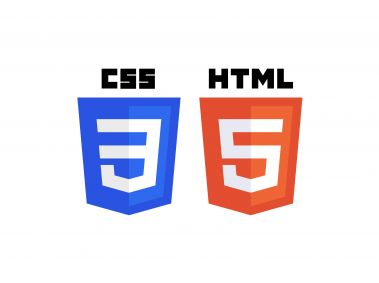

# Class Notes

## Table of Contents

- [HTML & CSS Tutorial](#html--css-tutorial)
  - [CSS 基本选择器](#css-基本选择器)
  - [Text 属性](#text-属性)
  - [引入 CSS 的三种方式](#引入-css-的三种方式)
  - [单位](#单位)
  - [元素模式](#元素模式)
  - [常用背景属性](#常用背景属性)
  - [样式冲突的优先级](#样式冲突的优先级)
  - [文字样式会继承父标签属性](#文字样式会继承父标签属性)
  - [块级元素居中](#块级元素居中)
  - [练习](#练习)

<p align='center'></p>

---

## HTML & CSS Tutorial

### CSS 基本选择器

- **ID 选择器**: 只适用于指定的 element
- **Class 类选择器**: 可以复用，可以给所有有同样样式需求的 element 加属性
- **Tag 标签类选择器**: 会对全局产生影响，谨慎使用，一般设定一些全局样式或者搭配别的选择器使用

```css
#id {
  font-size: 14px;
}
.class {
  font-size: 14px;
}
tag {
  font-size: 14px;
}
```

```html
<p class="content" id="content-p">content</p>
```

- **优先级排序**: inline-style(少用) > ID > Class > Tag
- **其他的选择器**:

```css
* {
  /* all 正则选择器 */
}
p::after {
  /* 在 p 标签 content 之后插入内容 */
  content: "after";
}
p::before {
  /* 在 p 标签 content 之前插入内容 */
  content: "before";
}
div:nth-child(2n + 1) {
  /* n: 第 n 个 child，2n：所有双数 child，2n+1：所有单数 child */
}
div:nth-last-child(n) {
  /* 选择倒数第 n 个 */
}
[href="..."] {
  /* attribute */
}
p,
span {
  /* 多标签同时应用 */
}
.class1 .class2 {
  /* 选中包含 class1 里面的 class2（children class2） */
}
div > p {
  /* 选择 div（父）标签下所有 p 标签（child） */
}
div + p {
  /* div 后第一个 p */
}
div ~ p {
  /* div 之后所有 p */
}
:hover {
  /* 将鼠标指针悬停在匹配该选择器的元素上时 */
}
:active {
  /* 被用户激活时的状态:通常是在用户按下并持有鼠标按钮时触发的，直到释放为止 */
}
:focus {
  /* 用于匹配当前获得键盘输入焦点的元素 */
}
:disabled {
  /* 用于匹配表单元素在其处于禁用状态时的样式 */
}
```

### Text 属性

- `font-family`: 字体样式
- `font-size`: 字体大小
- `color`: 字体颜色
- `text-align`: 对齐方式
- `line-height`: 行高
- `text-decoration`: 文本内容修饰（下划线、上划线、删除线等）

### 引入 CSS 的三种方式

- **inline-style**

```html
<h1 style="color:red">content</h1>
```

- **内部样式**

```html
<head>
  <style>
    h1 {
      color: red;
    }
  </style>
</head>
```

- **外部样式**

```html
<head>
  <link href="/style.css" rel="stylesheet" type="text/css" />
</head>
```

### 单位

- **block 的宽高，字体单位**

```css
px, rem（推荐使用，有浏览器解析优势）, em, vw, vh, %
```

- **颜色单位**

```css
rgb, rgba, #xxxxxx
```

### 元素模式

- **块级元素**

```css
block: div;
```

- **行内元素**

```css
inline: span, a, img;
```

- **行内块元素**

```css
inline-block: img;
```

### 常用背景属性

- `background`: 背景
- `background-color`: 背景颜色
- `background-img`: 背景图片

```css
background-img: url("path");
```

- `background-position`: 设置背景图像在一个元素中的位置
- `background-repeat`: 控制背景图像在容器内的重复方式

### 样式冲突的优先级

- **优先级排序**: inline-style(少用) > ID > Class > Tag > pseudo > 选择符
- `!important` 第一优先级，尽量避免使用

### 文字样式会继承父标签属性

### 块级元素居中

- **parent div**: width 已知, child div

```html
<style>
  .class1 {
    position: relative;
    width: 200px;
    height: 200px;
    background-color: antiquewhite;
    /* 方法1：运用 padding 组合 */
    /* padding-top: 50px; */
  }
  .class2 {
    position: absolute;
    width: 100px;
    height: 100px;
    /* 方法2：运用绝对定位的 absolute 的属性调整 box 位置 */
    /* top: 50px; */
    /* left: 50px; */
    bottom: 50px;
    right: 50px;
    background-color: brown;
    /* margin: auto; */
  }
</style>
```

### 练习

- **居中登录框**

```html
任务要求： 创建一个登录页面，其中包含一个居中的登录框。
登录框有一个半透明的背景，内有用户名和密码输入字段、登录按钮。 请使用 CSS
居中技巧，同时实现背景属性的设置。
```

- **导航栏布局 任务要求**

```html
创建一个水平导航栏，其中包含几个导航链接。
导航栏应具有固定高度和底边框，导航链接之间应均匀分布。 使用 CSS
来设置导航栏样式，并确保文字垂直居中。
```

- **display 例子**: [CSS Tricks Flexbox Guide](https://css-tricks.com/snippets/css/a-guide-to-flexbox/)

- **练习代码**

```html
<!DOCTYPE html>
<html lang="en">
  <head>
    <meta charset="UTF-8" />
    <meta name="viewport" content="width=device-width, initial-scale=1.0" />
    <title>Login</title>
    <style>
      .Login {
        width: 100vw;
        height: 100vh;
        /* 弹性布局 */
        display: flex;
        justify-content: center;
        align-items: center;
      }
      .Login-box {
        width: 500px;
        height: 500px;
        border-radius: 50px;
        display: flex;
        /* 按行竖直排列 */
        flex-direction: column;
        align-items: center;
        background-color: rgba(255, 155, 155, 0.7);
      }
      .Login-box > h1 {
        font-size: 36px;
        margin: 50px 0;
        color: white;
      }
      .Login-box > input {
        margin-bottom: 20px;
        width: 400px;
        height: 40px;
        /* 设置弧度 */
        border-radius: 10px;
        border: none;
        outline: none;
        font-size: 18px;
        padding-left: 10px;
      }
      .Login-box > button {
        margin-top: 50px;
        width: 140px;
        height: 45px;
        font-size: 20px;
        border-radius: 10px;
        border: none;
        background-color: rgb(247, 234, 218);
      }
    </style>
  </head>
  <body>
    <div class="Login">
      <div class="Login-box">
        <h1>Login</h1>
        <input type="text" placeholder="User Name" />
        <input type="password" placeholder="Password" />
        <button type="submit">Login</button>
      </div>
    </div>
  </body>
</html>
```
