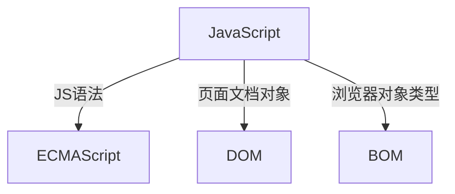

# Class Notes

## Table of Contents

- [Resources](#resources)
- [JavaScript_1](#javascript_1-18072023)
  - [汇编语言和高级语言](#汇编语言和高级语言)
  - [编程语言和标记语言](#编程语言和标记语言)
  - [编程语言](#编程语言)
  - [JS 的用途](#js的用途)
  - [JS 的组成](#js的组成)
  - [JavaScript 简介](#JavaScript简介)
    - [是什么](#是什么)
    - [作用](#作用)
  - [HTML 与 CSS 以及 JS 的关系](#HTML与CSS以及JS的关系)
  - [vscode 添加注释快捷键](#vscode添加注释快捷键)
  - [js 的 3 种写法](#js的3种写法)
  - [alert/console/prompt](#alertconsoleprompt)
  - [变量命名规范](#变量命名规范)
    - [变量声明](#变量声明)
  - [简单的数据类型](#简单的数据类型)
  - [交换两个变量的值](#交换两个变量的值)
  - [字符串](#字符串)
    - [转换字符串](#转换字符串)
  - [boolean 和数字](#boolean和数字)
  - [检测数据类型](#检测数据类型)
  - [打印数据结果(使用逗号分隔 string 和变量名)](#打印数据结果使用逗号分隔string和变量名)
  - [转化成数字型](#转化成数字型)
    - [浮点数计算](#浮点数计算)
  - [前自增/后自增](#前自增后自增)
- [作业](#作业)
- [运算符](#运算符)
  - [算数运算符](#算数运算符)
  - [比较运算符](#比较运算符)
  - [逻辑运算符](#逻辑运算符)
  - [实战练习](#实战练习)
    - [导入方式](#导入方式)
    - [注释](#注释)
    - [常用输出语句](#常用输出语句)
    - [声明变量](#声明变量)
    - [声明的用法](#声明的用法)
    - [变量用法](#变量用法)
    - [变量命名注意事项](#变量命名注意事项)
    - [变量值交换方法](#变量值交换方法)
    - [数字型](#数字型)
    - [String](#String)
    - [小练习 1](#小练习1)
    - [Boolean 布尔判断类型](#Boolean布尔判断类型)
    - [数据类型转换](#数据类型转换)
    - [小练习 2](#小练习2)
    - [一些运算符](#一些运算符)

## Resources

- [CSS Transition](https://www.w3schools.com/css/css3_transitions.asp)
- [CSS Transform](https://www.w3schools.com/css/css3_2dtransforms.asp)
- [Flexbox Practice Code](https://github.com/jessieyu1/intro-2-web-developmentV2/blob/main/PROTFOLIO/html/blog.html)
- [Dribbble](https://dribbble.com/shots)
- [Beautiful Buttons](https://getcssscan.com/css-buttons-examples)
- [Color Palettes](https://coolors.co/palettes/trending)
- [minhpham.design](https://minhpham.design/)

## JavaScript_1

<p align='center'></p>

### 汇编语言和高级语言

|                   汇编语言                   |                     高级语言                     |
| :------------------------------------------: | :----------------------------------------------: |
| 对硬件操作, 使用机器码和符号来表示指令和数据 | 通过编译器或解释器转换为机器码才能在计算机上运行 |

### 编程语言和标记语言

|     编程语言      |             标记语言             |
| :---------------: | :------------------------------: |
| if/else/for/while | 被动读取, 不直接向计算机发出指令 |

### 编程语言

- 编程：让计算机为解决某个问题而使用的某种程序设计语言编写程序代码
- 计算机程序：一系列计算机执行的指令集合
- 计算机定义：任何能够执行代码的设备
- 编程语言分类：汇编语言和高级语言

### JS 的用途

- 密码强度检测
- 网页特效
- 服务端开发
- 桌面开发
- 桌面程序
- App 开发
- 控制硬件

### JS 的组成



### JavaScript 简介

#### 是什么

- 世界上最流行之一，是一种运行在客户端的脚本语言
- 脚本语言：不需要编译，运行过程中由 JS 解释器（JS 引擎）逐行来进行解释并执行
- 现在也可以基于 Node.js 技术进行服务器端编程

#### 作用

- 表单动态校验（密码强度检测）
- 网页特效
- 服务端开发（Node.js）
- 桌面程序（Electron）
- APP（Cordova）
- 控制硬件-物联网（Ruff）
- 游戏开发（cocos2d-js）

### HTML 与 CSS 以及 JS 的关系

<p align='center'></p>

- HTML/CSS 标记语言--描述类语言

```html
<!-- HTML 决定网页结构和内容（决定看到什么），相当于人的身体 -->
<!-- CSS 决定网页呈现给用户的模样（决定好不好看），相当于给人穿衣服、化妆 -->
```

- JS 脚本语言--编程类语言

```html
<!-- 实现业务逻辑和页面控制（决定功能），相当于人的各种动作 -->
```

### vscode 添加注释快捷键

`ctrl/command + /`

### js 的 3 种写法

1. 行内

```html
<input type="button" value="click me" onclick="alert('Hello World');" />
```

2. 内嵌

```html
<script>
  alert("Hello World");
</script>
```

3. 外部

```html
<script src="my.js"></script>
```

### alert/console/prompt

| alert |   console    |         prompt         |
| :---: | :----------: | :--------------------: |
| 弹窗  | 在控制台看到 | prompt 返回的是 string |

### 变量命名规范

- 字母、数字、下划线、美元符号组成
- 严格区分大小写
- 不能以数字开头
- 不能是关键字、保留字
- 变量名必须有意义
- 遵守驼峰命名法：首字母小写，后面单词的首字母大写

#### 变量声明

```js
var name; // undefined
var name = 'Jack';
var name = 'James';

let name; // undefined
let name = 'Jack';
let name = 'James'; // error

const name; // error
const name = 'Jack';
const name = 'James'; // error
```

### 交换两个变量的值

```js
let apple1 = 1;
let apple2 = 2;
let temp = apple1;
apple1 = apple2;
apple2 = temp;
```

### 简单的数据类型

- Number: 数字型，包含整数型和浮点型值

```html
<!-- JavaScript 数字类型既可以用来保存整数值，也可以保存小数（浮点数） -->
<!-- isNaN()：用来判断一个变量是否为非数字的类型，返回 true 或者 false -->
```

- Boolean: 布尔值类型，如 true、false，等价于 1 和 0
- String: 字符串类型

```html
<!-- 可以是引号中的任意文本，分双引号 "" 和单引号 '' -->
<!-- length：表字符串长度 -->
<!-- 字符串 + 任何类型 = 拼接之后的新字符串，因为 HTML 标签里面的属性使用的是双引号，JS 这里我们推荐使用单引号 -->
```

- Undefined: 声明了变量但是没给值
- Null: 声明了变量为空值

### 字符串

- `字符串长度: str.length`
- 字符串 + 任何类型 = 字符串

#### 转换字符串

- `toString()` 常用
- `String()` 强制转换
- 加号拼接 隐式转换

```js
let name = prompt("please enter your age: ");
console.log("Your age is " + name + " years old");
```

### boolean 和数字

```js
true + 1; // 2
false + 1; // 1
```

### 检测数据类型

```js
let num = 10;
console.log(typeof num); // number

let a = null;
console.log(typeof a); // object
```

### 打印数据结果（使用逗号分隔 string 和变量名）

```js
let num = 10;
console.log("num", num);
```

### 转化成数字型

- `parseInt(str)`
- `parseFloat(str)`
- `Number(str)`
- 隐式转换

```js
console.log(parseInt("3.14")); // 3
console.log(parseInt("120px")); // 120
console.log(parseInt("rem120px")); // NaN
console.log(parseFloat("3.14")); // 3.14
console.log(parseFloat("120px")); // 120
console.log(parseFloat("rem120px")); // NaN

// 不要用 + ，这样会隐式转化成 string
console.log("12" - 0); // 12
console.log("123" - "120"); // 3
console.log("123" * 1); // 123
console.log("123" / 1); // 123
```

#### 浮点数计算

```js
let num = 0.1 + 0.2; // 0.30000000000000004
console.log(num.toFixed(1)); // 0.3
```

### 前自增/后自增

```js
let num = 1;
console.log(num++); // 1

let age = 18;
console.log(++age); // 19
```

## 作业

课件上的三个练习

## 运算符

### 算数运算符

```js
console.log(1 + 1); // 2
console.log(1 - 1); // 0
console.log(1 * 1); // 1
console.log(1 / 1); // 1
// % 取余 取模
console.log(4 % 2); // 0
console.log(5 % 3); // 2
console.log(3 % 5); // 2

// 浮点数 算数运算里会有问题
console.log(0.1 + 0.2); // 0.30000000000000004
console.log(0.07 * 100); // 7.000000000000001
let num = 0.1 + 0.2;
console.log(num == 0.3); // false
let sum = num.toFixed(1);
console.log(sum); // 0.3
```

### 比较运算符

```js
// 1. 程序里面的等于符号是 == ，默认转换数据类型，会把字符串型的数据转换为数字型，只要求值相等就可以
console.log(3 >= 5); // false
console.log(2 <= 45); // true
console.log(3 == 5); // false
console.log("hello" == "world"); // false
console.log(18 == 18); // true
console.log(18 == "18"); // true（隐式转换）
console.log(18 != 18); // false
// 2. 程序里面有全等，全等要求两侧的值和数据类型完全一致
console.log(18 === 18); // true
console.log(18 === "18"); // false
```

### 逻辑运算符

```js
// 1. 逻辑与 && (and)：两侧都为 true 结果才是 true，只要有一侧为 false 结果就为 false
console.log(3 > 5 && 3 > 2); // false
console.log(3 < 5 && 3 > 2); // true
// 2. 逻辑或 || (or)：两侧都为 false 结果才是 false，只要有一侧为 true 结果就是 true
console.log(3 > 5 || 3 > 2); // true
console.log(3 > 5 || 3 < 2); // false
// 3. 逻辑非 (not) ！
console.log(!true); // false
console.log(!false); // true
```

### 前缀增量

```js
// 前缀增量-prefix increment
// 1. 想要一个变量自己加 1   num = num + 1 比较麻烦
let num = 1;
// num = num + 1;
// num = num + 1;
++num;
++num;
console.log("num", num); // 3
let age = 10;
++age; // 11
let p = 20;
// 先加 1 ，再返回值
console.log(++p + 10); // 31
```

### 后缀增量

```js
// 后缀增量-postfix increment
// 1. 前置自增和后置自增如果单独使用，效果是一样的
// 2. 后置自增口诀：先返回原值，后自加 1
let num = 10;
num++;
console.log(num); // 11
let age = 30;
// 先返回值，后加 1
console.log(age++ + 10); // 40
```

## 实战练习

### 导入方式

1. 行内式的 JS 直接写到元素的内部

```html
<input type="button" value="enter" onclick="alert('hello world')" />
<!-- 可以将单行或少量 JS 代码写在 HTML 标签的事件属性中（以 on 开头的属性），如：onclick
注意单双引号的使用：HTML 中推荐使用双引号 "", JS 中推荐使用单引号 ''
可读性差，在 HTML 中编写大量 JS 代码时，不方便阅读
引号易错，引号多层嵌套匹配时，容易混淆
宜特殊情况下使用 -->
```

2. 内嵌式的 JS

```html
<script>
  prompt("Please enter your name");
</script>
<!-- 可以将多行 JS 代码写到 <script> 标签中
内嵌 JS 是学习时常用的方式 -->
```

3. 外部 JS

```html
<script src="/index.js"></script>
<!-- 利于 HTML 页面代码结构优化，把大段的 JS 代码独立到 HTML 页面之外，方便文件级别复用
引用外部 JS 文件的 <script> 标签中间不可以写代码
适合于 JS 代码量比较大的情况 -->
```

### 注释

- 单行注释 `ctrl + /`
- 多行注释 默认的快捷键：`shift + alt + a`
- 多行注释 vscode 中修改多行注释的快捷键：`ctrl + shift + /`

### 常用输出语句

- prompt 这是一个输入框

```js
prompt("Please enter your age");
```

- alert 弹出警示框 输出的 展示给用户的

```js
alert("hello world");
```

- console 控制台输出 给程序员测试用的

```js
console.log("testing ");
```

### 声明变量

```js
// 1. 声明了一个 age 的变量
var age; // undefined
// 2. 赋值  把值存入这个变量中
age = 18;
// 3. 输出结果
console.log("age", age);
// 4. 变量的初始化
// 可以复合写法如下
var userName = "Ben";
console.log("userName", userName);
```

### 声明的用法

```js
// let const var（几种方式，都可以声明变量）
// var 最老，缺陷较多，不推荐用
// 目前用的 let 和 const 比较多
// 1. 更新变量（可以重新 reset 定义的 value）
var userName = "Chris";
console.log("userName", userName);
userName = "Ben";
console.log("userName", userName);
// 2. 声明多个变量，只有 var 可重复声明（不会报错）
// 不推荐重复声明
var age = 18;
var age = 20;
console.log("age", age);
// 3. 声明变量的特殊情况
// 3.1 只声明不赋值，结果是？程序也不知道里面存的是啥，所以结果是 undefined 未定义的
var gender; // undefined
console.log(gender);
// 3.2 不声明不赋值直接使用某个变量会报错
console.log(phone); // 报错
// 3.3 不声明直接赋值使用（JS 为单线程，有一处报错后就不会运行之后的代码）
num = 110;
console.log(num);
```

### 变量用法

```js
// 1. 用户在弹出框输入姓名，存储到一个 userName 的变量里面
var userName = prompt("Please enter your name");
// 2. 输出这个用户名
alert(userName);
```

### 变量值交换方法

```js
// 实现这个要求的思路 先怎么做后怎么做
// 1. 我们需要一个临时变量帮我们
// 2. 把 apple1 给我们的临时变量 temp
// 3. 把 apple2 里面的值给 apple1
// 4. 把临时变量里面的值给 apple2
let apple1 = "green apple";
let apple2 = "red apple";
let temp = apple1; // green apple
apple1 = apple2; // red apple
apple2 = temp;
console.log("apple1", apple1); // red apple
console.log("apple2", apple2); // green apple
```

### 数字型

#### 基本使用方法

```js
let num = 10;
let pi = 3.14;
console.log(num, pi); // 可同时一起 console，中间用 ‘，’隔开
```

#### isNaN() 方法

```js
// isNaN() 这个方法用来判断非数字，并且返回一个值，如果是数字返回的是 false，如果不是数字返回的是 true
console.log(isNaN(12)); // false
let result = isNaN("Hello");
console.log(result); // true
```

### String

#### 基本用法

```js
let str = "Hello I am a string";
console.log(str);
```

#### 字符串拼接

```js
// 1. 检测获取字符串的长度 length
let str1 = "my name is Andy";
console.log(str1.length); // 14
// 2. 字符串的拼接 + 只要有字符串和其他类型相拼接，最终的结果是字符串类型
console.log("hello" + " " + "world"); // hello world
console.log("hello" + 20); // hello20
console.log("hello" + true); // hellotrue
console.log(12 + 12); // 24
console.log("12" + 12); // 1212
```

### 小练习 1

```js
// 弹出一个输入框（prompt)，让用户输入年龄（用户输入）
// 把用户输入的值用变量保存起来,把刚才输入的年龄与所要输出的字符串拼接（程序内部处理）
// 使用 alert 语句弹出警示框（输出结果） Your age is 20 years old
let age = prompt("Please enter your age");
alert("Your age is " + age + " years old");
```

### Boolean 布尔判断类型

#### 基本用法

```js
let flag = true;
console.log(flag); // true
console.log(flag + 1); // 2
let flag1 = false;
console.log(flag1 + 1); // 1
```

#### 查看基础数据类型

```js
let num = 10;
console.log(typeof num); // number
let str = "hello";
console.log(typeof str); // string
let flag = true;
console.log(typeof flag); // boolean
let value = undefined;
console.log(typeof value); // undefined
let value2 = null;
console.log(typeof value2); // object
let age = prompt("Please enter your age");
console.log("age", age, typeof age); // string
```

### 数据类型转换

#### 转换成 string

```js
// 1. 把数字型转换为字符串型 变量.toString()
let num = 10;
let str = num.toString();
console.log(str, typeof str); // 10 string
// 2. 我们利用 String(变量)
console.log("num", typeof String(num)); // num string
// 3. 利用 + 拼接字符串的方法实现转换效果 隐式转换（最推荐）
let str2 = num + "";
console.log(num + str2); // 1010
```

#### 转换成 number

```js
// parseInt() 返回整数
console.log(parseInt("3.14")); // 3
console.log(parseInt("120px")); // 120
console.log(parseInt("rem120px")); // NaN

// parseFloat() 返回小数
console.log(parseFloat("3.14")); // 3.14
console.log(parseFloat("120px")); // 120
console.log(parseFloat("rem120px")); // NaN

// Number()
let str = "123";
let num = Number(str);
console.log(num, typeof num); // 123 number

// 隐式转换 - * /（+ 会变成 string）
console.log("12" - 1); // 11
console.log("123" - "120"); // 3
let value = "123" * 1;
console.log(typeof value); // number
console.log(typeof ("123" / 1)); // number
```

### 小练习 2

```js
// 弹出一个输入框（prompt)，让用户输入出生年份 （用户输入）
// 把用户输入的值用变量保存起来，然后用今年的年份减去变量值

，结果就是现在的年龄（程序内部处理）
// 弹出警示框（alert），把计算的结果输出（输出结果）
let birthYear = prompt("Please enter your birth year");
let age = 2023 - birthYear; // 方法 1
let age = 2023 - parseInt(birthYear); // 方法 2
alert(age);
```

### 转换成布尔值类型

```js
console.log(Boolean("")); // false
console.log(Boolean(0)); // false
console.log(Boolean(NaN)); // false
console.log(Boolean("123")); // true
console.log(Boolean("hello")); // true
console.log(Boolean(null)); // false
console.log(Boolean(undefined)); // false

let arr = []; // length 0
if (arr.length > 0) {
  console.log("length > 0");
} else {
  console.log("length = 0");
}
```

## 作业

- 课件上的三个练习
