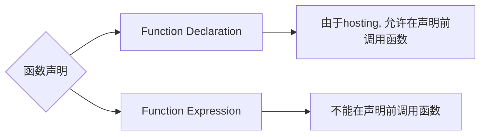
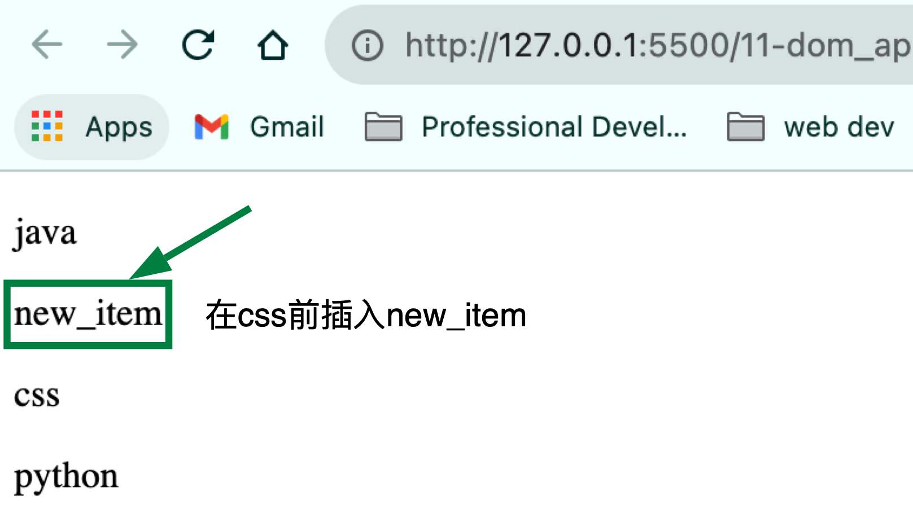

# Class Notes

## Table of Contents

- [Class Notes](#class-notes)
  - [Resources](#resources)
  - [JavaScript_3](#javascript_3)
    - [函数](#函数)
    - [函数的使用](#函数的使用)
      - [函数声明的不同方法](#函数声明的不同方法)
        - [Function Declaration](#function-declaration)
        - [Function Expression](#function-expression)
      - [求和函数](#求和函数)
    - [函数的参数](#函数的参数)
      - [形参和实参](#形参和实参)
      - [形参和实参个数不匹配](#形参和实参个数不匹配)
    - [return 关键字](#return-关键字)
      - [return 的注意事项](#return-的注意事项)
      - [return demo](#return-demo)
      - [得到两个数中最大值](#得到两个数中最大值)
      - [求数组的最大值](#求数组的最大值)
      - [不写 return 关键字的后果](#不写-return-关键字的后果)
    - [作用域](#作用域)
      - [ES6 之前](#es6-之前)
      - [ES6 之后 (使用 let/const 提升安全性)](#es6-之后-使用-letconst-提升安全性)
      - [闭包 (Lexical scope)](#闭包-lexical-scope)
    - [Object 练习](#object-练习)
    - [Math 方法](#math-方法)
      - [max 方法](#max-方法)
      - [abs 方法](#abs-方法)
      - [floor/ceil/round 方法](#floorceilround-方法)
      - [random 方法](#random-方法)
        - [用 random 方法得到两个数之间的随机整数](#用-random-方法得到两个数之间的随机整数)
        - [用 random 方法随机得到数组的任一元素(随机点名)](#用-random-方法随机得到数组的任一元素随机点名)
    - [String 方法](#string-方法)
      - [charAt 方法](#charat-方法)
      - [concat 方法](#concat-方法)
      - [substr 方法](#substr-方法)
      - [replace 方法](#replace-方法)
      - [split 方法](#split-方法)
    - [格式化输出 date](#格式化输出-date)
    - [DOM 方法](#dom-方法)
      - [08-dom_method.html 练习](#08-dom_methodhtml-练习)
      - [11-dom_appendChild.html 练习](#11-dom_appendchildhtml-练习)
        - [appendchild 添加新元素只能是 last-child, 怎样在指定位置插入新元素?](#appendchild-添加新元素只能是-last-child-怎样在指定位置插入新元素)
      - [12-dom_style.html 练习](#12-dom_stylehtml-练习)
      - [13-dom_eventListener.html 练习](#13-dom_eventlistenerhtml-练习)

## JavaScript_3

### 函数

> for 循环语句能实现简单的重复操作，但有局限性，另一个方法是定义函数。
> 函数是封装了一段可重复调用执行的代码块，通过调用函数可以实现大量的代码复用。

### 函数的使用

- 函数使用时分为两步：声明函数和调用函数

```js
funciton 函数名() { // 使用Function Declaration声明函数
    // 函数体代码
}
函数名() // 调用函数
```

> function 关键字必须小写, 函数名用动词
> function 的{}不能省略 (即使执行语句只有一句)

#### 函数声明的不同方法



##### Function Declaration

```js
getValue(); // correct
function getValue() {
  console.log("hello world");
}
```

##### Function Expression

```js
isFormValidated(); // error
let isFormValidated = function () {
  console.log(true);
};
```

#### 求和函数

```js
function getSum(start, end) {
  let sum = 0;
  for (let i = start; i <= end; i++) sum += i;
  console.log(sum);
}
getSum(1, 100); //5050
```

### 函数的参数

> _参数: 函数内部的值不固定, 根据传入参数决定_

#### 形参和实参

`形参: 不用声明的变量`<br>
`实参: 实际传输的参数`

#### 形参和实参个数不匹配

| 实参个数=形参 |         实参个数>形参个数          |     实参个数<形参个数      |
| :-----------: | :--------------------------------: | :------------------------: |
|  **_正常_**   | **_只取到形参的个数, 多余的忽略_** | **_多的形参是 undefined_** |

```js
function getSum(num1, num2) {
  console.log(num1 + num2);
}
getSum(3, 5); //8, 3+5=8
getSum(1, 2, 3); //3 1+2=3
getSum(1); //NaN 1+undefined=NaN
```

### return 关键字

`让函数返回值, 可以用变量保存`

#### return demo

```js
// 比起直接console.log, return更常用
function getResult() {
  return "hello";
}
const res = getResult();
```

```js
// 1.函数是做某件事或者实现某种功能
// 2. 函数的返回值格式
// function 函数名() {
//     return 需要返回的结果;
// }
// 函数名();
// (1) 我们函数只是实现某种功能，最终的结果需要返回给函数的调用者函数名() 通过return 实现的
// (2) 只要函数遇到return 就把后面的结果 返回给函数的调用者  函数名() = return后面的结果
// 3. 代码验证
function getResult() {
  return "hello";
  //这里如果不放return或者没有具体返回的结果就会输出undefined
}
let res = getResult();
console.log(res);
//4. 求任意两个数的和
function getSum(num1, num2) {
  return num1 + num2;
}
let result = getSum(2, 5);
console.log("result", result);
```

#### return 的注意事项

> _在使用 return 语句时, return 后的语句不会执行_<br> > _在 return 语句中，逗号被用来分隔不同的表达式，但是只会返回最后一个表达式的值 return num1, num2 => 只返回 num2_

```js
// 函数返回值注意事项
// 1. return 终止函数
function getSum(a, b) {
  return a + b;
  alert("hello world");
  //return 后面的代码不会执行
}
let res = getSum(2, 4);
console.log(res);
// 2. return 只能返回一个值
function fun(num1, num2) {
  return num1, num2;
  //此时只能返回最后一个值
}
console.log(fun(4, 6));
// 3.  我们求任意两个数的 加减乘数结果

// 4. 我们的函数如果有return 则返回的是 return 后面的值，如果函数么有 return 则返回undefined
function fun1() {
  return "hi";
}
console.log(fun1()); //此时return 'hi'
function fun2() {
  "hello world";
}
console.log(fun2()); //undefined因为没有return
function fun3(number) {
  if (number > 100) {
    return;
  }
}
console.log(fun3()); //还是undefined
```

#### 得到两个数中最大值

```js
// 方法1: Ternary Operator
function getMax(num1, num2) {
  return num1 > num2 ? num1 : num2;
}
console.log(getMax(7, 6)); //7

// 方法2: if-else statements
function getMax2(num1, num2) {
  if (num1 > num2) return num1;
  else return num2;
}
console.log(getMax2(7, 6)); //7
```

#### 求数组的最大值

```js
// 方法1: Ternary Operator
let arr = [5, 2, 99, 101, 67, 77];

function getArrayMax(arr) {
  let max = arr[0];
  for (let i = 1; i < arr.length; i++) max = arr[i] > max ? arr[i] : max;
  return max;
}
console.log(getArrayMax(arr)); // 101

// 方法2: if-else statements
function getArrayMax2(arr) {
  let max = arr[0];
  for (let i = 1; i < arr.length; i++) if (arr[i] > max) max = arr[i];
  return max;
}
console.log(getArrayMax2(arr));
```

#### 不写 return 关键字的后果

```js
function getStr() {
  "hello";
}
console.log(getStr()); // undefined
```

### 作用域

> ES6 之前: 全局作用域+局部作用域(函数作用域)
> ES6 后: 块级作用域 (let/const)

_obj 本身不构成作用域_

#### ES6 之前

```js
// 全局作用域 (污染全局的命名空间)
var num = 10;
var num = 30;
console.log(num); // 30

if (true) var a = 1;

console.log("a", a); // a 1

for (var i = 0; i < 10; i++) {}
console.log("i", i);

// 变量提升
console.log(foo); // undefined
var foo = 2;

// 内层变量被外层修改
var tmp = new Date();
function fn() {
  console.log(tmp);
  if (false) var tmp = "hello world";
}
fn(); // undefined (拿不到外部的tmp)

// 局部作用域
function fn() {
  var num1 = 20;
  console.log("num1", num1);
}
console.log("num1", num1); // error
```

#### ES6 之后 (使用 let/const 提升安全性)

```js
console.log(a); // error
let a = 1;
```

```js
let tmp = new Date();
function fn() {
  console.log(tmp);
  if (false) tmp = "hello world";
}
fn(); //正常输出date
```

#### 闭包 (Lexical scope)

```js
// 闭包: 先找自身方法内部有没有这个变量, 再找父级function有没有, 最后找全局变量 -> 这种机制可以保护被调用的方法内部定义的变量不会被外部修改 (私有化)
const scope = "global scope";
function checkscope() {
  const scope = "checkscope() scope";
  return () => {
    const scope = "f() scope";
    return scope;
  };
}
console.log(checkscope()()); // f() scope
```

### Object 练习

```js
const info = {
  name: "Ben",
  age: 20,
  gender: "male",
  comments: "hello",
};
// 方法一: Template Strings
console.log(`The user's name is ${info.name}`);
// 方法二: '+' operator
console.log("The user's name is " + info.name);

const puppy = {
  name: "coco",
  type: "alaska",
  age: 5,
  desex: false,
  color: "brown",
  skills: "bark",
};
// 方法一: Template Strings
console.log(
  `${puppy.name} is a ${puppy.age} years old dog who likes ${puppy.skills}`
);
// 方法二: '+' operator
console.log(
  puppy.name + " is a " + puppy.age + " years old dog who likes " + puppy.skills
);
```

### Math 方法

#### max 方法

```js
console.log(Math.max(1, 99, 3)); // 99
console.log(Math.max(-1, -10)); // -1
console.log(Math.max(1, 99, "Hi")); // NaN
console.log(Math.max()); // -Infinity
```

#### abs 方法

```js
console.log(Math.abs(1)); // 1
console.log(Math.abs(-1)); // 1
console.log(Math.abs("-1")); // 1
console.log(Math.abs("hello")); // NaN
```

#### floor/ceil/round 方法

```js
console.log(Math.floor(1.1)); // 1
console.log(Math.floor(3.9)); // 3
console.log(Math.ceil(1.2)); // 2
console.log(Math.ceil(1.9)); // 2
console.log(Math.round(1.2)); // 1
console.log(Math.round(1.9)); // 2
```

#### random 方法

```js
console.log(Math.random()); // 0~1随机数
```

##### 用 random 方法得到两个数之间的随机整数

```js
const random = Math.floor(Math.random() * (max - min + 1)) + min;
```

##### 用 random 方法随机得到数组的任一元素(随机点名)

```js
let arr = ["Jane", "Ben", "Chris", "John", "Andrew", "Amy"];
function getRandom(min, max) {
  return Math.floor(Math.random() * (max - min + 1)) + min;
}
const index = getRandom(0, 5);
console.log(arr[index]);
console.log(arr[Math.floor(Math.random() * arr.length)]);
```

### String 方法

#### charAt 方法

```js
// charAt(index) 根据位置返回字符
var str = "andy";
console.log(str.charAt(3)); // y
// 遍历所有的字符
for (let i = 0; i < str.length; i++) console.log(str[i]);
```

#### concat 方法

```js
// concat将多个字符串连接(不改变原array)
var str = "andy";
console.log(str.concat(" ", "hi")); // "andy hi"
```

#### substr 方法

```js
// 2. substr(不改变原array)
var str1 = "abcdefghijk";
console.log(str1.substr(2, 2)); // "cd"
```

#### replace 方法

```js
// replace替换
var str1 = "abcoefoxyozzopp";
console.log(str1.replace("a", "b")); // bbcoefoxyozzopp

// 全部替换
// 方法一 - replace方法
var str2 = "abcoefoxyozzopp";
const newString = str2.replace(/o/g, "*");
console.log(newString); // abc*ef*xy*zz*pp

// 方法2 - while循环
while (str2.indexOf("o") !== -1) str2 = str2.replace("o", "*");
console.log(str2); // abc*ef*xy*zz*pp
```

#### split 方法

```js
var str3 = "red, pink, blue";
console.log(str3.split(",")); // [ 'red', ' pink', ' blue' ]
```

### 格式化输出 date

```js
const arr = [
  "Sunday",
  "Monday",
  "Tuesday",
  "Wednesday",
  "Thursday",
  "Friday",
  "Saturday",
];

function addZero(num) {
  return num < 10 ? "0" + num : num;
}
let date = new Date();
let year = date.getFullYear();
let month = date.getMonth() + 1;
month = addZero(month);
let dates = date.getDate();
dates = addZero(dates);
let day = date.getDay();
console.log(year + "-" + month + "-" + dates + " " + arr[day]);
```

### DOM 方法

#### DOM 方法 1

```html
<body>
  <!-- Finding HTML elements by id
Finding HTML elements by tag name
Finding HTML elements by class name
Finding HTML elements by CSS selectors -->

  <body>
    <h1 id="title"></h1>
    <div class="skill">html</div>
    <div>css</div>
    <p class="intro">Hello World!</p>
    <p class="intro"><b>querySelectorAll</b> method.</p>
    <p id="demo"></p>
    <script>
      const title = document.getElementById("title");
      title.innerHTML = "Heading";
      const skill = document.getElementsByClassName("skill");
      skill[0].style.color = "red";
      let elements = document.getElementsByClassName("intro");
      let demoEle = document.getElementById("demo");
      demoEle.innerHTML = elements[0].textContent;
    </script>
  </body>
</body>
```

#### DOM 方法 2

```html
<body>
  
  <p>First Name: <input name="fname" type="text" value="Michael" /></p>
  <p>First Name: <input name="fname" type="text" value="Doug" /></p>

  <p>The tag name of the first element with the name "fname" is:</p>

  <p id="demo"></p>
  <!-- change bg1.png to bg2.png, copy the value of first input to demo-->
  <script>
    document.getElementById("myImage").src = "images/bg2.png"; //修改图片地址
    let demoEle = document.getElementById("demo");
    let inputEle = document.getElementsByName("fname")[0];
    demoEle.innerHTML = inputEle.value; //将第一个名字添加到demo里
  </script>
</body>
```

#### DOM_queryselector

```html
<body>
  <p>hello world1</p>
  <p>hello world2</p>
  <div class="p_hello">hello world3</div>
  <!-- change first p tag background color to red -->
  <!-- set font size 30px for all p tags -->
  <script>
    document.querySelector("p").style.backgroundColor = "red";
    const pList = document.querySelectorAll("p");
    for (let i = 0; i < pList.length; i++) {
      pList[i].style.fontSize = "30px";
    }
  </script>
</body>
```

#### DOM_appendChild

```html
<body>
  <p id="p"></p>
  <div id="list">
    <p id="java">java</p>
    <p id="css">css</p>
    <p id="python">python</p>
  </div>
  <!-- add 'js' to the end of the list -->
  <script>
    p.innerHTML = "js";
    const parent = document.getElementById("list");
    parent.appendChild(p);
  </script>
</body>
```

#### DOM_style

```html
<body>
  <!--set style for id 'p-id': ff0000, 20px, padding top 20px, hello world -->
  <p id="p-id"></p>
  <script>
    const element = document.getElementById("p-id");
    element.innerHTML = "hello world";
    element.style.color = "#ff0000";
    element.style.fontSize = "20px";
    element.style.paddingTop = "20px";
  </script>
</body>
```

#### DOM_eventlistener

```html
//给myBtn添加一个点击事件，内容是调用现在的时间
<body>
  <h2>JavaScript addEventListener()</h2>

  <p>
    This example uses the addEventListener() method to attach a click event to a
    button.
  </p>

  <button id="myBtn">Try it</button>

  <p id="demo"></p>
  <script>
    document.getElementById("myBtn").addEventListener("click", displayDate);
    function displayDate() {
      document.getElementById("demo").innerHTML = Date();
    }
  </script>
</body>
```

#### 08-dom_method.html 练习

```js
const title = document.getElementById("title");
title.innerHTML = "Hello World";
const skills = document.getElementByclassName("skill");
skills[0].style.color = "red";
const intros = document.getElementByclassName("intro");
document.getElementById("demo").innerHTML = intros[0].textContent;
```

#### 11-dom_appendChild.html 练习

```js
p.innerHTML = "js";
const parent = document.getElementById("list");
parent.appendChild(p);
```

添加新元素只能是 last-child, 怎样在指定位置插入新元素?

```js
const newElement = document.createElement("p");
newElement.textContent = "new_item";
document
  .getElementById("list")
  .insertBefore(newElement, document.getElementById("css"));
```

```html
<p align="center">
  
</p>
```

#### 12-dom_style.html 练习

```js
const element =

document.getElementById("p-id"); element.style.cssText = "color: #ff0000;
font-size: 20px; padding-top: 20px;"; element.innerHTML = "hello world";
```

#### 13-dom_eventListener.html 练习

```js
document
  .getElementById("myBtn")

  .addEventListener(
    "click",
    () => (document.getElementById("demo").innerHTML = Date())
  );
```
