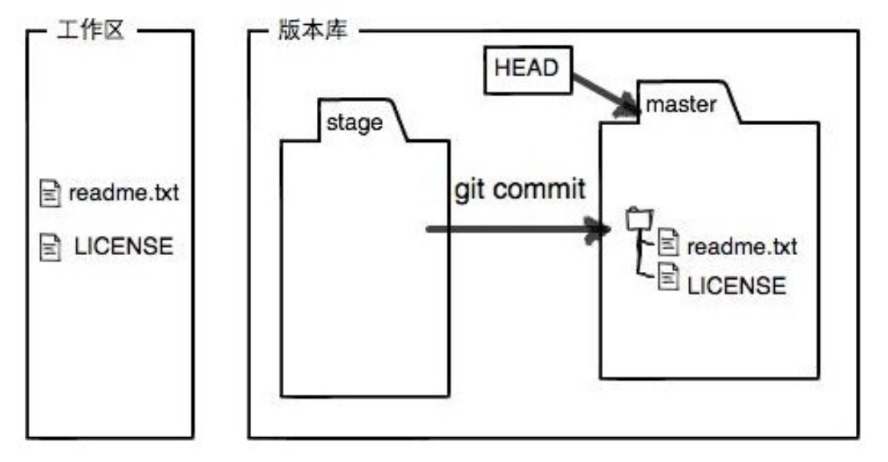
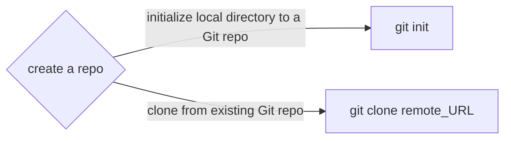
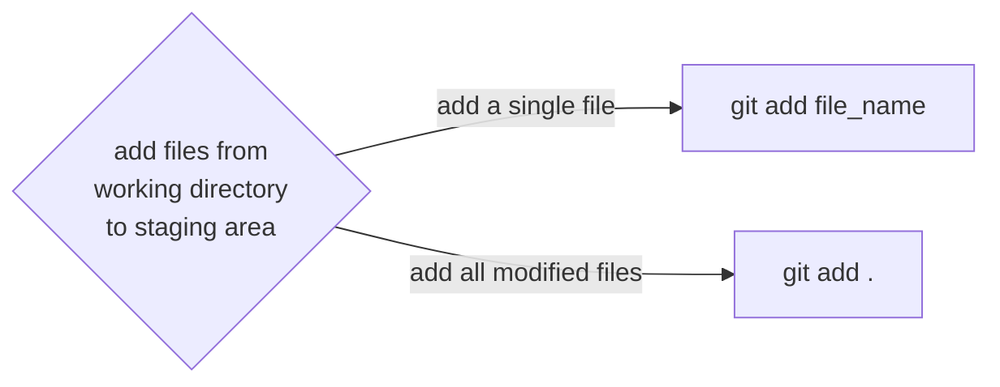
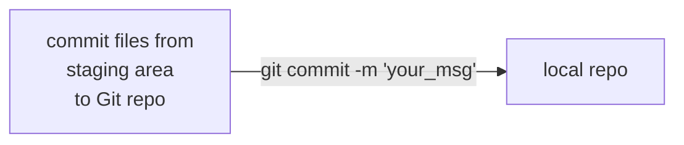
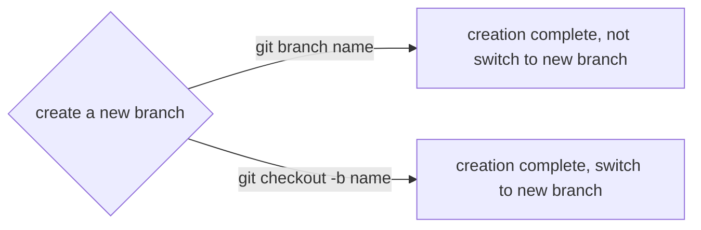
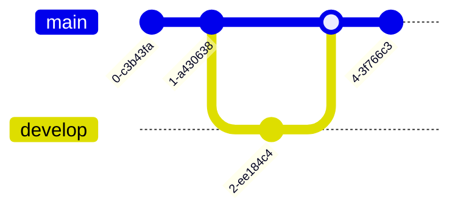
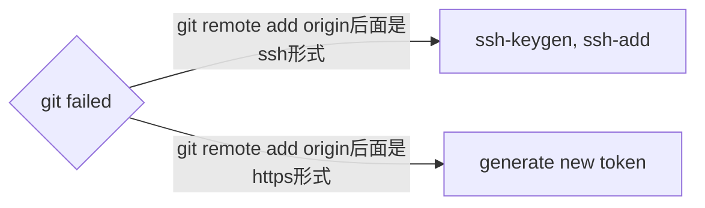

# Class Notes

## Table of Contents

- [Class Notes](#class-notes)
  - [Resources](#resources)
  - [Git](#git)
    - [为什么要使用 Git?](#为什么要使用-git)
    - [如何设置 Git](#如何设置-git)
    - [Git 的工作原理](#git-的工作原理)
      - [Git 的三个分区](#git-的三个分区)
      - [Git 工作原理流程图](#git-工作原理流程图)
      - [注意事项](#注意事项)
    - [Git 常用指令](#git-常用指令)
    - [GIT 提交过程详解](#git-提交过程详解)
      - [创建仓库(repository)](#创建仓库-repository)
      - [将修改加到暂存区](#将修改加到暂存区)
      - [将暂存区内容提交到本地仓库](#将暂存区内容提交到本地仓库)
      - [将本地仓库的内容提交到远程仓库](#将本地仓库的内容提交到远程仓库)
    - [创建新分支 (一般基于 master 创建新分支, 内容和 master 一样)](#创建新分支-一般基于-master-创建新分支-内容和-master-一样)
    - [不同分支 commit \& merge 流程图举例](#不同分支-commit--merge-流程图举例)
    - [Git 可视化工具](#git-可视化工具)
    - [Git clone/pull/push 失败](#git-clonepullpush-失败)
      - [Git clone 配置 http 连接详解](#git-clone-配置-http-连接详解)
      - [Git clone 配置 ssh 详解](#git-clone-配置-ssh-详解)

## Resources

[Git 指南](./git.pdf)<br>
[Error: Permission denied (publickey)](https://docs.github.com/en/authentication/troubleshooting-ssh/error-permission-denied-publickey)<br>

## Git

<p align='center'></p>

### 为什么要使用 Git?

> Git 是一种分布式版本控制工具. 它具备以下几种功能

- 撤销改动和回退版本
- 回溯历史
- 小组合作
- 备份

### Git 和 GitHub

- Git 是一个备份工具，通过 git 传送到 gitup 上备份
- GitHub 是一个平台，用来接收 Git 传送的备份文件

<hr>

### 如何设置 Git

```bash
git config --global user.name "<Your-Full-Name>"
git config --global user.email "<your-email-address>"
git config --global color.ui auto
git config --global merge.conflictstyle diff3
git config --global core.editor "code --wait"
```

<hr>

### 创建版本库

```bash
git init
git clone (remote respository only)
```

<hr>

### Git 的工作原理

#### Git 的三个分区

1. 工作区 (working directory)：操作系统上的文件，所有代码开发编辑都在这个上面完成。

<p align='center'></p>

2. 暂存区 (staging area)：一个暂存区域，会在下一次 commit 被提交到 Git 仓库。

<p align='center'></p>

3. Git 仓库 (git repository)：由 Git object 记录着每一次提交的快照，以及链式结构记录的提交变更历史。

#### Git 工作原理流程图


#### 注意事项

`commit要有意义, 不要用以下的语句来命名`

- _code additions/edits_
- _here have code_
- _more code_
- _misc bugfixes_

<hr>

### Git 常用指令

`git status`: 命令可以让我们时刻掌握仓库当前的状态<br>
`git diff`: 查看⼯作区和版本库⾥⾯最新版本的区别<br>
`git log`: 命令显⽰从最近到最远的提交⽇志<br>
`git reflog`: 查看本地操作日志<br>
`git reset HEAD^/ git reset HEAD~1`: 回退 commit 到工作区<br>
`git reset HEAD file_name`: 撤销暂存区修改<br>

> **_reset 后面加--hard 的意思是将上次 commit 的修改也删除_**<br>

`git checkout -- file_name`: 可以丢弃⼯作区的修改<br>

> **_对刚创建文件无效, 用 vscode 点 discard changes 就好_**
>
> > **_不要忘记写--,这样就会切换到另⼀个分⽀_**

`git rm file_name`: 删除文件<br>
`git branch`, `git branch -d <branch name>`: 查看分支/删除本地分支<br>
`git log --all --decorate --oneline --graph`: 用图形化展示分支和合并情况<br>
`git branch -u name/branch`: 将当前分支和远程分支进行关联<br>
`git remote -v`: 查看远程库信息<br>
`git pull`: 同步更新<br>

> 在 push 前一定要 pull

### GIT 提交过程详解

#### 创建仓库(repository)



#### 将修改加到暂存区



#### 将暂存区内容提交到本地仓库



#### 将本地仓库的内容提交到远程仓库


<hr>

### 创建新分支 (一般基于 master 创建新分支, 内容和 master 一样)



<hr>

### 不同分支 commit & merge 流程图举例



`想要把其他分支的内容merge到master, 当前分支需要是master, 且其他分支的修改已经commit了`

<hr>

### Git 可视化工具

- GitHub Desktop
- Sourcetree

### Git clone/pull/push 失败



#### Git clone 配置 http 连接详解

```bash
http连接 -> 使用developer settings里的token进行验证
```

#### Git clone 配置 ssh 详解

```bash
ssh连接 -> ssh-keygen
ssh-keygen -t ed25519 -C "email_address"
eval "$(ssh-agent -s)"
touch ~/.ssh/config -> 写入
Host *
    AddKeysToAgent yes
    IdentityFile ~/.ssh/id_ed25519
ssh-add ~/.ssh/id_ed25519
在github setting中添加.ssh文件中的public key
ssh -T git@github.com -> 做测试
```
