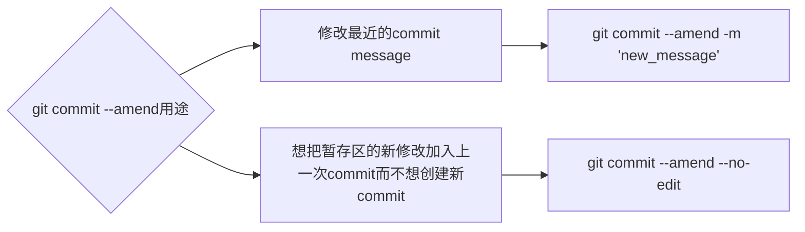

# Class Notes

## Table of Contents

- [Class Notes](#class-notes)
  - [Resources](#resources)
  - [Git tutorial](#git-tutorial)
    - [常见 git 指令](#常见-git-指令)
      - [git clone 和 git pull 的区别](#git-clone-和-git-pull-的区别)
      - [merge 的应用场景](#merge-的应用场景)
      - [git rm 和 rm 的区别](#git-rm-和-rm-的区别)
    - [git rebase/git reset/git commit --amend 的区别](#git-rebasegit-resetgit-commit---amend-的区别)
      - [git reset --mixed/--soft/--hard](#git-reset---mixed--soft--hard)
      - [git rebase 操作](#git-rebase-操作)
      - [git commit --amend 操作](#git-commit---amend-操作)
    - [常规 commit\&push(git add. \&\& git commit -m "msg" \&\& git push)](#常规-commitpushgit-add--git-commit--m-msg--git-push)
    - [简便 commit\&push(git commit -am "msg" \&\& git push)](#简便-commitpushgit-commit--am-msg--git-push)
    - [gitpush 和 gitampush edge case handling (重点!)](#gitpush-和-gitampush-edge-case-handling-重点)
      - [solution](#solution)
    - [git commit -am 的局限性和优势](#git-commit--am-的局限性和优势)
      - [运行结果对比](#运行结果对比)
    - [.gitignore 的陷阱](#gitignore-的陷阱)
    - [如何将一个 branch 所有 commit 合并成一个?](#如何将一个-branch-所有-commit-合并成一个)
      - [gitclearcommithistory()函数](#gitclearcommithistory-函数)
      - [两种使用场景](#两种使用场景)
    - [常见 shell 命令](#常见-shell-命令)
    - [cloud shell 练习](#cloud-shell-练习)
      - [environment setup](#environment-setup)

## Resources

- [Git 指南](./git.pdf)
- [Cloudshell Practice](https://console.cloud.google.com/cloudshell/editor?cloudshell_git_repo=https://github.com/praqma-training/git-katas.git)

## Git tutorial

<p align='center'></p>

### 常见 git 指令

- git init: 创建一个新 repo
- git clone: 复制一个已存在的 repo
- git remote add origin <remote_url>: 添加一个远程 repo, 并命名为 origin.
- git branch 查看本地有哪些 branch
- git branch -d/-D: 删除 branch
- git switch 切换 branch (指针不会指到最上面)
- git checkout 切换 branch (指针到最上面)
- git add file_name: 将文件添加到 staging area
- git commit -m "your commit message": 把 staging area 的文件 commit 到本地 repo
- git push origin main/master: 把本地 repo 的内容 push 到远程 repo
- git log --all --decorate --oneline --graph: 查看当前分支 commit 的记录
- git status：查看 git repo 当前状态
- git diff： 比较 working area 和 staging area 的差异
- git diff --staged: 比较 staging area 和上一次提交的差异
- git restore --staged file: 把 staging area 的文件放到 working area
- git restore --staged . 撤销 staging area 所有文件
- git restore file: 撤销 working area 修改
- git restore . 撤销 working area 所有修改

#### git clone 和 git pull 的区别

|                git clone                 |                                     git pull                                      |
| :--------------------------------------: | :-------------------------------------------------------------------------------: |
| **_第一次操作, 将远程 repo 下载到本地_** | **_本地 repo 已经和远程 repo 建立了联系, 基于远程仓库最新的内容, 更新本地 repo_** |

#### merge 的应用场景

`大多数merge都是用git官网上按钮完成, 一般create a pull request, 在别人review后, 才会执行merge`

> `git merge --squash <branch>`: 将所有 commits 应用到当前分支上, merge 完删除分支, 节省对 branch 的维护成本

#### git rm 和 rm 的区别

|                             git rm                             |                   rm                   |
| :------------------------------------------------------------: | :------------------------------------: |
| **_一般使用--cached 来删除暂存区文件, 保留本地文件,可以恢复_** | **_Unix/Linux 系统级别指令,很难恢复_** |

> 如果不小心在子文件夹使用 git init. 可以 cd 后执行"rm -rf .git"来撤销这步 git init 操作同时保留子文件夹内容 (不用完全删除子文件夹).

<hr>

### git rebase/git reset/git commit --amend 的区别

|              git rebase               |            git reset             |    git commit --amend     |
| :-----------------------------------: | :------------------------------: | :-----------------------: |
| **_合并 commits, 让 git log 更简洁_** | **_撤销暂存区或 commit 的修改_** | **_修改最近一次 commit_** |

#### git reset --mixed/--soft/--hard

- git reset --mixed 为默认，将 commit 的修改回退到工作区

```shell
git reset head^
git reset head^ 1.txt
git reset commit_id
git push origin branch
```

- git reset --soft: 将 commit 的修改回退到暂存区

```shell
git reset --soft head^
git reset --soft head^ 1.txt
git reset --soft commit_id
git push origin branch
```

- git reset --hard: 将工作区和暂存区修改全部丢弃

```shell
git reset --hard head^
git reset --hard head^ 1.txt
git reset --hard commit_id
git push origin branch --force-with-lease
```

#### git rebase 操作

`丢弃rebase的修改`

```bash
git rebase --abort
```

`查看commit的数量`

```bash
git log --oneline | wc -l
```

```shell
# 全局设置一个code editor
# 举例: git config --global core.editor "nano"
git rebase -i HEAD~2
window 1: 将除第一个pick的commit都改成s (不能先s后pick)
退出esc
window 2: 编辑commit msg (ctrl+k删除不需要的行)
退出esc
git push --force-with-lease
git pull --rebase
```

#### git commit --amend 操作

> git commit --amend 本质上创建一个新的 commit 代替了旧 commit, commitid 会变, **_建议不要 amend public commits_**



### 常规 commit&push(git add. && git commit -m "msg" && git push)

_无论本地 repo 的所有文件是不是 tracked, 保险的方式是使用 git add .将工作区所有修改添加到暂存区, 全部的指令如下_

```bash
git add. && git commit -m "msg" && git push
```

`如果觉得上面的代码很长, 可以在~/.bash_profile中添加一个方法`

```bash
gitpush() {
    git add . && git commit -m "$1" && git push
}
```

这样一来, 你可以在 terminal 中使下面的指令实现相同效果

```bash
gitpush "commit_msg"
```

### 简便 commit&push(git commit -am "msg" && git push)

_当本地 repo 里所有的文件都是已 tracked, 使用下面指令可以完成 git add, git commit 和 git push._

```bash
git commit -am "your_msg" && git push
```

> 但如果本地 repo 有的文件是些是 untracked (新创建的), 要使用 git add ., git commit 和 git push 而不使用上面的代码

`如果觉得上面的代码很长, 可以在~/.bash_profile中添加一个方法`

```bash
gitampush() {
    git commit -am "$1" && git push
}
```

_这样一来, 你可以在 terminal 中使下面的指令实现相同效果_

```bash
gitampush "commit_msg"
```

### [gitpush](#常规commitpushgit-add--git-commit--m-msg--git-push)和[gitampush](#简便commitpushgit-commit--am-msg--git-push) edge case handling (重点!)

> 上面的 gitpush 和 gitampush 没有处理一个 edge case. 在做 pull request 时, 需要创建一个新分支, 当第一次 push 到新分支时, 我们会因为没有写`-u`而出现 error.

#### solution

```bash
git_push() {
    [ -z "$(git branch -vv --list $(git symbolic-ref --short HEAD) | grep '\[.*\]')" ] \
        && git push -u origin $(git symbolic-ref --short HEAD) \
        || git push
}

gitpush() {
    git add . && git commit -m "$1"
    git_push
}

gitampush() {
    git commit -am "$1"
    git_push
}
```

_通过封装一个方法来判断是否本地 repo 和远程 repo 已经建立连接_

### git commit -am 的局限性和优势

> 很多时候, 两种方法进行对比, 往往各有千秋. 绝对的情况很少. 一般称为 trade-off. 前面两种 git commit & git push 的对比如下.

|            |                        git add. && git commit                        |                       git commit -am                       |
| :--------: | :------------------------------------------------------------------: | :--------------------------------------------------------: |
| **_优点_** | **_保险, 可以正确将 untracked 修改(如新建文件)添加到 staging area_** |                 **_时间和 cpu 消耗较少_**                  |
| **_缺点_** |                      **_时间和 cpu 消耗较多_**                       | **_无法将 untracked 修改(如新建文件)添加到 staging area_** |

#### 运行结果对比

<div style='display:flex; justify-content: space-between'>
    
    
</div>

### .gitignore 的陷阱

_很多时候第一次 push 时创建的.gitignore 会生效. 但为什么 push 几次后再修改.gitignore 就不生效了呢?_

> 实际上, .gitignore 只能应用于未被 track 的文件. 如果这些文件已经被 push 过了, 我们需要执行下面的代码:

```bash
git rm -r --cached . # 从暂存区中取消跟踪所有文件和目录，但保留这些文件在工作目录中
git add . # 将工作区所有修改添加到暂存区
git commit -m 'update .gitignore' # 将暂存区修改commit到本地仓库
git push # 将本地仓库的commit推送到远程仓库
```

`如果觉得上面需要一行一行输入太麻烦, 可以在~/.bash_profile中添加alias (注意等号前后均无空格)`

```bash
alias gitignore-update='git rm -r --cached . && git add . && git commit -m "update .gitignore" && git push'
```

### 如何将一个 branch 所有 commit 合并成一个?

> 很多人想到的是 rebase 方法. 但是这样做至少会剩余两个 commits. 理想的方式是新建一个 branch, 复制原来的 branch, 删除原来的 branch, 新 branch 重命名 (过河拆桥)

```bash
git checkout --orphan new
git add .
git commit -m "first commit"
git branch -D main
git branch -m main
git push --force-with-lease -u origin main
```

_你可以自由修改 commit message 或者 branch name 来实现合并成一个 commit, 但用户要手打 6 行, 能不能只打一行实现?_

#### gitclearcommithistory()函数

```bash
gitclearcommithistory() {
    branch_name=${2:-main}
    git checkout --orphan new && \
    git add . && \
    git commit -m "$1" && \
    git branch -D "$branch_name" && \
    git branch -m "$branch_name" && \
    git push --force-with-lease -u origin "$branch_name"
}
```

#### 两种使用场景

- 个人练习项目: 我想直接把自己的 main branch 合并成一个 commit

```bash
gitclearcommithistory "first commit"
```

- 团队项目: 我想直接把自己的 feature branch 合并成一个 commit 而不影响别人的分支

```bash
gitclearcommithistory "first commit" "featureA"
```

<hr>

### 常见 shell 命令

```shell
cd -> 切换到一个文件夹 # cd ..回退上一级
ls -> 列出当前目录所有文件
rm -> 删除文件 # rm -r 删除目录
open -> 打开一个文件夹 # open . 打开当前文件夹 | open .. 打开上一级文件夹
cp x newfile -> 拷贝文件到新位置(和mv不同, cp会保留原文件)
mkdir -> 新建目录
touch -> 新建文件
cat -> 输出文件内容
echo -> 打印/写入文件
# echo 'string' > filename  用string覆盖file所有内容<br>
# echo 'string' >> filename 把string添加到file内容最后
```

<hr>

### cloud shell 练习

<https://console.cloud.google.com/cloudshell/editor?cloudshell_git_repo=https://github.com/praqma-training/git-katas.git>

#### environment setup

```shell
cd basic-commits
source setup.sh
git config --global user.email "xxx"
git config --global user.name "xxx"
```

## Git and GitHub for Beginners Tutorial

https://www.youtube.com/watch?v=tRZGeaHPoaw

### 本地仓库
