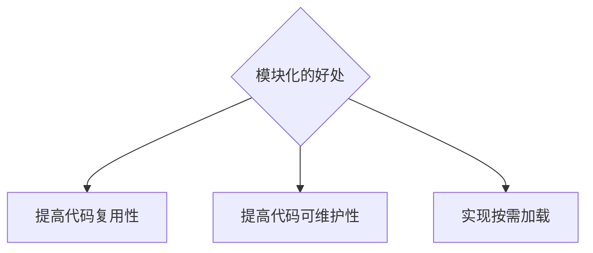
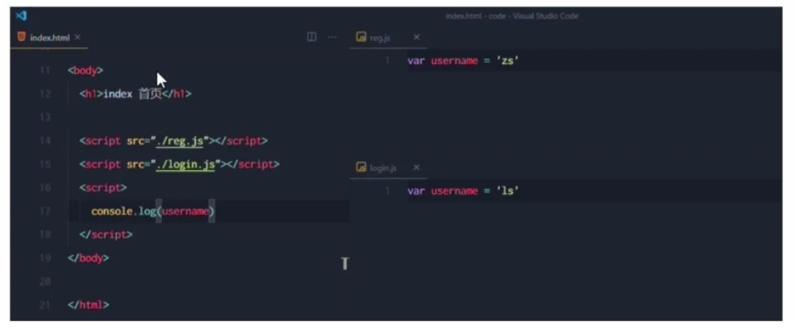
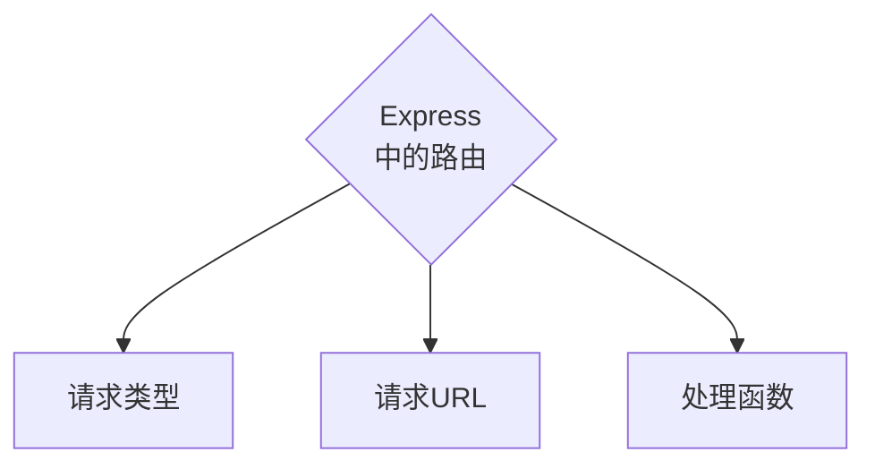

# Class Notes

## Table of Contents

- [Class Notes](#class-notes)
  - [Resources](#resources)
  - [Node_3](#node_3)
    - [package.json vs package-lock.json vs node_modules](#packagejson-vs-package-lockjson-vs-node_modules)
    - [模块化](#模块化)
      - [模块的分类](#模块的分类)
      - [加载模块](#加载模块)
      - [模块作用域](#模块作用域)
      - [module 对象](#module-对象)
      - [module.exports 对象](#moduleexports-对象)
      - [共享成员时的注意点及使用误区](#共享成员时的注意点及使用误区)
      - [Node.js 模块化规范](#nodejs-模块化规范)
    - [Express 介绍](#express-介绍)
      - [两种服务器](#两种服务器)
        - [安装 express 和 nodemon](#安装-express-和-nodemon)
      - [搭建 server](#搭建-server)
    - [Express 中的路由](#express-中的路由)
      - [模块化路由](#模块化路由)
        - [server.js](#serverjs)
        - [router.js](#routerjs)
        - [userRouter.js](#userrouterjs)
        - [journalRouter.js](#journalrouterjs)
  - [作业](#作业)

## Resources

[npm express](https://www.npmjs.com/package/express)<br>
[npm nodemon](https://www.npmjs.com/package/nodemon)<br>

## Node_3

<p align='center'></p>

### package.json vs package-lock.json vs node_modules

|        package.json        |         package-lock.json          |    node_modules    |
| :------------------------: | :--------------------------------: | :----------------: |
| **_项目信息和依赖项信息_** | **_npm 包的地址,来源,具体版本号_** | **_下载包的位置_** |

> ^2.29.4：表示可以使用 2.29.4 版本及其后续的次版本或修订版本, 但不包括 3.x.x 版本. 换句话说, 它允许在 2.x.x 版本范围内自动更新, 但不允许更新到 3.x.x 版本.

`package.json和js中的object差别在于`

- package.json 最后出现逗号会报错. js 的 object 最后的逗号是可选的

### 模块化

#### 什么是模块化

> 遵循特定的规则, 把大文件拆成小文件<br>



#### 模块的分类

- 内置模块（由 Node.js 官方提供，如 fs\path\http 等）
- 自定义模块
- 第三方模块

#### 加载模块

```js
// 1.加载内置的fs模块
const fs = require("fs");

// 2.加载用户自定义模块
const custom = require("./custom.js");

// 3.加载第三方模块
const moment = reqiure("moment");
```

#### 模块作用域

> 自定义模块中定义的变量,方法只能在模块内被访问

Node.js -> CommonJS 的规范

- 默认用 module.exports/require()

#### 模块作用域的好处

> 防止全局变量污染的问题

- 'reg.js'和'login.js'是作为独立的模块被引入的
- 这两个文件各自封装了其变量和函数,即使两个模块内部有相同的变量名，它们也不会互相影响

<p align='center'></p>

#### module 对象

- 每个.js 自定义模块中都有一个 module 对象，它里面存储了和当前模块有关的信息

<hr>

#### module.exports 对象

- 自定义模块中，可以使用 module.exports 对象，将模块内的成员共享出去，供外界使用
- 用 require()方法导入自定义模块是，得到的就是 module.exports 所指向的对象

<hr>

#### 共享成员时的注意点及使用误区

- 使用 require()方法导入模块时，导入的结果，永远以 module.exports 指向的对象为准
- exports 和 module.exports 的使用误区

<hr>

#### Node.js 模块化规范

> Node.js 遵循了 CommonJS 模块化规范，CommonJS 规定了模块的特性和各模块之间如何相互依赖<br> > <br>
> CommonJS 规定：

- 每个模块内部，module 变量代表当前模块
- module 变量是一个对象，它的 exports 属性（即 module.exports）是对外的接口
- 加载某个模块，其实是加载该模块的 module.exports 属性，require()方法用于加载该模块

### Express 介绍

#### 两种服务器

- WEB 服务器: http -> createServer
- API 服务器: Express (简化了 http 内置模块, 使用 express 更方便)

API: Application Programming Interface

> 连接前后端的桥梁

<p align='center'></p>

#### 进一步理解 Express

- 问：不使用 Express 能否创建 Web 服务器？
- 答：能，使用 Node.js 提供的原生 http 模块即可

<hr>

- 问：有了 http 内置模块，为什么还要用 Express？
- 答：http 内置模块用起来复杂，开发效率低；Express 基于 http 进一步封装出现，能提高开发效率

<hr>

- 问：http 内置模块与 Express 的关系？
- 答：类似 Web.API 和 jQuery 的关系。后者是基于前者进一步封装出来的

<hr>

##### 安装 express 和 nodemon

```shell
npm init
npm i express # 装在dependencies下
npm i nodemon -D # 装在devDependencies下
```

#### 搭建 server

```js
const express = require("express");
const app = express();
const PORT = 8080;
app.get("/user", (req, res) => {
  console.log(req.query);
  res.send({ name: "Chris", age: 20 });
});
app.post("/user", (req, res) => {
  res.send("request succeeded");
});
app.get("/", (req, res) => {
  console.log(req.query);
  res.send(req.query);
});
app.get("/profiles/:name", (req, res) => {
  console.log("name", req.params.name);
  res.send(req.params);
});
app.get("/users/:id/:room", (req, res) => {
  console.log("id", req.params.id);
  console.log("room", req.params.room);
  res.send(req.params);
});
app.listen(PORT, () => console.log("server is running on 8080."));
```

> npx nodemon (启动 server + 实时更新)<br>
> req.query 默认是{}, 可以使用?name=Chris&age=20 传输数据<br>
> req.params 通过:匹配动态参数<br>

### Express 中的路由



> 请求类型和请求 URL 同时匹配成功, Express 就会允许处理函数(从上到下匹配)<br>

#### 模块化路由

为了方便管理, 不应该把[路由挂载到 app 上](#搭建server), 推荐将路由抽离成独立的模块

##### server.js

```js
const express = require("express");
const router = require("./router");
const userRouter = require("./userRouter");
const journalRouter = require("./journalRouter");
const app = express();
app.use(express.urlencoded({ extended: false }));
app.use(express.json());
app.use(router);
app.use(userRouter);
app.use(journalRouter);
app.listen(8080, () => console.log("server is running on 8080"));
```

##### router.js

```js
const express = require("express");
const router = express.Router();
router.get("/list", (req, res) => res.send("get list succeed"));
router.post("/profile", (req, res) => res.send("add new profile"));
module.exports = router;
```

##### userRouter.js

```js
const express = require("express");
const userRouter = express.Router();
userRouter.post("/add", (req, res) => {
  const body = req.body;
  console.log("body", body);
  res.send({
    status: 0,
    msg: "add user succeed",
    data: body,
  });
});
module.exports = userRouter;
```

##### journalRouter.js

```js
const express = require("express");
const journalRouter = express.Router();
let journal = [
  { event: "work", squirrel: true },
  { event: "cycling", squirrel: false },
  { event: "break", squirrel: true },
  { event: "brushed teeth", squirrel: true },
];

journalRouter.get("/event", (req, res) => {
  const eventToFind = req.query.event;
  if (!eventToFind) {
    return res.status(400).send("Event parameter is missing");
  }
  const foundEvent = journal.find((item) => item.event === eventToFind);
  if (!foundEvent) {
    return res.status(404).send("Event not found");
  }
  res.send(foundEvent);
});

journalRouter.post("/events", (req, res) => {
  const { event, squirrel } = req.body;
  if (!event || !squirrel) {
    return res.status(400).send("Event and squirrel are required");
  }
  const newEvent = { event, squirrel };
  journal.push(newEvent);
  res.status(201).send({
    msg: "Add event succeeded",
    data: newEvent,
  });
});

module.exports = journalRouter;
```

## 作业

1. 写两个 api (retrieve all list + get an event by params)

2. 针对新 data, 写 4 个 api

```js
let journal = [
  {
    events: ["work", "touched tree", "pizza", "running", "television"],
    squirrel: false,
  },
  {
    events: [
      "work",
      "ice cream",
      "cauliflower",
      "lasagna",
      "touched tree",
      "brushed teeth",
    ],
    squirrel: false,
  },
  {
    events: ["weekend", "cycling", "break", "peanuts", "beer"],
    squirrel: true,
  },
];
```
