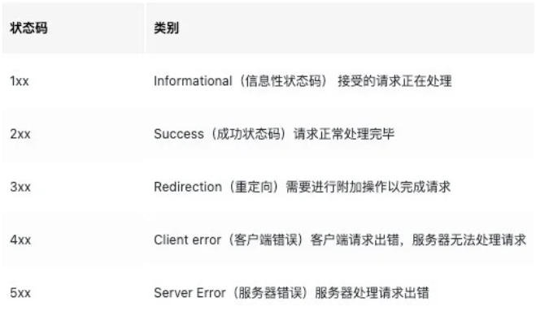
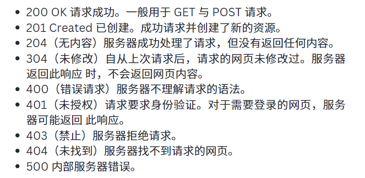
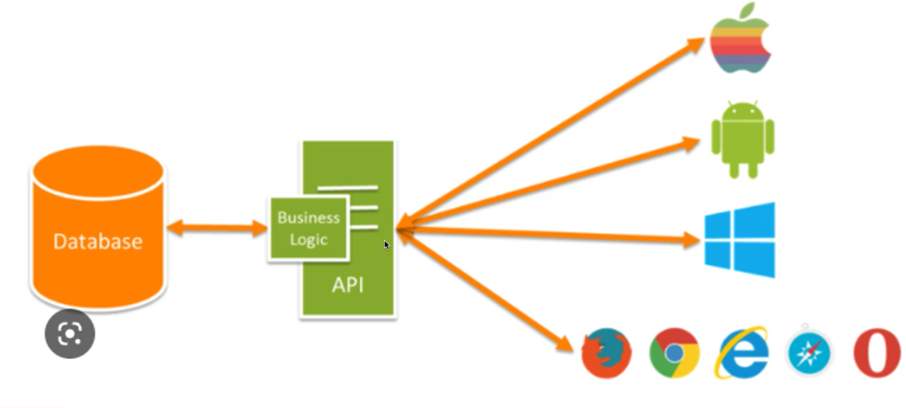
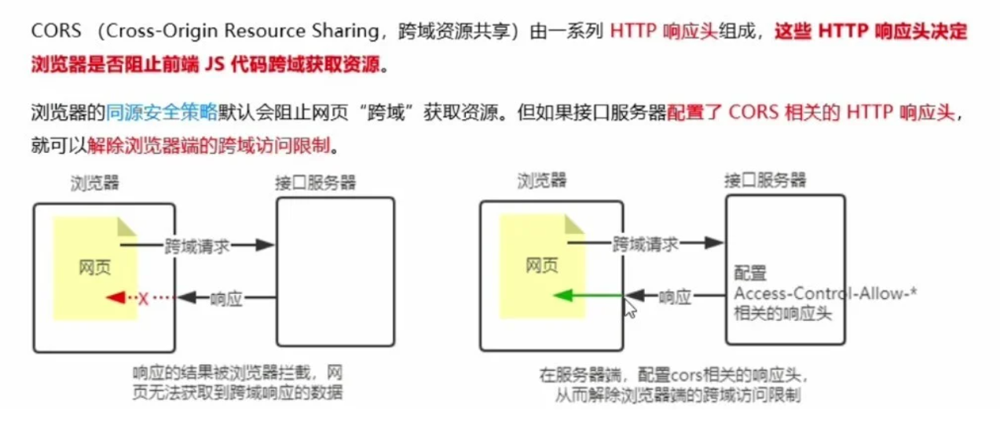
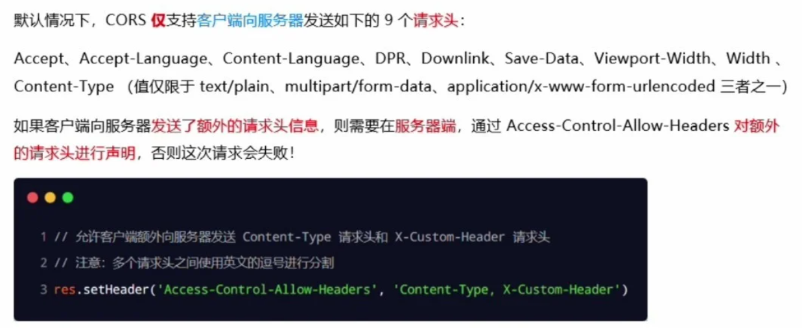
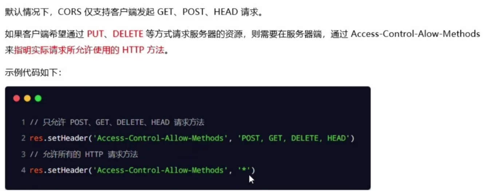
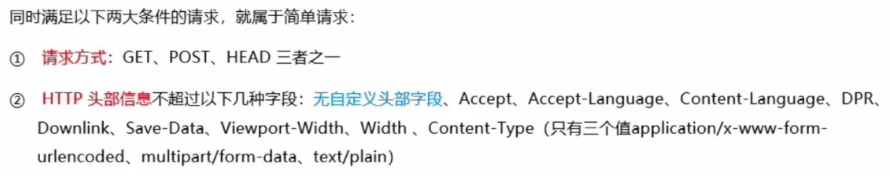
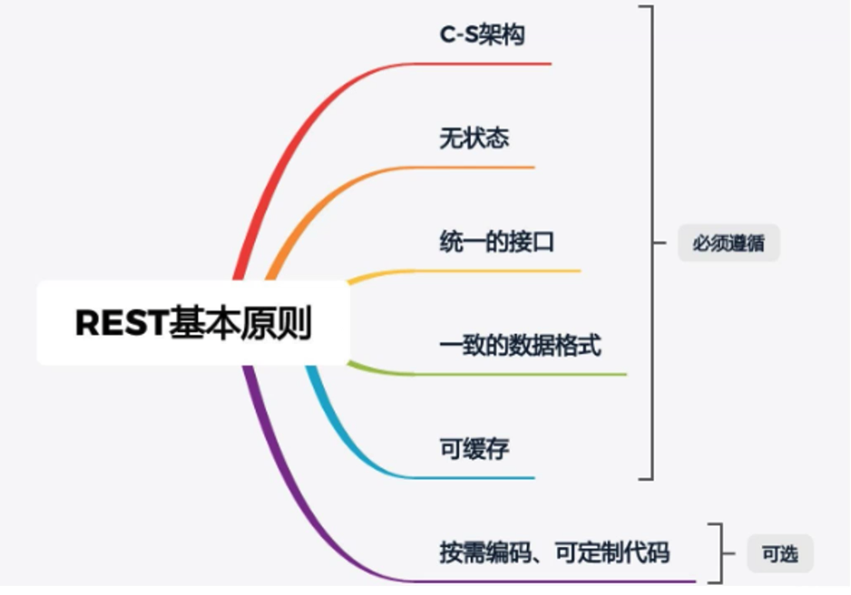
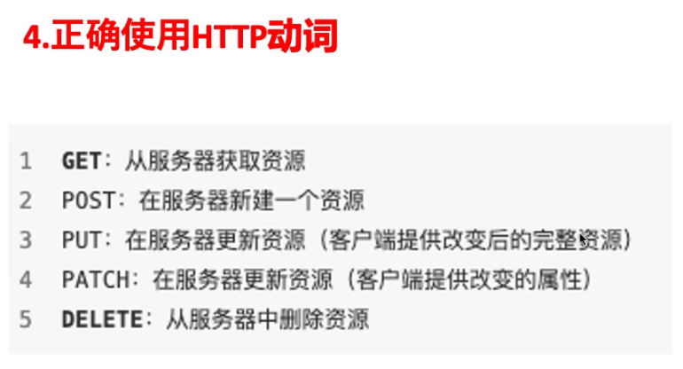

# Class Notes

## Table of Contents

- [Class Notes](#class-notes)
  - [Resources](#resources)
  - [Node_4](#node_4)
    - [状态码](#状态码)
    - [静态资源托管](#静态资源托管)
      - [express-static](#express-static)
      - [托管多个静态资源目录](#托管多个静态资源目录)
      - [添加前缀 (解决上面的冲突问题)](#添加前缀-解决上面的冲突问题)
    - [CORS 跨域资源共享](#cors-跨域资源共享)
      - [接口的跨域问题](#接口的跨域问题)
      - [使用 cors 中间件解决跨域问题](#使用-cors-中间件解决跨域问题)
      - [什么是 cors](#什么是-cors)
      - [cors 注意事项](#cors-注意事项)
      - [cors 响应头部](#cors-响应头部)
    - [RESTful API](#restful-api)
      - [http 动词](#http-动词)
        - [get vs post](#get-vs-post)
      - [http 状态码](#http-状态码)
    - [User list 后端练习](#user-list-后端练习)
      - [npm 安装](#npm-安装)
      - [index.js](#indexjs)
      - [router.js](#routerjs)

## Resources

[express static](https://expressjs.com/en/starter/static-files.html)<br>

## Node_4

<p align='center'></p>

### 状态码

- 主要状态码类型
<p align='center'></p>

- 一般常见代码状态
<p align='center'></p>

<hr>

### 静态资源托管

#### express-static

- express.static()：express 提供的一个函数，可以方便的创建一个静态资源服务器。

```js
app.use(express.static("./public"));
```

`可以访问public文件夹下的文件:`<br>
http://localhost:3000/images/bg.jpg<br>
http://localhost:3000/css/style.css<br>
http://localhost:3000/js/login.js<br>

> 如果 f 其他文件夹下面也有相同文件名, 会执行第一个找到的文件

#### 托管多个静态资源目录

```js
app.use(express.static("./public")); // 找到public下面的文件就停了
app.use(express.static("./files"));
```

#### 添加前缀 (解决上面的冲突问题)

```js
app.use("./public", express.static("./public"));
app.use("./user", express.static("./files"));
```

> 以"/public"开头的请求将从 "./public" 目录中提供文件; 以 "/user" 开头的请求将从 "./files" 目录中提供文件.

http://localhost/public/1.html<br>
http://localhost/user/1.html

### CORS 跨域资源共享

#### 接口的跨域问题

- 之前编写的 GET 和 POST 接口接口，存在不支持跨域请求的问题
- 解决方案

  > 1. CORS（主流解决方案）
  > 2. JSONP（有缺陷的解决方案：只支持 GET 请求）

#### 使用 cors 中间件解决跨域问题

- cors 是 Express 的一个三方中间件。

浏览器的"Same Origin Policy"默认阻止网页跨域访问资源. 如果配置了 CORS 相关的 header, 就能解决这个问题. 一般也可以用 npm 安装 cors 来解决.

- 步骤：
  > 1. 运行 `npm install cors` 安装中间件
  > 2. 使用 `const cors = require（'cors'）`导入中间件
  > 3. 在路由之前调用 `app.use(cors())`配置中间件

`一定在app.use(router)前使用app.use(cors())`

<p align='center'></p>

#### 什么是 cors

<p align='center'></p>

<hr>

#### cors 注意事项

- cors 主要在服务器端进行配置，客户端浏览器无须做任何额外的配置，即可请求开启了 cors 的接口
- cors 在浏览器中有兼容性，但对浏览器有一定要求，需要支持 XMLHttpRequest Level2

#### cors 响应头部

**Acess-Control-Allow-Origin**

- 响应头部可以携带 Acess-Control-Allow-Origin 字段
- 其中，origin 参数的值指定了允许访问该资源的外域 URL

```js
Acess-Control-Allow-Origin: <origin> | *
```

- 如果指定了 Acess-Control-Allow-Origin 字段的值为通配符'\*'，表示允许来自任何域的请求

```js
res.setHeader("Acess-Control-Allow-Origin", "*");
```

<hr>

**Acess-Control-Allow-Origin-Headers**

<p align='center'></p>

<hr>

**Acess-Control-Allow-Origin-Methods**

<p align='center'></p>

<hr>

**简单请求**

<p align='center'></p>

<hr>

**预检请求**

- 只要符合以下任何一个条件的请求，都需要进行预检请求：
  > 1. 请求方式为 GET、POST、HEAD 之外的请求 Method 类型
  > 2. 请求头中包含自定义头部字段
  > 3. 向服务器发送了 application/json 格式的数据

<hr>

**简单请求和预检请求的区别**

- 简单请求：客户端与服务器之间只会发生一次请求
- 预检请求：客户端与服务器之间会发生两次请求，OPTION 预检请求成功之后，才会发起真正的请求

### RESTful API

一种设计风格: 请求和响应简洁, 可读性强
一个架构符合 REST 原则, 就称它符合 RESTful 架构

<p align='center'></p>

> URL 中名词应该用复数

#### http 动词

<p align='center'></p>

##### get vs post

|           get            |          post          |
| :----------------------: | :--------------------: |
| **_从服务器上获取数据_** | **_向服务器发送数据_** |
|       **_< 2KB_**        |   **_默认不受限制_**   |
|       **_不安全_**       |      **_较安全_**      |

#### http 状态码

<p align='center'></p>

### User list 后端练习

#### npm 安装

```shell
npm init
npm i express cors body-parser
npm i nodemon -D
```

#### index.js

```js
const express = require("express");
const app = express();
const router = require("./router");
const cors = require("cors");
const parser = require("body-parser");
app.use(cors());
app.use(parser.json());
app.use("/api", router);
const PORT = 8080;
// lsof -i tcp:8080
// kill -9 id
app.listen(PORT, function () {
  console.log("Server is running on http://localhost:8080");
});
```

#### router.js

```js
const express = require("express");
const router = express.Router();
let user = [
  { id: 1, name: "Ben", age: 20 },
  { id: 2, name: "John", age: 30 },
  { id: 3, name: "Chris", age: 40 },
  { id: 4, name: "Jane", age: 60 },
];

router.get("/users", function (req, res) {
  res.status(200).json({
    status: "success",
    msg: "Retrievedd users successfully",
    data: user,
  });
});

function getNextUser(users) {
  const userIds = users.map(function (user) {
    return user.id;
  });
  return Math.max(...userIds) + 1;
}

router.post("/users", function (req, res) {
  const newUser = req.body;
  if (!newUser.name || !newUser.age) {
    return res.status(400).json({ msg: "missing parameters" });
  }
  const newId = getNextUser(user);
  let obj = { id: newId, ...newUser };
  user.push(obj);
  res
    .status(201)
    .json({ status: "success", msg: "add user successfully", data: user });
});

router.delete("/users", function (req, res) {
  user = [];
  res.status(204).send();
});

router.delete("/users/:id", function (req, res) {
  const userIdToDelete = parseInt(req.params.id);
  const initialUserCount = user.length;
  user = user.filter(function (user) {
    return user.id !== userIdToDelete;
  });
  if (user.length === initialUserCount) {
    return res.status(404).json({
      status: "error",
      msg: "User not found",
    });
  }
  res.status(200).json({
    status: "success",
    msg: "User deleted successfully",
  });
});
module.exports = router;
```
