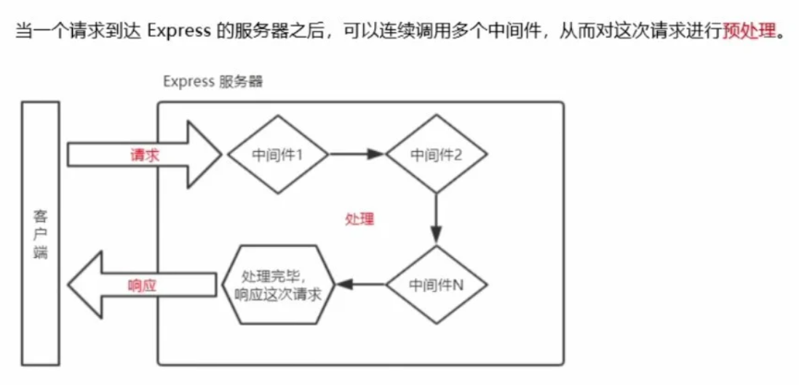
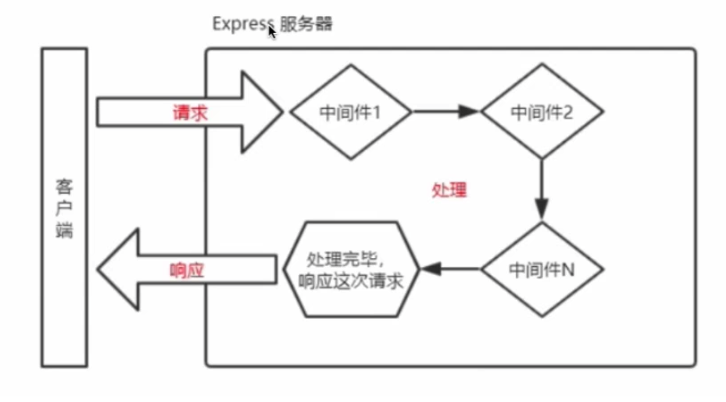
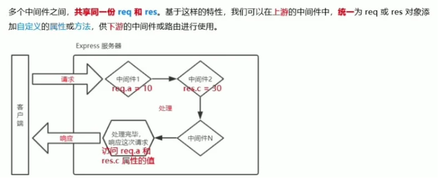

# Class Notes

## Table of Contents

- [Class Notes](#class-notes)
  - [Resources](#resources)
  - [Node_5](#node_5)
    - [中间件](#中间件)
      - [express 中间件的调用流程](#express-中间件的调用流程)
      - [express 中间件的格式](#express-中间件的格式)
      - [next 函数的作用](#next函数的作用)
      - [Express 中间件初体验](#express-中间件初体验)
        - [定义中间件函数](#定义中间件函数)
        - [全局生效的中间件](#全局生效的中间件)
        - [定义全局中间件的简化形式](#定义全局中间件的简化形式)
        - [中间件的作用](#中间件的作用)
        - [定义多个全局中间件](#定义多个全局中间件)
        - [局部生效的中间件](#局部生效的中间件)
        - [定义多个局部中间件](#定义多个局部中间件)
        - [了解中间件的 5 个使用注意事项](#了解中间件的-5-个使用注意事项)
      - [中间件的分类](#中间件的分类)
        - [应用级别的中间件](#应用级别的中间件)
        - [路由级别的中间件](#路由级别的中间件)
        - [错误级别的中间件](#错误级别的中间件)
        - [Express 内置的中间件](#express-内置的中间件)
        - [第三方的中间件](#第三方的中间件)
      - [练习](#练习)
      - [index.js](#indexjs)
      - [index2.js](#index2js)
      - [局部中间件 index3.js](#局部中间件-index3js)
      - [index4.js \& router.js](#index4js--routerjs)
    - [User list 前端练习](#user-list-前端练习)
      - [list.html](#listhtml)
      - [list.css](#listcss)
      - [list.js](#listjs)

## Resources

[Simple-User-List-Class-Solution](https://github.com/ESJiang/JR16-notes/tree/main/Simple-User-List-Class-Solution)<br>
[Simple-User-List-Solution-Two](https://github.com/ESJiang/JR16-notes/tree/main/Simple-User-List-Solution-Two)<br>

## Node_5

### 中间件

#### express 中间件的调用流程

当一个请求到达 Express 的服务器后, 连续调用多个中间件, 对这次请求进行预处理



#### express 中间件的格式


#### next 函数的作用

next 函数是多个中间件调用的关键



```js
const nw = function (req, res, next) {
  console.log("这是一个中间件函数");
  next();
};

app.use(nw);
```

#### Express 中间件初体验

##### 定义中间件函数

> 可通过如下方式定义一个最简单的中间件函数：

```js
//常量mw所指向的，就是一个中间件函数
const mw = function (req, res, next) {
  console.log("这是一个最简单的中间件函数");
  // 注意：在当前中间件的业务处理完毕以后，必须调用next()函数
  // 表示把流转关系转交给下一个中间件或路由
  next();
};
```

##### 全局生效的中间件

> 客户端发起的任何请求达到服务器之后都会触发的中间件，叫全局生效中间件
> 通过调用 app.use(中间件函数)，即可定义一个全局生效的中间件，代码如下：

```js
// 常量mw所指向的，就是一个中间件函数
const mw = function(req, res, next)
  console.log('这是一个最简单的中间件函数')
  next()
}

// 全局生效的中间件
app.use(mw)
```

##### 定义全局中间件的简化形式

```js
// 全局生效的中间件
app.use(function (req, res, next) {
  console.log("这是一个最简单的中间件函数");
  next();
});
```

##### 中间件的作用



##### 定义多个全局中间件

> 可使用 app.use()连续定义多个全局中间件，客户端会按照中间件定义的先后顺序一次进行调用

```js
app.use(function (req, res, next) {
  //第一个全局中间件
  console.log("调用了第1个全局中间件");
  next();
});
app.use(function (req, res, next) {
  //第二个全局中间件
  console.log("调用了第2个全局中间件");
  next();
});
app.get("/user", (req, res) => {
  //请求这个路由，会依次触发上述两个全局中间件
  res.send("Home page.");
});
```

##### 局部生效的中间件

> 不使用 app.use()定义的中间件，叫做局部生效的中间件，代码如下：

```js
// 定义中间件函数mw1
const mw1 = function (req, res, next) {
  console.log("这是中间件函数");
  next();
};
// mw1这个中间件只在"当前路由中生效"，这种用法属于"局部生效的中间件"
app.get("/", mw1, function (req, res) {
  res.send("Home page.");
});
// mw1这个中间件不会影响下面这个路由↓↓↓
app.get("/user", function (req, res) {
  res.send("User page");
});
```

##### 定义多个局部中间件

> 可以在路由中，通过等价的方式，使用多个局部中间件：

```js
// 以下两种写法是"完全等价"的，可以根据自己的喜好，任意选择一种方式进行使用
app.get("/", mw1, mw2, (req, res) => {
  res.send("Home page.");
});
app.get("/", [mw1, mw2], (req, res) => {
  res.send("Home page.");
});
```

##### 了解中间件的 5 个使用注意事项

1.一定要在`路由之前`注册中间件 
2.客户端发送过来的请求，`可以连续调用多个`中间件进行处理
3.执行完中间件的业务代码之后，不要忘记调用next()函数 
4.为了`防止代码逻辑混乱`，调用 next()函数之后不要再写额外的代码
5.连续调用多个中间件时，多个中间件之间，`共享`req 和 res 对象


#### 中间件的分类

##### 应用级别的中间件

- 通过 app.use()或 app.get()或 app.post()，绑定到 app 实例上的中间件：

```js
// 应用级别的中间件（全局中间件）
app.use((req, res, next) => {
  next();
});

// 应用级别的中间件（局部中间件）
app.get("/", mw1, (req, res) => {
  res.send("Home page.");
});
```

##### 路由级别的中间件

- 是指绑定到 express.Router()实例上的中间件，用法和应用级别中间件没有任何区别
- 但是应用级别中间件时绑定到 app 实例上，路由级别中间件时绑定到 router 实例上

```js
var app = express()
var router = express.Router()

//路由级别的中间件
router.use(function(req, res next){
  console.log('Time', Date,now())
  next()
})

app.use('/', router)
```

##### 错误级别的中间件

- 作用：专门用来捕获项目中发生的异常错误，防止项目异常和崩溃
- 格式：`必须有4个形参`，形参顺序从前到后，分别是（err, req, res, next）

```js
app.get("/", function (req, res) {
  // 1. 路由
  throw new Error("服务器内部发生了错误！"); // 1.1 抛出一个自定义的错误
  res.send("Home page.");
});
app.use(function (err, req, res, next) {
  // 2. 错误级别的中间件
  console.log("发生了错误： " + err.message); // 2.1 在服务器打印错误信息3
  res.send("Error! " + err.message); // 2.2 向客户端响应错误相关的内容
});
```

##### Express 内置的中间件

- 自 Express 4.16.0 版本开始，Express 内置了 3 个常用的中间件，提高开发效率：
  - `express.static`：快速托管静态资源的内置中间件（HTML 文件\图片\CSS 样式等）
  - `express.json`：解析 JSON 格式的请求数据（4.16.0+版本可用）
  - `express.urlencoded`：解析 URL-encoded 格式的请求数据（4.16.0+版本可用）

```js
// 配置解析application/json格式数据的内置中间件
app.use(express.json());
// 配置解析application/x-www-form-urlencoded格式数据的内置中间件
app.use(express.urlencoded({ extended: false }));
```

##### 第三方的中间件

- 非官方内置的第三方开发的中间件
- 运行步骤：
  1.运行 npm install body-parser 安装中间件
  2.使用 require 导入中间件
  3.调用 app.use() 注册并使用中间件
- 注意：Express 内置的 express.urlencoded 中间件，就是基于 body-parser 这个第三方中间件进一步封装出来的

#### Express 练习

```shell
npm init
npm i express && npm i nodemon -D
```

#### index.js

```js
const express = require("express");
const app = express();
const PORT = 8000;
// 定义一个最简单的中间件函数
function mw(req, res, next) {
  console.log("This is a middleware function");
  next();
}
// 注册成全局中间件
app.use(mw);
app.use((req, res, next) => {
  console.log("This is the second middleware");
  next();
});
app.get("/home", (req, res) => {
  console.log("Home Page");
  res.send("home page");
});
app.get("/users", (req, res) => {
  console.log("users Page");
  res.send("users page");
});
app.listen(PORT, () =>
  console.log("server is running on http://127.0.0.1:8000")
);
```

_结论: 中间件先执行, 后执行 router, 如果 next()忘记写, postman 会陷入死循环._

#### index2.js

```shell
npm i moment
```

```js
const express = require("express");
const moment = require("moment");
const app = express();

// 定义全局中间件
app.use((req, res, next) => {
  const time = moment().format();
  req.startTime = time;
  next();
});

// 路由拿到全局中间件
app.get("/", (req, res) => {
  console.log("startTime ", req.startTime);
  res.send("home page " + req.startTime);
});

app.get("/users", (req, res) => {
  console.log("startTime ", req.startTime);
  res.send("user page " + req.startTime);
});

app.listen(8000, () => console.log("the server is running on port 8000"));
```

> 全局中间件可以和路由共享 req 和 res, 在前面的中间件定义 req 和 res 的属性, 后面的路由可以得到这些值

#### 局部中间件 index3.js

```js
const express = require("express");
const app = express();
app.use(express.json());
const mw1 = function (req, res, next) {
  console.log("first middleware");
  next();
};
const mw2 = function (req, res, next) {
  console.log("second middleware");
  next();
};
// 先执行mw1后执行mw2
app.get("/book", mw1, mw2, (req, res) => {
  console.log("book page");
  res.send("book page");
});
app.post("/user", (req, res) => {
  console.log("body", req.body);
  res.send({ msg: "post succeed", data: req.body });
});
app.listen(8000, () => console.log("the server is running on port 8000"));
```

> 局部中间件的执行顺序在定义 api 时可以指定<br>
> 要解析 post req.body 的 json 数据, 使用`app.use(express.json());`

##### 中间件的作用


#### index4.js & router.js

`index4.js`

```js
const express = require("express");
const router = require("./router");
const app = express();
app.use(router);
app.listen(8000, () => console.log("the server is running on port 8000"));
```

`router.js`

```js
const express = require("express");
const router = express.Router();

// add post api
router.post("/", function (req, res, next) {
  const error = new Error("this is an error");
  next(error); // pass error to next middleware
});

// define error middleware
const errorHandler = function (err, req, res, next) {
  console.error(err.stack);
  res.status(500).json({
    status: "error",
    msg: "Internal server error",
  });
};
// add error middleware
router.use(errorHandler);
module.exports = router;
```

> 路由可以传递参数给下一个中间件

### User list 前端练习

`axios导入`

```html
<script src="https://unpkg.com/axios/dist/axios.min.js"></script>
```

#### list.html

```html
<body>
  <div class="container">
    <h3>User List</h3>
    <form class="user_form">
      <label for="username">Name</label>
      <input type="text" id="username" value="" />
      <label for="age">Age</label>
      <input type="number" id="age" value="" />
    </form>
    <div class="btn_group">
      <button onclick="getList()" id="get_list">get list</button>
      <button onclick="postUser()" id="add_user">add user</button>
      <button onclick="deleteList()" id="clear_list">clear list</button>
    </div>
    <ul id="user_list"></ul>
  </div>
  <script src="https://unpkg.com/axios/dist/axios.min.js"></script>
  <script src="./list.js"></script>
</body>
```

#### list.css

```css
.container {
  width: 600px;
  height: 600px;
  overflow: scroll;
  margin: 10px auto;
  background-color: #7986cb;
  padding: 20px;
  color: #fff;
  box-sizing: border-box;
}

h3,
.user_form,
.btn_group {
  display: flex;
  justify-content: center;
}

.user_form {
  margin-bottom: 1rem;
}

ul li {
  list-style: none;
  counter-increment: item;
  margin-bottom: 1rem;
}

ul li::before {
  content: counter(item);
  background-color: #f9dd94;
  color: #fff;
  font-weight: bold;
  padding: 3px 8px;
  border-radius: 3px;
  margin-right: 1rem;
}

button {
  color: #fff;
  background-color: #c2d352;
  text-transform: capitalize;
  text-decoration: none;
  padding: 0.5rem 1rem;
  border: none;
  border-radius: 5px;
  margin: 0 1rem;
  cursor: pointer;
}

button:hover {
  background: #434343;
  transition: all 0.4s ease;
}
```

#### list.js

```js
function clearList() {
  const userList = document.getElementById("user_list");
  while (userList.firstChild) userList.removeChild(userList.firstChild);
}

function getList() {
  console.log("getList fired");
  const url = "http://localhost:8080/api/users";
  axios
    .get(url)
    .then(function (res) {
      const users = res.data.data;
      console.log("users", users);
      clearList();
      users.forEach(function (user) {
        const li = document.createElement("li");
        li.innerHTML = user.name + " " + user.age;
        li.setAttribute("data-id", user.id);
        const deleteButton = document.createElement("button");
        deleteButton.textContent = "Delete";
        deleteButton.addEventListener("click", function () {
          deleteUserById(user.id);
        });
        li.appendChild(deleteButton);
        document.getElementById("user_list").appendChild(li);
      });
    })
    .catch(function (err) {
      console.error("Error fetching user list:", err);
    });
}

function deleteUserById(userId) {
  console.log("deleteUserById fired");
  const url = "http://localhost:8080/api/users/" + userId;
  axios
    .delete(url)
    .then(function (res) {
      console.log(userId + " deleted");
      getList();
    })
    .catch(function (err) {
      console.error("Error deleting user with ID: " + userId, err);
    });
}
```
