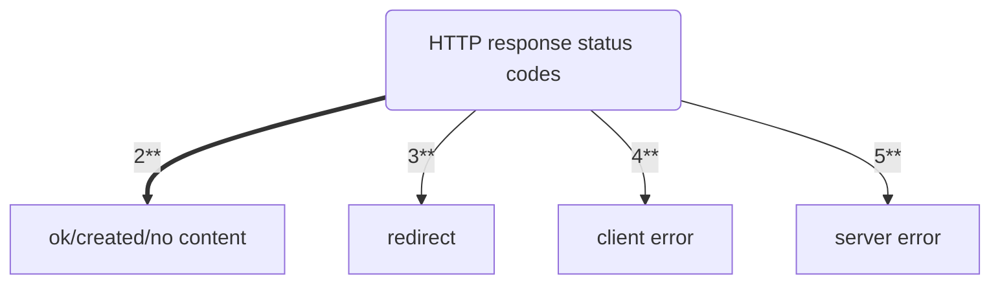
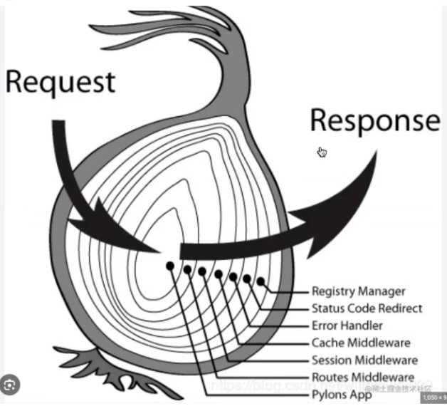

# Class Notes

## Table of Contents

- [Class Notes](#class-notes)
  - [Resources](#resources)
  - [Node_tutorial](#node_tutorial)
    - [复习](#复习)
      - [安装包的指令](#安装包的指令)
      - [运行包的指令](#运行包的指令)
      - [包版本含义](#包版本含义)
      - [http 和 fs 模块](#http-和-fs-模块)
        - [fs 模块](#fs-模块)
        - [http 模块](#http-模块)
      - [HTTP 状态码与 HTTP 请求方法的关联](#http-状态码与-http-请求方法的关联)
        - [2\*\*](#2)
        - [3\*\*](#3)
        - [4\*\*](#4)
        - [5\*\*](#5)
      - [模块化](#模块化)
      - [express 搭建服务器](#express-搭建服务器)
      - [CRUD - 创建,读取,更新和删除数据](#crud---创建读取更新和删除数据)
      - [Route](#route)
        - [中间件](#中间件)
    - [message-board CRUD practice](#message-board-crud-practice)
      - [json vscode 插件](#json-vscode-插件)
      - [npm 初始化 + 安装包](#npm-初始化--安装包)
      - [server.js](#serverjs)
      - [router.js solution 1](#routerjs-solution-1)
      - [router.js solution 2](#routerjs-solution-2)

## Resources

[课堂代码整理](https://github.com/ESJiang/JR16-notes/tree/main/Node_tutorial_code)

## Node_tutorial

<p align='center'></p>

### 复习

#### 安装包的指令

```bash
npm i package_name
npm i package_name --save-dev
```

#### 运行包的指令

`先修改package.json中的scirpts`

```bash
npm run dev
npm run start
npm dev
npm start
```

#### 包版本含义

> 2: major changes<br> 3. minor changes<br> 4. patch changes<br>

#### http 和 fs 模块

##### fs 模块

```js
fs.readFile(filename, encoding, callback_function);
fs.writeFile(file, data, options, callback);
```

##### http 模块

```js
const http = require("http");
const server = http.createServer();
server.on("request", (req, res) => {
  console.log("someone is visiting the server");
  res.end();
});
```

#### HTTP 状态码与 HTTP 请求方法的关联



##### 2\*\*

- **_200 GET、HEAD、POST、PUT、PATCH、DELETE 请求成功处理, 并返回请求的资源_**
- **_201 Created：POST、PUT、PATCH 请求成功创建了新的资源, 并在响应的 Location 头中包含了新创建资源的 URL_**
- **_204 No Content：DELETE 请求成功处理, 但没有返回任何响应内容_**

##### 3\*\*

- **_301 Moved Permanently：永久性重定向, 表示请求的资源已永久移动到新位置_**
- **_302 Found：临时性重定向, 表示请求的资源临时移动到新位置_**
- **_304 Not Modified：条件请求，表示客户端缓存的资源未发生变化，可以继续使用缓存的版本_**

##### 4\*\*

- **_400 Bad Request：客户端发送的请求有错误, 服务器无法处理_**
- **_401 Unauthorized：需要身份验证, 表示客户端未提供有效的身份验证信息_**
- **_403 Forbidden：服务器理解请求, 但拒绝执行，通常因为权限问题_**
- **_404 Not Found：请求的资源未找到_**

##### 5\*\*

- **_500 Internal Server Error：服务器内部错误, 无法完成请求_**
- **_502 Bad Gateway：服务器作为网关或代理, 从上游服务器收到无效的响应_**
- **_503 Service Unavailable：服务器当前无法处理请求, 通常因为过载或维护_**

#### 模块化

- 可读性, 可维护性
- 复用性, 灵活性
- 三方, 内置, 自定义

#### express 搭建服务器

```js
//导入express
const express = require("express");
//创建一个web服务器
const app = express();
//4.处理一个简单的request
app.get("/", (req, res) => res.send("hello world"));
//3.启动服务器
app.listen(8000, () => console.log("Server is running on port 8000"));
```

#### CRUD - 创建,读取,更新和删除数据

- Create: post
- Read: get
- Update: put
- Delete: delete

#### Route

```js
const router = express.Router();
module.exports = router;
```

##### 中间件

<p align='center'></p>

> 简单来说, 每一个中间件都有两次处理时机. 在洋葱模型中，每一层相当于一个中间件, 其处理顺序先是 next()前请求(Request, 从外层到内层)然后执行 next()函数，最后是 next()后响应(Response, 从内层到外层)

`app.use(router)就是一个简单的中间件`

### message-board CRUD practice

#### json vscode 插件

<p align='center'></p>

#### npm 初始化 + 安装包

```bash
npm init
npm i cors express fs && npm i nodemon -D
```

#### server.js

```js
//1.导入express, cors, route.js的express.Router()对象
const express = require("express");
const cors = require("cors");
const messageRouter = require("./router");
//2.创建一个web服务器
const app = express();
//设置cors请求头 - 允许跨域请求
app.use(cors());
//允许postman在body使用json和x-www-form-urlencoded格式
app.use(express.json());
app.use(express.urlencoded({ extended: false }));
//4.处理一个简单的request
app.get("/test", (req, res) => res.send("hello world"));
app.use(messageRouter);
//3.启动服务器
app.listen(8080, () => console.log("Server is running on port 8080"));
```

#### router.js solution 1

> 在 post 和 put 接口中灵活使用 es6 解构+展开运算符, 同时封装一个 writeMessagesFile 的箭头函数用来每次覆盖原 messages.json 全部内容

```js
const express = require("express");
const router = express.Router();
const fs = require("fs");
const messages = require("./messages.json").messages; //const {messages}=require('./messages.json')
const writeMessagesFile = (newMessages) => {
  const data = JSON.stringify({
    messages: newMessages,
  });
  fs.writeFileSync("messages.json", data);
};

//CRUD
//Get:获取所有的留言 R:READ
router.get("/messages", (req, res) => {
  res.status(200).json(messages);
});

//POST:添加留言 C:CREATE
router.post("/messages", (req, res) => {
  const newMessageId = messages.length;
  const { name, message } = req.body;
  const newMessage = {
    id: newMessageId,
    name,
    message,
  };
  const newMessages = [...messages, newMessage];
  writeMessagesFile(newMessages);
  res.send({
    status: 201,
    message: "Create success",
    data: newMessages,
  });
});

//DELETE: 删除留言 D:DELETE
router.delete("/messages/:id", (req, res) => {
  const { id } = req.params;
  const index = messages.findIndex((message) => message.id === parseInt(id));
  if (index === -1) res.sendStatus(404);
  messages.splice(index, 1); //从'参数1'(index)开始删除'参数2'(1)个
  const newMessages = messages;
  writeMessagesFile(newMessages);
  res.send({
    status: 200,
    messages: "delete messages",
    data: newMessages,
  });
});

//PUT: 更新留言 U:UPDATE
router.put("/messages/:id", (req, res) => {
  const { id } = req.params;
  const index = messages.findIndex((message) => message.id === parseInt(id));
  if (index === -1) res.sendStatus(404);
  messages.splice(index, 1);
  const { name, message } = req.body;
  const newMessages = [
    ...messages,
    {
      id: parseInt(id),
      name: name,
      message: message,
    },
  ];
  writeMessagesFile(newMessages);
  res.send({
    status: 201,
    messages: "update messages",
    data: newMessages,
  });
});
module.exports = router;
```

#### router.js solution 2

> 在 writeMessageFile()直接写入{messages}, 就不需要创建每次更新后的 messages array, 因为 push, splice, Object.assign 方法已经修改了 message.json 中的元素. 此外, put 接口中使用 Object.assign 可以避免使用解构和删除操作. 封装三个命名函数 writeMessageFile(), getMessageById(messageId)和 handleErrorMessage(res, messageId)用来实现代码复用.

```js
const express = require("express"),
  router = express.Router(),
  fs = require("fs"),
  messages = require("./messages.json").messages;

function writeMessagesFile() {
  fs.writeFileSync("./messages.json", JSON.stringify({ messages }, null, 4));
}

function getMessageById(messageId) {
  return messages.find((msg) => msg.id === messageId);
}

function handleErrorMessage(res, messageId) {
  res.status(404).json({ msg: `id ${messageId} does not exist` });
}

//Get:获取所有的留言 R:READ
router.get("/", (req, res) => res.status(200).json(messages));

// 获取单条留言
router.get("/:id", (req, res) => {
  const messageId = parseInt(req.params.id);
  const message = getMessageById(messageId);
  message ? res.status(200).json(message) : handleErrorMessage(res, messageId);
});

//POST:添加留言 C:CREATE
router.post("/", (req, res) => {
  const newMessage = {
    id: messages.length,
    name: req.body.name,
    message: req.body.message,
  };
  messages.push(newMessage);
  writeMessagesFile();
  res.status(201).json({ msg: "create successfully", newData: newMessage });
});

//PUT: 更新留言 U:UPDATE
router.put("/:id", (req, res) => {
  const messageId = parseInt(req.params.id);
  const messageToUpdate = getMessageById(messageId);
  if (messageToUpdate) {
    Object.assign(messageToUpdate, req.body);
    writeMessagesFile();
    res
      .status(201)
      .json({ msg: "update successfully", updateData: messageToUpdate });
  } else handleErrorMessage(res, messageId);
});

//DELETE: 删除留言 D:DELETE
router.delete("/:id", (req, res) => {
  const messageId = parseInt(req.params.id);
  const messageIndex = messages.findIndex((msg) => msg.id === messageId);
  if (messageIndex !== -1) {
    const deletedMessage = messages.splice(messageIndex, 1)[0];
    writeMessagesFile();
    res
      .status(201)
      .json({ msg: "delete successfully", deleteData: deletedMessage });
  } else handleErrorMessage(res, messageId);
});

module.exports = router;
```
