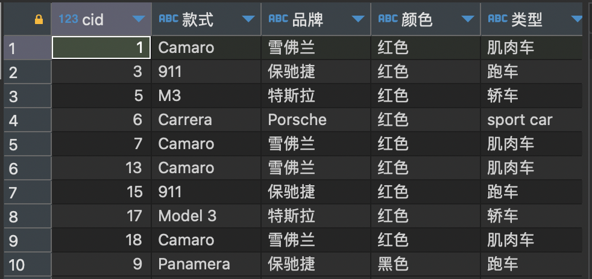

# Class Notes

## Table of Contents

- [Class Notes](#class-notes)
  - [Resources](#resources)
  - [Database_tutorial](#database_tutorial)
    - [数据库基本概念](#数据库基本概念)
    - [INSERT 关键字](#insert-关键字)
    - [DELETE 关键字](#delete-关键字)
    - [SELECT 关键字](#select-关键字)
    - [创建 Factories table](#创建-factories-table)
      - [忘记添加 AUTOAUTO_INCREMENT 怎么处理](#忘记添加-autoauto_increment-怎么处理)
    - [添加 Factories 数据](#添加-factories-数据)
    - [Foreign key constraints](#foreign-key-constraints)
    - [创建 Production table](#创建-production-table)
      - [Production 添加数据](#production-添加数据)
    - [HAVING 关键字](#having-关键字)
      - [选择库存中数量大于 3 的汽车款式](#选择库存中数量大于-3-的汽车款式)
      - [查询哪一个品牌的车, 最贵的那款超过 20 万](#查询哪一个品牌的车-最贵的那款超过-20-万)
      - [查询哪一个品牌的车有 2020 年款的](#查询哪一个品牌的车有-2020-年款的)
    - [联表查询](#联表查询)
    - [创建 Factories_2 table](#创建-factories_2-table)
    - [JOIN 关键字](#join-关键字)
      - [Crossjoin](#crossjoin)
      - [Innerjoin](#innerjoin)
    - [Union vs Union All](#union-vs-union-all)
      - [使用 union](#使用-union)
      - [使用 union all](#使用-union-all)
    - [NULL 关键字](#null-关键字)
    - [sql_mode=only_full_group_by](#sql_modeonly_full_group_by)
      - [group by one column](#group-by-one-column)
      - [group by two columns](#group-by-two-columns)
      - [为什么不能 select two columns, group by one column?](#为什么不能-select-two-columns-group-by-one-column)
      - [SQL execution order](#sql-execution-order)

## Resources

[class resources](https://github.com/jessieyu1/intro2database)<br>
[sql practice](https://sqlbolt.com/lesson/select_queries_introduction)

## Database_tutorial

<p align='center'></p>

### 数据库基本概念

- SQL 服务器: 提供 DBMS 功能 (MySQL, PostgreSQL, Oracle, etc)
- 客户端 (Client Side): 向 SQL 服务器发送查询请求，处理返回的结果，并将数据显示给用户或用于其他操作
- 实例 (Instance): 一个数据库有多个实例, 每个实例是一个独立的数据库环境
- 进程 ID (Process ID): 标识正在运行的进程的唯一标识符

### INSERT 关键字

```sql
INSERT INTO Cars(`款式`,`品牌`, `颜色`, `类型`, `价格`, `生产年份`, `是否卖出`)
VALUES ('Camaro','雪佛兰','蓝色','肌肉车',65000,2017,'1')
```

### DELETE 关键字

```sql
DELETE FROM
    Cars;

DELETE FROM
    Cars
WHERE
    款式 = "Camaro" -- 执行多次, updated row是0, 正确返回不会报错
```

`transaction 保证数据一致性`

### SELECT 关键字

```sql
-- Q1
SELECT
    *
FROM
    Cars
WHERE
    颜色 = "红色"

-- Q2
SELECT
    *
FROM
    Cars
WHERE
    颜色 = "红色"
    AND 生产年份 < 2017

-- Q3
SELECT
    cid,
    颜色,
    价格
FROM
    Cars
WHERE
    款式 = "Camaro"
ORDER BY
    价格 DESC
LIMIT
    2

-- Q4
SELECT
    *
FROM
    Cars
WHERE
    款式 LIKE 'C%' -- 'like' is not case sensitive

-- Q5
SELECT
    品牌,
    count(*) AS 数量
FROM
    Cars
GROUP BY
    品牌
ORDER BY
    品牌

-- Q6
SELECT
    max(价格)
FROM
    Cars
WHERE
    款式 = 'Camaro'

-- Q7
SELECT
    SUM(价格) AS total_amount
FROM
    Cars
WHERE
    是否卖出 = 1
```

### 创建 Factories table

```sql
CREATE TABLE Factories(
    fid INTEGER PRIMARY KEY NOT NULL AUTO_INCREMENT,
    `工厂名字` TEXT,
    `地址` TEXT,
    `建造年份` INTEGER,
    `员工数量` INTEGER,
    `主管` TEXT,
    `车间数量` INTEGER,
    `品牌` TEXT
);
```

#### 忘记添加 AUTOAUTO_INCREMENT 怎么处理

```sql
ALTER TABLE
    Factories
MODIFY
    COLUMN fid INT PRIMARY KEY NOT NULL AUTO_INCREMENT;
```

### 添加 Factories 数据

```sql
INSERT INTO
    Factories(工厂名字, 地址, 建造年份, 员工数量, 主管, 车间数量, 品牌)
VALUES
    ('雪佛兰 加州1厂', '美国', 2000, 450, 'James', 20, '雪佛兰'),
    ('Toyota 2厂', '美国', 1998, 700, 'Asuka', 30, 'Toyota'),
    ('特斯拉西雅图分部', '美国', 2003, 600, 'Elon', 30, '特斯拉'),
    ('保驰捷2厂', '德国', 2010, 380, 'Alex', 10, '保驰捷'),
    ('宝马4厂', '德国', 1995, 480, 'Alex', 20, '宝马'),
    ('福特 加州分部', '美国', 1988, 900, 'Rex', 30, '福特');
```

### Foreign key constraints

_一个表的 FK 往往是另一个表的 PK. 添加数据时要保证 FK 在另外一张表的 PK 中能找到_

<p align='center'></p>

```sql
-- 成功, 两个FK都能在Cars和Factories的PK中一一对应
INSERT INTO
    Production(`cid`, `fid`, `生产日期`, `负责员工`)
VALUES
    (1, 1, “ 20150908 ”, “ Zavier ”);

-- 失败, 9在Factories的PK的无法找到
INSERT INTO
    Production(`cid`, `fid`, `生产日期`, `负责员工`)
VALUES
    (2, 9, “ 20171208 ”, “ Ross ”);
```

### 创建 Production table

```sql
USE lab2;

CREATE TABLE Production(
    `pid` INT PRIMARY KEY AUTO_INCREMENT,
    `cid` INT NOT NULL,
    `fid` INT NOT NULL,
    `生产日期` TEXT,
    `负责员工` TEXT,
    FOREIGN KEY(`cid`) REFERENCES Cars(`cid`),
    FOREIGN KEY(`fid`) REFERENCES Factories(`fid`)
);
```

#### Production 添加数据

```sql
INSERT INTO
    Production (`cid`, `fid`, `生产日期`, `负责员工`)
VALUES
    (2, 6, '17/12/2020', 'Alex'),
    (5, 4, '18/12/2020', 'Zed'),
    (7, 2, '23/12/2020', 'Lee'),
    (8, 1, '28/12/2020', 'Lin'),
    (13, 2, '1/01/2021', 'Gabriel'),
    (4, 3, '1/01/2021', 'Jason'),
    (15, 4, '2/01/2021', 'Chris'),
    (6, 5, '3/01/2021', 'Mark'),
    (9, 6, '14/01/2021', 'Ron'),
    (18, 6, '16/01/2021', 'Harris');
```

### HAVING 关键字

#### 选择库存中数量大于 3 的汽车款式

```sql
SELECT
    款式,
    COUNT(*) AS num
FROM
    Cars
GROUP BY
    款式
HAVING
    num > 3
```

#### 查询哪一个品牌的车, 最贵的那款超过 20 万

```sql
SELECT
    品牌,
    款式,
    max(价格) AS maxPrice
FROM
    Cars
GROUP BY
    品牌,
    款式
HAVING
    maxPrice > 200000;
```

> group by 必须同时包含所有 nonaggregated columns. 否则如果你只是用`group by 款式`, 你不能区分相同款式不同颜色的车. 这样一来, sql 会报错

#### 查询哪一个品牌的车有 2020 年款的

```sql
SELECT
    品牌
FROM
    Cars
WHERE
    生产年份 = 2020
GROUP BY
    品牌
HAVING
    COUNT(*) > 0;
```

### 联表查询

```sql
SELECT
    *
FROM
    Cars,
    Production,
    Factories
WHERE
    production.生产日期 = "1/01/2021"
    AND Production.cid = Cars.cid
    AND Factories.fid = Production.fid
```

### 创建 Factories_2 table

```sql
CREATE TABLE Factories_2(
    `fid` INT AUTO_INCREMENT,
    `工厂名字` VARCHAR(255),
    `地址` VARCHAR(255) NOT NULL CHECK(`地址` IN ("美国", "德国")),
    `建造年份` INT,
    `员工数量` INT CHECK(`员工数量 ` >= 100),
    `主管` VARCHAR(255),
    `车间数量` INT,
    `品牌` VARCHAR(255) UNIQUE,
    PRIMARY KEY(`fid`)
);
```

### JOIN 关键字

> 如果多个表有关联性(相同 column), 可以用 join 来生成一个具有关联关系的结果集

<p align='center'></p>

#### Crossjoin

```sql
SELECT
    Cars.颜色,
    Factories.工厂名字
FROM
    Cars
    CROSS JOIN Factories
```

#### Innerjoin

```sql
SELECT
    款式,
    类型
FROM
    Cars
    INNER JOIN Factories ON Cars.品牌 = Factories.品牌
```

### Union vs Union All

> union 和 union all 都是合并输出结果.

|       union        |    union all     |
| :----------------: | :--------------: |
| **_不包含重复行_** | **_包含重复行_** |

#### 使用 union

```sql
SELECT
    *
FROM
    Cars
WHERE
    颜色 = '红色'
UNION
SELECT
    *
FROM
    Cars
WHERE
    类型 = '跑车';
```

<p align='center'></p>

#### 使用 union all

```sql
SELECT
    *
FROM
    Cars
WHERE
    颜色 = '红色'
UNION ALL
SELECT
    *
FROM
    Cars
WHERE
    类型 = '跑车';
```

<p align='center'></p>

### NULL 关键字

> NULL 表示一个缺失值的项, 和 0 或包含空格的字段不同<br>
> 一般用来做 check constraint (NOT NULL)

### sql_mode=only_full_group_by

> 这是 sql 对于 group by 的一个 constraint. 举一个例子

<p align='center'></p>

_这样创建了一个简单的 table, 有 3 个 columns, 6 个 rows_

<p align='center'></p>

#### group by one column

<p align='center'></p>

_第一种是只针对品牌分组. 效果就是输出了 3 行. (即使最高价格都相同, 每个组只会输出一行)_

#### group by two columns

<p align='center'></p>

_第二种是 group by 两个 columns, 相当于用组合方式. 这里和前面例子不同在于, 同一个品牌, 颜色不同,相同 maxprice 全部输出了._

#### 为什么不能 select two columns, group by one column?

> 只是 group by 一个品牌, 最后应该像第一个例子一样输出 3 行. 问题在于你现在多 select 一个 non-aggragated->颜色. mysql 不知道应该 return 给你 green 还是 red 还是 red

- 所以必须把所有 non-aggregated columns 都加入 group by 中. 抽象一点说就是颜色和 group by 中的品牌没有依赖性. 所以报错

#### SQL execution order

|  Order  |     Clause     |                       Function                        |
| :-----: | :------------: | :---------------------------------------------------: |
| **_1_** |   **_FROM_**   | **_Tables are merged in order to get the base data_** |
| **_2_** |  **_WHERE_**   |        **_This clause filters the base data_**        |
| **_3_** | **_GROUP BY_** |    **_This clause group the filtered base data_**     |
| **_4_** |  **_HAVING_**  |    **_This clause filters the grouped base data_**    |
| **_5_** |  **_SELECT_**  |       **_This clause returns the final data_**        |
| **_6_** | **_ORDER BY_** |        **_This clause stored the final data_**        |
| **_7_** |  **_LIMIT_**   |    **_The returned data is limited to row count_**    |
