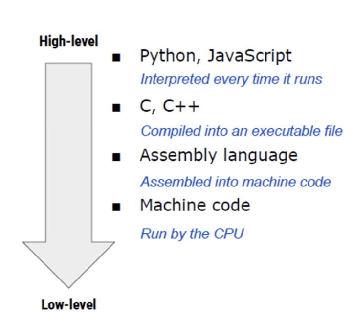
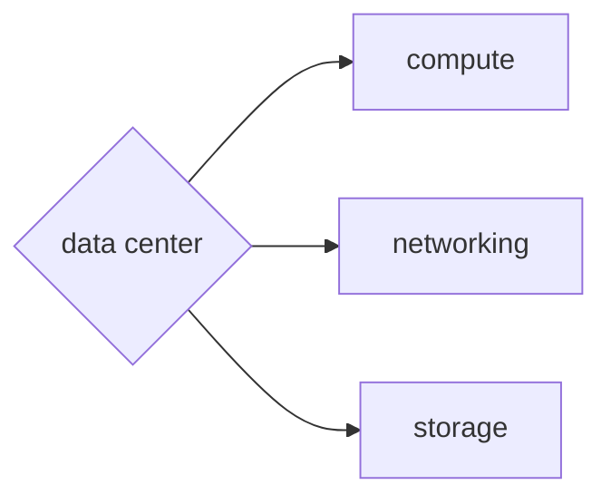

# Class Notes

## Table of Contents

- [Class Notes](#class-notes)
  - [Resources](#resources)
  - [Python_1](#python_1)
    - [OCR](#ocr)
    - [ETL (Extract + Transform + Load)](#etl-extract--transform--load)
    - [Angular 和 React](#angular-和-react)
    - [Bootstrap](#bootstrap)
    - [Django](#django)
    - [SQL 的优势](#sql-的优势)
    - [Kubernetes 和 GKE](#kubernetes-和-gke)
    - [什么是 Python?](#什么是-python)
      - [OOP 面向对象](#oop-面向对象)
      - [Interpreted language vs Compiled language](#interpreted-language-vs-compiled-language)
      - [State in Object](#state-in-object)
    - [为什么学 Python](#为什么学-python)
    - [Cloud](#cloud)
    - [DevOps 证书](#devops-证书)

## Resources

[Bootstrap](https://getbootstrap.com/) 
[Weed AI](https://github.com/Weed-AI/Weed-AI) 
[chatgpt interpreter](https://openai.com/blog/chatgpt-plugins#code-interpreter) 
[AWS certification](https://aws.amazon.com/certification) 

## Python_1

### OCR

`将图像中的文本转换为可编辑文本的技术``

_OpenCV 对图像进行预处理, 使用 OCR 对预处理完的图像进行文本识别, 将结果保存在 csv 文件中_

### ETL (Extract + Transform + Load)

_ETL 是数据处理的过程, 将原始数据转换为可用于机器学习的数据集_

### Angular 和 React

|           Angular           |                    React                    |
| :-------------------------: | :-----------------------------------------: |
| Google 开发和维护的 js 框架 | Facebook 开发而维护的 js 框架 (Virtual DOM) |

### Bootstrap

_它提供了一套用于构建响应式、移动优先的网页和应用程序的工具和组件_

<https://getbootstrap.com/>

### Django

_基于 Python 的网络框架_

### SQL 的优势

- 执行速度快
- 便宜 (按查询的存储和计算收费)
- Software Development Kit (sdk): 提供了很多语言支持

### Kubernetes 和 GKE

|              Kubernetes              |                   GKE                   |
| :----------------------------------: | :-------------------------------------: |
| 游乐园的管理员, 保证服务器能正常运行 | 游乐园的主人, GKE 会帮你提供 Kubernetes |

### 什么是 Python?

_高级语言 - 主流里最接近人类语言的编程语言_

1. CPU 二极管 - 发送信号(1 0)
2. 汇编语言: 最快速度转化成机器语言的语言 - 直接与计算机硬件相关
3. C 语言比较低级 (面向过程), 性能优化好
4. C++: 在 c 语言的基础上加入 OOP, 加入 C++的生态
5. Java/C#: 高级语言, 企业级平台会用这些
6. golang(Google 开发的语言)/kotlin(语法接近 Java)
7. Python/JS (TypeScript)

#### OOP 面向对象

_Class/Object/继承/多态_

#### Interpreted language vs Compiled language

|   Interpreted language   | Compiled language |
| :----------------------: | :---------------: |
| 边解释边执行 (如 Python) |    编译后执行     |

> `Interpreted language的灵活性在于运行时逐行解释代码, 即使在最后出现了语法错误, 仍然能尽可能打印前面部分执行结果. 这意味着开发人员能更快定位出问题, 进行修复.`

#### State in Object

_object 中有 state 属性用来存储对象的状态或数据_

### 为什么学 Python

|                   职位                    |                       职责                       |
| :---------------------------------------: | :----------------------------------------------: |
|              Tech consultant              |    Automation (可能被 code interpreter 取代)     |
|             Business Analyst              |          dashboarding (tableau powerbi)          |
|               Data Analyst                | python scripting, sql, bigquery (data warehouse) |
|              Data Scientist               |                  DA + modeling                   |
| SDE, software Developer(frontend/backend) |              google, Django golang               |
|               Quantitative                |                   c++, python                    |
|               Data Engineer               |     java,python,scala,spark,hadoop,MapReduce     |
|         Site Reliability Engineer         |              运维 (python + kotlin)              |

### Cloud

data center: cloud provider (aws/gcp/azire) -> 多计算机, 多网线

AWS prime day: 流量大, 把闲置的 resource 租出去

on premise: 1cpu + 4gb + 100gb ssd

elastic: pay-as-you-go (需要多少用多少)

S3(simple storage service), EC2(Elastic cloud computing) -> 存储和运算

### DevOps 证书

<https://aws.amazon.com/certification>
