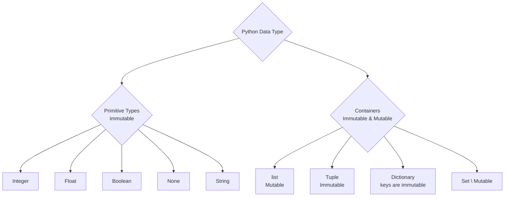
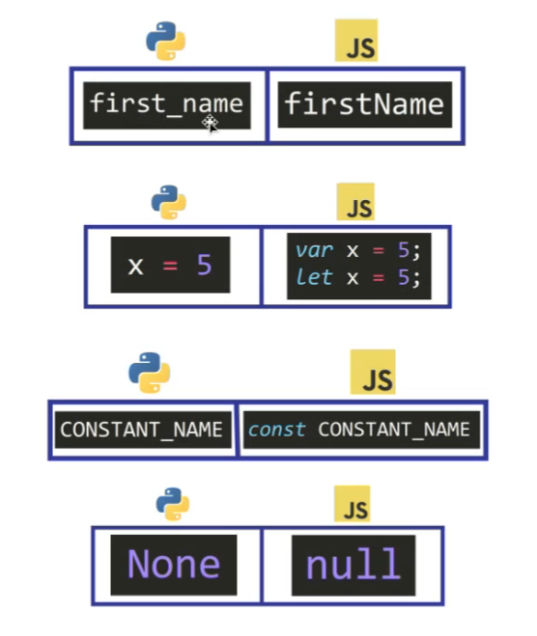
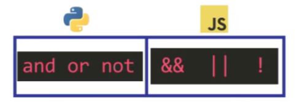
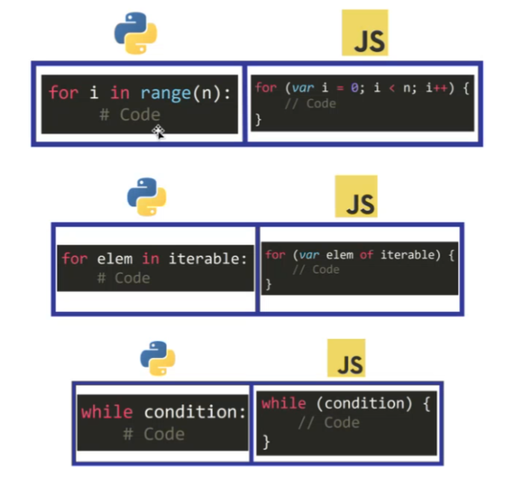
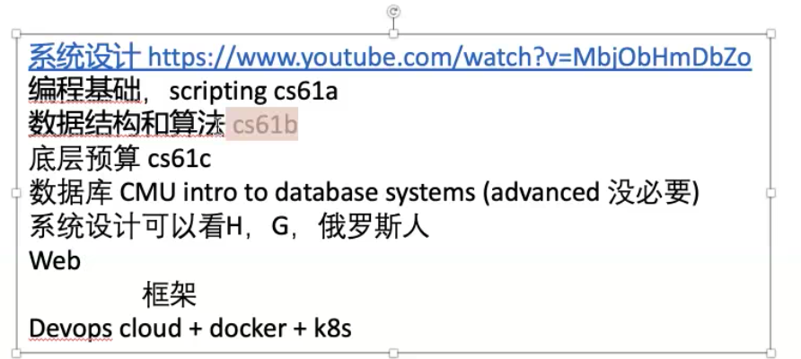

# Class Notes

## Table of Contents

- [Class Notes](#class-notes)
  - [Resources](#resources)
  - [Python_2](#python_2)
    - [安装 Python](#安装-python)
      - [Anaconda 和 Python](#anaconda-和-python)
      - [Python 调试](#python-调试)
      - [安装 pygame](#安装-pygame)
      - [遇到 Unknown Word 解决方法](#遇到-unknown-word-解决方法)
      - [VScode Workspace Setting](#vscode-workspace-setting)
    - [Python 数据类型](#python-数据类型)
      - [Integer](#integer)
      - [Boolean](#boolean)
      - [None](#none)
      - [String](#string)
      - [Immutable Mutable Hashable](#immutable-mutable-hashable)
    - [Python 和 JavaScript 的命名差异](#python-和-javascript-的命名差异)
    - [Python 和 JavaScript 添加注释](#python-和-javascript-添加注释)
    - [获得包的帮助信息](#获得包的帮助信息)
    - [and 和 or 的区别](#and-和-or-的区别)
    - [for 循环](#for-循环)
    - [推荐课程](#推荐课程)

## Resources

[anaconda](https://www.anaconda.com/download/)

## Python_2

<p align='center'></p>

### 安装 Python

[anaconda](https://www.anaconda.com/download/)

#### Anaconda 和 Python

> Anaconda 是 Python 的发行版, 包含超过 1500 个科学包. 装包后, 就可以直接使用预先封装的方法.

`collection.abc: 抽象基类(Abstract Base Classes)`

#### Python 调试

- import pdb; pdb.set_trace()
- python -i test.py

#### 安装 pygame

```plaintext
conda create -n snake python=3.9
conda activate snake
conda env list
pip install pygame==2.1.2
python
import pygame
```

`vscode - select python interpreter`

#### 遇到 Unknown Word 解决方法

setting -> search spell

#### VScode Workspace Setting

```json
{
  "workbench.editorAssociations": {
    "*.ipynb": "jupyter-notebook"
  },
  "notebook.cellToolbarLocation": {
    "default": "right",
    "jupyter-notebook": "left"
  },
  "terminal.integrated.inheritEnv": false,
  "python.analysis.typeCheckingMode": "basic",
  "editor.formatOnSaveMode": "file",
  "editor.formatOnSave": true,
  "python.linting.enabled": true,
  "python.formatting.provider": "none",
  "redhat.telemetry.enabled": true,
  "window.zoomLevel": 2,
  "[python]": {
    "editor.formatOnType": true,
    "editor.defaultFormatter": "ms-python.black-formatter"
  },
  "cSpell.diagnosticLevel": "Hint",
  "cSpell.enabled": false
}
```

<hr>

### Python 数据类型

> Primitive type(不可变): integer/float/boolean/none/string

> container type: list(可修改)/tuple(不可变)/set(不同元素只保存一次,可变)/dictionary(可变)



#### Integer

- Python 对整数的处理方式
  > 在 Python 中，整数（通常在-5 到 256 之间）是预先创建并缓存起来的,这意味着它们将会有相同的内存地址<br>
  > 当你改变这些变量的值，使其超出了这个预缓存的范围，Python 会创建一个新的整数对象来表示新的值

<hr>

#### Boolean

> 与 integer 类似，a、b 同时赋予 true 或者 false 时地理位置相同

<hr>

#### None

> 无论赋值给谁，都只有一个地理位置

<hr>

#### String

> 一开始通过赋值得到的内容会修改地址，而赋值过后任何的修改不会<br>
> 在 string 后增加字母位数不会修改地址，而增加空格会

<hr>

#### Immutable Mutable Hashable

|          Immutable           |          Mutable           |                     Hashable                     |
| :--------------------------: | :------------------------: | :----------------------------------------------: |
| 创建后其状态就不能改变的对象 | 创建后可以改变其状态的对象 | 有一对一的映射并且可以用作字典的键或集合中的元素 |
|  字符串（str）和整数（int）  | 列表（list）和字典（dict） |            不可变的，它们也是可哈希的            |

- 相互间的联系：
  > 不可变的对象是可哈希的，因为它们的内容不会改变<br>
  > 可变对象通常是不可哈希的，因为它们的内容可以改变

```python
a = 1
b = 1
print(a == b)  # True
print(id(a) == id(b))  # True
print(a is b)  # True
c = []
d = []
print(c == d)  # True
print(id(c) == id(d))  # False
print(c is d)  # False
```

`id(1) -> 地址信息`
`hash(1) -> hash值`
`hash是用于在散列数据结构中快速查找对象的唯一标识`

> 注意只有 immutable type 才是 hashable.

```python
# set中的元素必须是hashable的, 不能直接添加unhashable的list
a= set()
a.add([]) # error
a.add(tuple([])) # correct -> {()}

# dict中的key必须是hashable的, 而value随意
c = dict()
c[[1]] = [1]  # error
c[tuple([1])] = [1]  # correct -> {(1,): [1]}
```

<hr>

### Python 和 JavaScript 的命名差异

<p align='center'></p>

- Python: 运用 indentation(缩进)来显示 level
- JavaScript: 对缩进不太敏感, 更专注传输
- PEP8 规则: 它是一个编码约定文档，描述了如何编写 Python 代码的风格指南

<br>

|         规则         |                                            内容                                            |
| :------------------: | :----------------------------------------------------------------------------------------: |
|         缩进         |                        使用 4 个空格进行缩进，不要使用制表符（Tab）                        |
|         行宽         |                          每行代码尽量不超过 79 个字符，以便于阅读                          |
|         空行         |                        用空行来分隔函数和类，以及代码中较大的代码块                        |
|         注释         |                 尽量清晰，不要解释代码是如何做的，而是解释代码为什么这么做                 |
|       命名规范       |                            类名通常使用驼峰命名法（如 MyClass）                            |
|       命名规范       |                   函数和变量名使用小写字母和下划线分隔（如 my_function）                   |
|       命名规范       |                    常量通常使用全大写字母和下划线分隔（如 MY_CONSTANT）                    |
|      空格的使用      |                        在逗号、冒号、分号后面要加空格，但不是在前面                        |
|      空格的使用      |                           参数列表、索引或切片的括号内侧不加空格                           |
|       引入模块       | 每个引入应该独立一行，标准库模块、第三方库模块、应用程序指定模块分组导入，组之间用空行分隔 |
| 表达式和语句中的空格 |                                      避免不必要的空格                                      |

<p align='center'></p>

|      Python      |         JavaScript         |
| :--------------: | :------------------------: |
|  snake_pattern   |      camelCasePattern      |
| 赋值时直接用'='  | 赋值时需要用到'var'和'let' |
| 常量名可直接使用 |  常量名之前需要加'const'   |
|       None       |  一般用 null 或 undefined  |

### Python 和 JavaScript 添加注释

- Python

  - \#
  - """

- JavaScript
  - //
  - /\* \*/

<hr>

### 获得包的帮助信息

```python
import pygame
print(help(pygame))
```

<hr>

### and 和 or 的区别

<p align='center'></p>

> 两者都是返回停止判断位置的元素
> and: 有一个 false 就是 false
> or: 有一个 true 就是 true

`and和or本质上返回一个真正的值, 而不是boolean`

<hr>

#### for 循环

<p align='center'></p>

### 推荐课程

<p align='center'></p>
