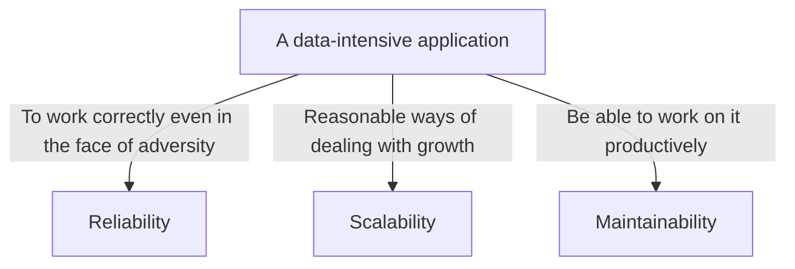

# Class Notes

## Table of Contents

- [Class Notes](#class-notes)
  - [Resources](#resources)
  - [Python_3](#python_3)
    - [Python-Set/List/Dict 的常用方法](#python-setlistdict-的常用方法)
      - [Set](#Set)
      - [List](#List)
        - [List: 三种赋值方式的区别](#list-三种赋值方式的区别)
      - [Dict](#dict)
        - [copy()](#copy)
        - [items()](#items)
        - [pop()](#pop)
        - [popitem()](#popitem)
    - [A data-intensive application](#a-data-intensive-application)
      - [Vertical scale 和 Horizontal scale](#vertical-scale-和-horizontal-scale)
    - [数据结构 (Trade-off)](#数据结构-trade-off)
      - [映射关系](#映射关系)
      - [Array: 有序 + 连续存储](#array-有序--连续存储)
      - [Linked List: 有序 + 不连续存储(链式存储)](#linked-list-有序--不连续存储链式存储)
      - [Hashtable: 无序 + 不连续存储](#hashtable-无序--不连续存储)
      - [Stack vs Queue](#stack-vs-queue)
        - [Priority queue(heap)](#priority-queueheap)
    - [Python-Set/List/Dict 的常用方法](#python-setlistdict-的常用方法)

## Resources

- [Cinder](https://github.com/facebookincubator/cinder)
- [Data Structures](https://sp23.datastructur.es/)
- [labuladong 的算法小抄](https://labuladong.github.io/algo/di-ling-zh-bfe1b/xue-xi-sua-01220/)

## Python_3

### Python-Set/List/Dict 的常用方法

_method.png)

#### Set

唯一、无序、hashable
  - 检查存在性可直接
  - a = set()
  - a.add(1)
  - 1 in a

#### List

有序、不唯一、index
  - a = list() 
  - a.append(1)
  - a[0] 
  - 即可以通过一个具体的位置信息快速 access 到 value 或其他信息

##### List: 三种赋值方式的区别

b = a<br>
  - 这种方式是将 b 直接指向 a 所引用的对象。这意味着 a 和 b 实际上指向的是同一个对象，因此对 b 的任何修改都会反映在 a 上，反之亦然。
  - 在以下这个例子中: 使用 b = a，**_修改 b 导致 a 也发生了变化_**。

```python
import copy
# 示例数据结构
a = [1, [2, 3], 4]
# 直接赋值
b = a
b[0] = 10
print("After 'b = a':", a)  # 输出: [10, [2, 3], 4]
```

b = copy(a)
  - 这种方式使用 copy 模块的浅复制（shallow copy）。它创建了一个新对象，然后尽可能地将原对象中的内容复制到新对象中。
  - 对于复杂的对象（如包含其他对象的列表），浅复制只复制最外层的容器，容器内部的元素仍然是原始对象的引用。这意味着修改这些内部元素会影响原始对象。
  - 在以下这个例子中: 使用 b = copy(a)（浅复制），**_修改 b 中的内嵌列表会影响 a 中对应的列表_**。

```python
# 浅复制
a = [1, [2, 3], 4]
b = copy.copy(a)
b[1][0] = 20
print("After 'b = copy(a)':", a)  # 输出: [1, [20, 3], 4]
```

b = deepcopy(a)
  - 这种方式使用 copy 模块的深复制（deep copy）。深复制创建了一个完全独立的新对象，包括其内部嵌套的所有对象。这意味着原始对象和副本之间不会相互影响。
  - 在以下这个例子中: 使用 b = deepcopy(a)（深复制），**_a 和 b 完全独立，对 b 的任何修改都不会影响 a_**。

```python
# 深复制
a = [1, [2, 3], 4]
b = copy.deepcopy(a)
b[1][0] = 30
print("After 'b = deepcopy(a)':", a)  # 输出: [1, [2, 3], 4]
```

#### Dict

##### copy()

- 仍是 shallow copy，只是 copy 了 key 和 value 的值，对于 mutable 的 object 来说，它的值就是地址，即地址相同

##### items()

- 用于返回字典中的键值对

##### pop()

- 用于移除字典中指定的元素

##### popitem()

- 用于移除并返回字典中的一个键值对
- 与 pop()的区别：
  - popitem()不需要键作为参数，它移除并返回最后一个插入的键值对（在 Python 3.7 及更高版本中）。
  - pop()需要指定要移除的键，并且可以返回该键对应的值。如果键不存在，可以设置默认返回值，否则会引发 KeyError。
  - popitem()通常用于实现类似堆栈或队列的数据结构，其中元素的添加和移除顺序很重要。
  - pop()则更适用于当你知道要移除哪个键时的情景。

### A data-intensive application



#### Vertical scale 和 Horizontal scale

|                                   Vertical scale                                    |                 Horizontal scale                 |
| :---------------------------------------------------------------------------------: | :----------------------------------------------: |
| **_Adding hardware resources to a single server, such as CPU, memory, disk, etc._** | **_Adding more servers or nodes to the system_** |

`Vertical scale和Horizontal scale是提升系统性能的两种方法. Horizontal scale普遍认为优于Vertical scale, 因为多server可以更好处理负载增加, 采用分布式结构等. 但对于资源有限/重视latency的情况, 可以考虑使用Vertical scale.`。


### 数据结构 (Trade-off)

#### 映射关系

> DFS -> stack<br>
> BFS -> queue

#### Array: 有序 + 连续存储

- 优势: 快速直接访问任意位置的元素(用 index)
- 劣势: 插入和删除元素时效率低(没有指针, 要先移动元素)

```python
# Dynamic -> Length + Type
a = list()
for i in range(10):
    a.append(i) # the length of array a is changed
a[1] = "1" # add a new type to array a

class Test:
    pass

a[2] = Test() # add a new type to array a
print(a)  # [0, '1', <__main__.Test object at 0x7fd6d006c910>, 3, 4, 5, 6, 7, 8, 9]
```

#### Linked List: 有序 + 不连续存储(链式存储)

- 优势: 插入和删除元素时效率很高(改变指针方向)
- 劣势: 访问任意位置的元素效率低 (没有 index, 每次都要从头开始找)

二叉树本质上是特殊的 Linked List

尽管Array和Listed List在访问元素和插入删除各有千秋, 但它们的搜索复杂度都是O(n)。

> Hashtable

#### Hashtable: 无序 + 不连续存储

优势: 访问查找和插入删除效率高(哈希函数将键映射到存储位置)

劣势: 容易出现 hash collision, 访问查找和插入删除的算法复杂度变成了(O(n)). 解决 hash collision 可以使用 chaining。

#### Stack vs Queue

|          Stack          |          Queue           |
| :---------------------: | :----------------------: |
| **_last in first out_** | **_first in first out_** |

##### Priority queue(heap)

```python
import heapq

min_heap = []
heapq.heappush(min_heap, 5)
heapq.heappush(min_heap, 3)
heapq.heappush(min_heap, 7)
heapq.heappush(min_heap, 1)
min_element = heapq.heappop(min_heap)
print("Min heap elements:", min_heap)  # Min heap elements: [3, 5, 7]
print("Min element:", min_element)  # Min element: 1
```
