# Class Notes

## Table of Contents

- [Class Notes](#class-notes)
  - [Resources](#resources)
  - [Python_5](#python_5)
    - [封装的概念](#封装的概念)
      - [Function 的优势](#function-的优势)
        - [模块化](#模块化)
      - [Function Calls and Definition](#function-calls-and-definition)
      - [Positional Arguments](#positional-arguments)
      - [Keyword Arguments](#keyword-arguments)
      - [Default Parameters](#default-parameters)
      - [Argument Tuple Packing](#argument-tuple-packing)
      - [Argument Dictionary Packing](#argument-dictionary-packing)
      - [Putting It All Together](#putting-it-all-together)
    - [lambda function](#lambda-function)
      - [dis 库](#dis-库)
      - [lambda 的优势和使用场景](#lambda-的优势和使用场景)
    - [Decorator](#decorator)
      - [Decorator 例子 1: 计算运行时间](#decorator-例子-1-计算运行时间)
        - [计算函数平均执行时间 - timeit 库](#计算函数平均执行时间---timeit-库)
      - [Decorator 例子 2: logging](#decorator-例子-2-logging)
      - [Decorator 的其他应用场景](#decorator-的其他应用场景)
      - [cProfile](#cprofile)
    - [map/filter/reduce](#mapfilterreduce)
      - [map 返回一个迭代器 (对每个元素统一执行相同操作)](#map-返回一个迭代器-对每个元素统一执行相同操作)
      - [filter 返回一个迭代器 (挑选满足条件的元素)](#filter-返回一个迭代器-挑选满足条件的元素)
      - [reduce 返回一个值 (累加, 累乘)](#reduce-返回一个值-累加-累乘)
    - [List comprehension 实现 map/filter/reduce](#list-comprehension-实现-mapfilterreduce)
      - [为什么推荐使用 List comprehension 而不是直接使用 map/filter/reduce?](#为什么推荐使用-list-comprehension-而不是直接使用-mapfilterreduce)
      - [使用 List comprehension 实现 map](#使用-list-comprehension-实现-map)
        - [两种错误写法](#两种错误写法)
      - [使用 List comprehension 实现 filter](#使用-list-comprehension-实现-filter)
      - [使用 List comprehension 实现 reduce](#使用-list-comprehension-实现-reduce)
      - [List comprehension vs map/filter/reduce 总结](#list-comprehension-vs-mapfilterreduce-总结)
    - [Generator Expression 为什么比 List comprehension 更好?](#generator-expression-为什么比-list-comprehension-更好)
      - [Generator expression vs List comprehension 执行结果](#generator-expression-vs-list-comprehension-执行结果)
      - [Generator expression vs List comprehension 总结](#generator-expression-vs-list-comprehension-总结)

## Resources

- [Python_lambda](https://www.w3schools.com/python/python_lambda.asp)
- [Python_decorator](https://foofish.net/python-decorator.html)
- [Python_map](https://www.w3schools.com/python/ref_func_map.asp)
- [Python_filter](https://www.freecodecamp.org/chinese/news/python-filter-function)
- [Python_reduce](https://www.runoob.com/python/python-func-reduce.html)
- [Generator Expression vs List Comprehension](./Generator%20Expression%20vs%20List%20Comprehension.py)

## Python_5

#### 封装的概念

- 在编程中，封装是一种将数据（属性）和代码（方法）绑定到一起的机制，以隐藏具体实现的方式
- 这是面向对象编程（OOP）的四大基本原则之一
- 封装的主要目的是保护对象内部的状态和实现细节，只允许通过定义好的接口（即公有方法）来访问对象的状态
- 老师的理解：开发者之间只通过接口进行交流，不需要去管封装里面的内容

#### Function 的优势

##### 模块化

- Reusable
- 模块化之前，每个功能都要重新写一遍内容

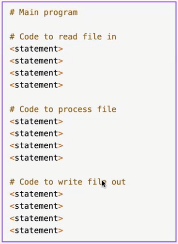

- 模块化之后，所有的功能只需要在写完一遍之后分别调用就好

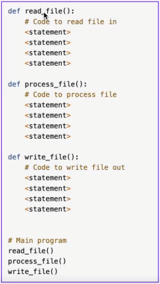

#### Function Calls and Definition

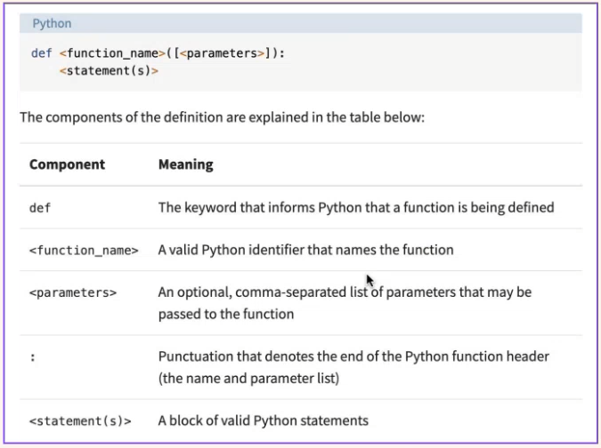

#### Positional Arguments

- 即 Arguments 是按顺序出现的

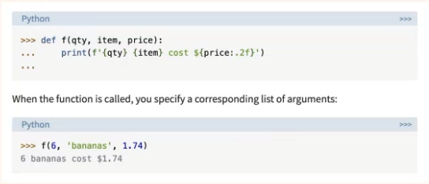

- input parameters: signature of the function(参数即签名)
- polymorphism(多态：只要符合位置要求，任何类型的参数均可填入)
- 但注意不能超过或少于参数数量范围

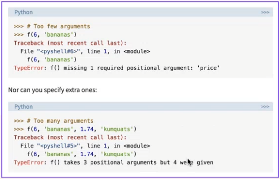

#### Keyword Arguments

- 正常情况下，每个 keyword 对应的参数会按顺序输出

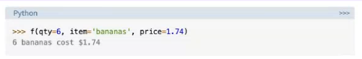

- 修改 keyword 关键词会导致报错

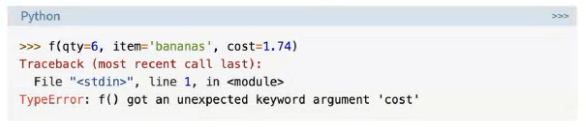

- 省去一两个 keyword 不会影响输出，系统会按照 Positional Arguments 的顺序继续执行
  
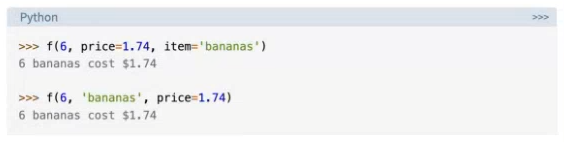

- 注意：当所有 arguments 中只有一个 keyword 时，只能出现在最右边，不然会报错

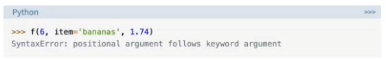

#### Default Parameters

- 当定义了默认值时，少输或者不输入内容时系统会自动用默认值补齐

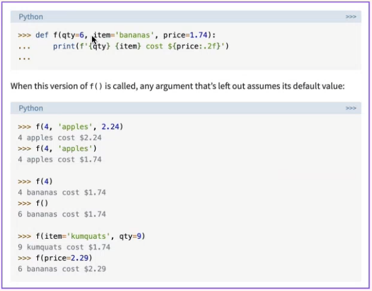

#### Argument Tuple Packing

- 当不确定 parameter 的个数时，可以采用 packing

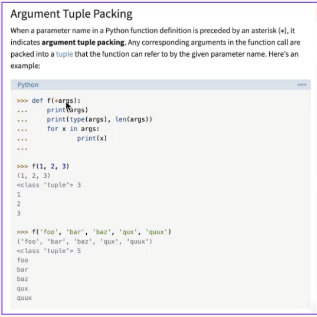

#### Argument Dictionary Packing

- 多个 value 变成一个 Dic

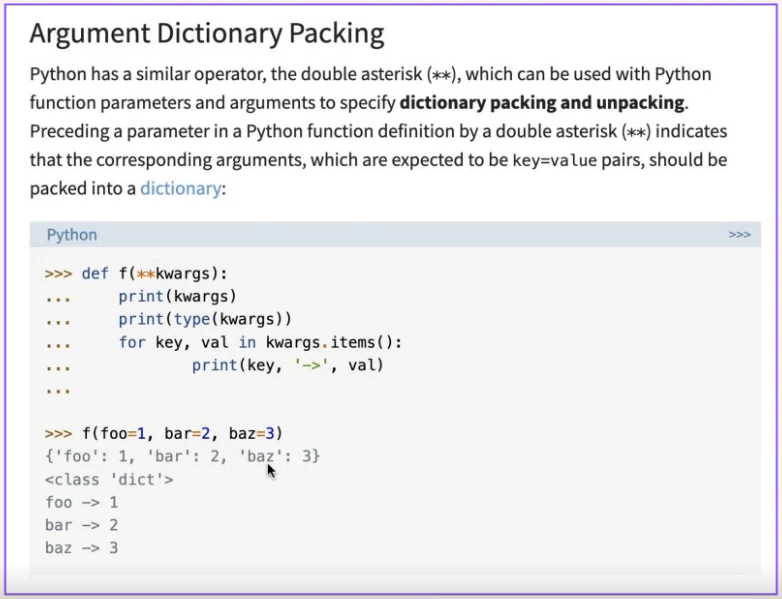

#### Putting It All Together

- 当所有类型的数据放在一起 packing 时，keyword 类型也要放在最右边 packing

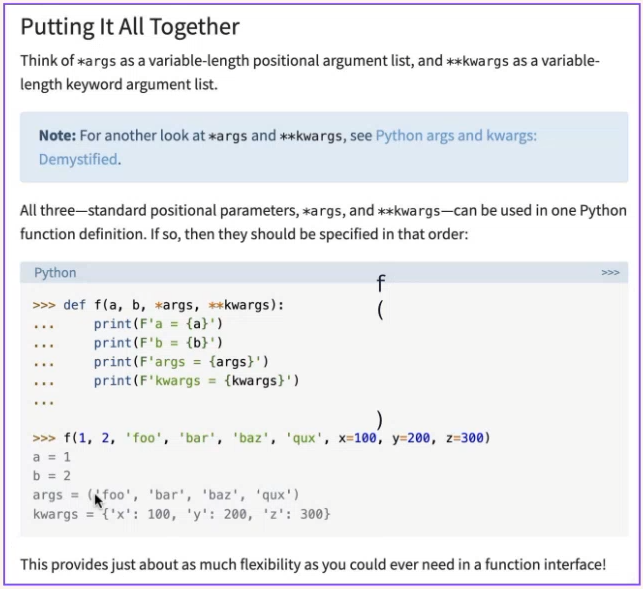

### lambda function

lambda function是有返回值的匿名函数, 并且只能执行返回值操作。

> 提升可读性, 对于一些只调用一次的函数, 没必要定义一个命名函数, 使用 lambda funciton 是较好的。

```python
# lambda input: expression

# 1. 求和
print((lambda x, y: x + y)(2, 3))  #5

# 2. array每个元素平方
arr = [1,2,3,4,5]
new_arr=list(map(lambda x:x**2, arr))
print(new_arr) # [1, 4, 9, 16, 25]

# 3. sort
a = [2, 3, 9, 7, 4]
a.sort(key=lambda x: x)
print(a) # [2, 3, 4, 7, 9]
a.sort(key=lambda x: -x)
print(a) # [9, 7, 4, 3, 2]
```

#### dis 库

```python
import dis

# 使用 dis 模块查看代码在底层是如何执行的
dis.dis(lambda x, y: x + y)
```

#### lambda 的优势和使用场景

- 简洁性&匿名性: 减少了不必要的命名和函数定义，使代码更加紧凑
- 匿名性: 避免命名冲突, 覆盖本地库
- 内联使用: Lambda 函数通常用于一些只在一个地方被调用一次的操作，避免了为简单操作创建单独的命名函数; 避免覆盖本地库

> lambda 不能直接使用->这种 annotation, 但可以使用 Callable 检查

```python
from typing import Callable

addition: Callable[[int], int] = lambda x: x + 1
result = addition([3]) # 会提示type error
print(result)
```

### Decorator

`Higher Order Function`

- 一定是嵌套函数(nested function)
- 在不修改原始代码的情况下, 对函数或类的功能进行增强或修改

```python
from typing import Callable, Tuple

addition: Callable[[int, int, int], int] = lambda x, y, z: x + y + z


def high_order(func, input: Tuple[int, int, int]) -> int:
    return func(*input)


print(high_order(addition, (1, 2, 3)))  # 6
```

```python
def my_decorator(func):
    def wrapper():
        print('before')
        func()
        print('after')
    return wrapper

@my_decorator
def say_hello():
    print('Hello')

say_hello() # before Hello after

def say_hi():
    print('Hi')
decorated_say_hi = my_decorator(say_hi)
print(decorated_say_hi)
```

#### Decorator 例子 1: 计算运行时间

```python
import time


def calculate_runtime(func):
    def wrapper(*args, **kwargs):
        start_time = time.time()
        result = func(*args, **kwargs)
        end_time = time.time()
        runtime = end_time - start_time
        print(f"Function {func.__name__} took {runtime:.6f} seconds to run.")
        return result

    return wrapper


@calculate_runtime
def slow_function(n):
    total = 0
    for i in range(n):
        total += i
        time.sleep(0.1)
    return total


print(slow_function(5))
```

##### 计算函数平均执行时间 - timeit 库

```python
import timeit


def example_code():
    total = 0
    for i in range(20):
        total += i
    return total


# 测量 example_code 的平均执行时间，执行 1000 次
execution_time = timeit.timeit(example_code, number=10)
print(f"Average execution time: {execution_time:.6f} seconds")
```

#### Decorator 例子 2: logging

```python
import logging


def log_function_calls(func):
    logging.basicConfig(level=logging.INFO)

    def wrapper(*args, **kwargs):
        logging.info(
            f"Calling {func.__name__} with args: {args}, kwargs: {kwargs}"
        )
        result = func(*args, **kwargs)
        logging.info(f"{func.__name__} returned: {result}")
        return result

    return wrapper


@log_function_calls
def add(a, b):
    return a + b


@log_function_calls
def multiply(x, y):
    return x * y


result1 = add(3, 5)
result2 = multiply(2, 4)
```

#### Decorator 的其他应用场景

装饰器在的其他应用场景:

- Authorization: You can use decorators to check if a user has the permission to execute specific requests.
- Caching/Memoization: Decorators can be used for caching the results of a function to improve speed. If a function is frequently called with the same parameters, decorators can store the previous results.
- Data Validation: Decorators can be used to automatically validate the input and output of a function, ensuring they meet certain requirements.
- Retry Mechanism: In network requests or other potentially failing operations, decorators can be used for automatic retries.
- Feature Toggling: Decorators can control the enabling or disabling of specific features, making feature toggling easier.
- Monitoring and Statistics: Decorators can be used to gather information about how a function is used and may send this information to external tools for monitoring or analysis.
- AOP (Aspect-Oriented Programming): Decorators allow you to separate cross-cutting concerns like logging and security from business logic, making the code cleaner and more maintainable.
- Response Handling: In web frameworks, decorators can be used for pre-processing or post-processing HTTP responses, such as adding headers or changing status codes.
- Routing: Many web frameworks use decorators to link functions with URL routes.
- Event Registration: Decorators can be used for registering event handlers in a system.

#### cProfile

> 提供了一个轻量级的性能分析器，可以用来测量函数调用的时间和调用次数，帮助您识别代码中的瓶颈和优化点。

```python
import cProfile


def fibonacci(n):
    if n <= 1:
        return n
    return fibonacci(n - 1) + fibonacci(n - 2)


if __name__ == "__main__":
    cProfile.run("fibonacci(30)")
```

### map/filter/reduce

#### map 返回一个迭代器 (对每个元素统一执行相同操作)

```python
print(list(map(lambda x: x * 2, [1, 2, 3, 4, 5]))) # [2, 4, 6, 8, 10]
```

#### filter 返回一个迭代器 (挑选满足条件的元素)

```python
print(list(filter(lambda x: x % 2 == 0, [1, 2, 3, 4, 5, 6]))) # [2, 4, 6]
```

#### reduce 返回一个值 (累加, 累乘)

```python
from functools import reduce
print(reduce(lambda x, y: x * y, [1,2,3])) # 6
```

**一般推荐使用 list comprehensive 或 generator expression 而避免使用 map/filter. reduce**

### List comprehension 实现 map/filter/reduce

#### 为什么推荐使用 List comprehension 而不是直接使用 map/filter/reduce?

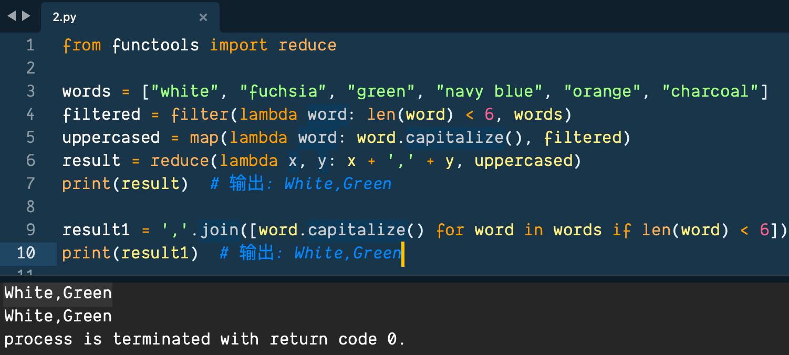

#### 使用 List comprehension 实现 map

```python
print([i * 2 for i in [1, 2, 3, 4, 5, 6]])  # [2, 4, 6, 8, 10, 12]
```

##### 两种错误写法

```python
print([i *= 2 for i in [1, 2, 3, 4, 5, 6]])
```

> 第一个写法的错误原因是 i\*=2 没有返回值

```python
print([i := i * 2 for i in [1, 2, 3, 4, 5, 6]])
```

> 第二种写法的错误原因是迭代变量 i 在 List comprehension 中是只读的, 不能重新绑定

#### 使用 List comprehension 实现 filter

```python
print([i for i in [1, 2, 3, 4, 5, 6] if i % 2 == 0]) # [2, 4, 6]
```

#### 使用 List comprehension 实现 reduce

```python
product = 1
print([product := product * num for num in [1, 2, 3]][-1]) # 6
```

使用了 python3.8 版本引入的 Assignment Expresions 实现了 reduce 操作. 累乘实际上直接用 reduce 实现起来更容易些, 但对于[简单的情况](#为什么推荐使用list-comprehension而不是直接使用mapfilterreduce), 可以用 List comprehension

#### List comprehension vs map/filter/reduce 总结

对于简单操作且数据量较少, 用写法简洁的list comprehension好; 数据集庞大且需要复杂处理时, 用map等内置方法能节约内存 (map方法return的是iterator不是iterable)

### Generator Expression 为什么比 List comprehension 更好?

#### Generator expression vs List comprehension 执行结果

```python
"""
    list()+generator和list_comprehension都能得到list
    但使用list()+generator的写法比用list_comprehension更省内存, 执行速度快一点
"""
from sys import getsizeof as getsize
import time

list_comprehension_a = [i * 2 for i in range(1000000)]
generator_expression_a = (i * 2 for i in range(1000000))
generator_expression_list_a = list(generator_expression_a)
print(
    f"value: {len(list_comprehension_a)} | 使用列表生成式的size: {getsize(list_comprehension_a)}"
)
print(
    f"value: {len(generator_expression_list_a)} | 使用生成式+list()的size: {getsize(generator_expression_list_a)}"
)


start_time = time.time()
print(sum(list_comprehension_a))
end_time = time.time()
print(f"使用列表生成式的sum执行时间: {end_time - start_time} 秒")

start_time = time.time()
print(sum(generator_expression_list_a))
end_time = time.time()
print(f"使用生成器表达式的sum执行时间: {end_time - start_time} 秒")

# 用生成式做需要iterable方法的参数, 可以省略(), 更简洁
print(sum([x for x in range(3)]))
print(sum(x for x in range(3)))
```

#### Generator expression vs List comprehension 总结

- 大多数情况下, 对于需要 iterable 做参数的内置方法, 可以优先使用 Generator Expression. 这样写法更简洁, 也能达到相同效果
- 即使需要输出一个 list, 也可以通过 list() + Generator Expression 轻松实现. 更重要是在数据量很大时, 使用 list() + Generator Expression [不仅节省内存而且可以提升效率](#generator-expression-vs-list-comprehension执行结果)
