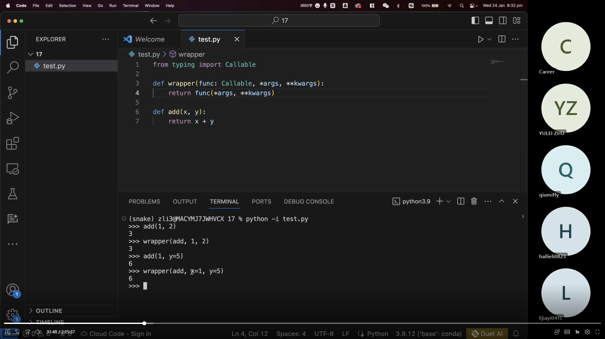
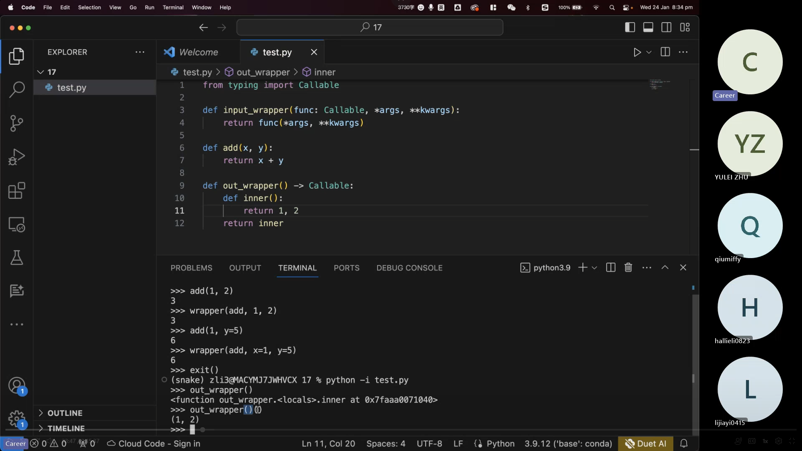
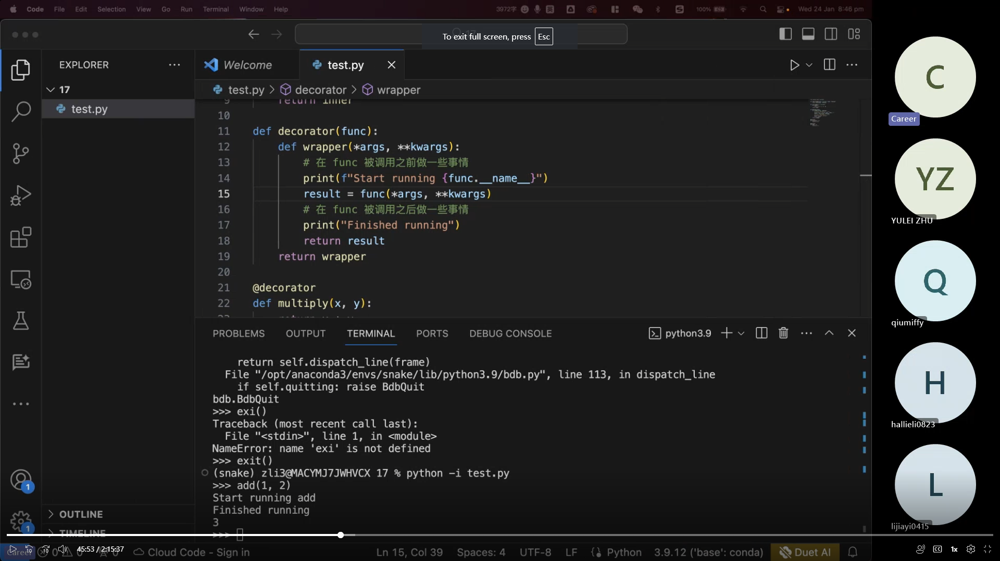
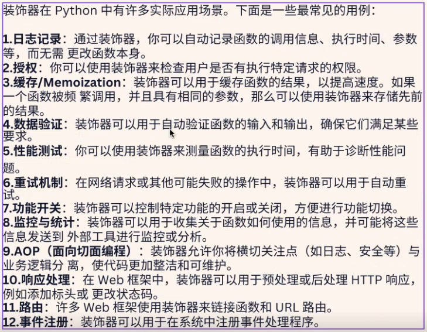
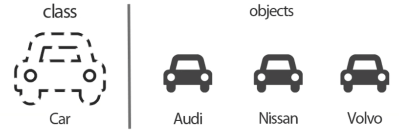
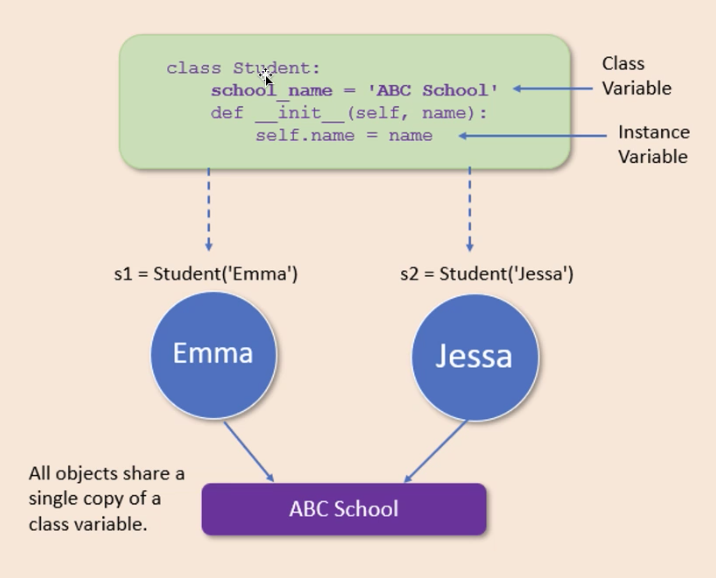
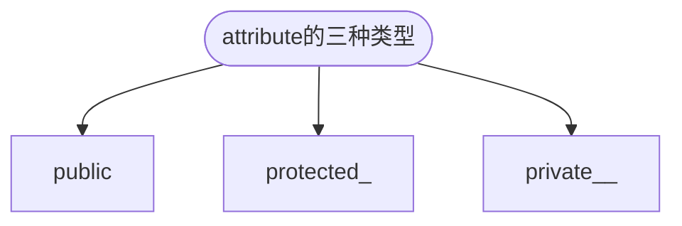
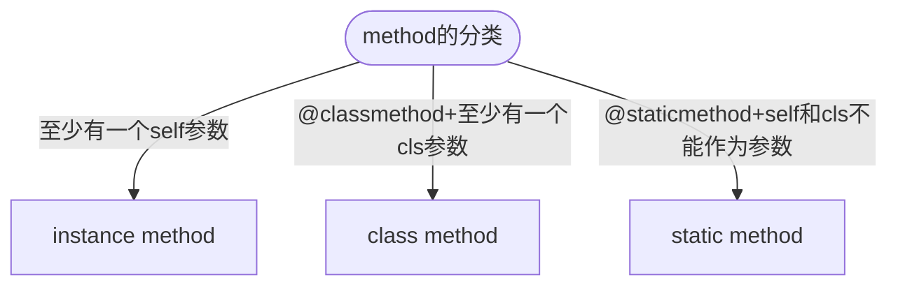
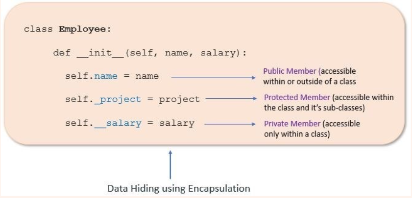

# Class Notes

## Table of Contents

- [Class Notes](#class-notes)
  - [Resources](#resources)
  - [Python_6](#python_6)
    - [Python 的装饰器](#python-的装饰器)
    - [Python OOP](#python-oop)
    - [为什么需要 class](#为什么需要-class)
      - [object 的 state 和 behavior](#object-的-state-和-behavior)
      - [class attribute vs object attribute](#class-attribute-vs-object-attribute)
      - [class attribute vs object attribute demo](#class-attribute-vs-object-attribute-demo)
    - [namespace 中的\_\_module\_\_](#namespace-中的__module__)
      - [obj.attribute_name 的查找流程](#objattribute_name-的查找流程)
      - [class 中使用 type annoation](#class-中使用-type-annoation)
    - [attribute 的三种属性](#attribute-的三种属性)
    - [method 的分类](#method-的分类)
    - [封装（Encapsulation）](#封装-encapsulation)
    - [python 多态](#python-多态)
    - [python 继承](#python-继承)
    - [在一个 class 的方法前面添加"\_"或者"\_\_"](#在一个-class-的方法前面添加_或者__)

## Resources

[Python OOP](https://www.w3schools.com/python/python_classes.asp)

## Python_6

### Python 的装饰器

- 概念：允许你再不修改原有函数代码的情况下，增加额外的功能
- 装饰器(Decorator)本质上是一个函数，可以接受一个函数作为参数，并返回一个新的函数
- input wrapper 示例



- output wrapper 示例(此时注意需要 call 两次才能生效)



- @decorator 的一些用法



- decoratorde 可能的实际应用场景



### Python OOP

blue print: 蓝图, 图纸 -> reusable



### 为什么需要 class

> 当很多 objects 具有相同属性和行为时, 我们没必要一个一个 object 定义; 用同一个 class 实例化对象可以减少代码。

#### object 的 state 和 behavior

- state(属性): brand, body type, fuel type, model car, fuel level
- behavior(函数): 启动, 刹车, 踩油门, 开雨刷, 开大灯, 加 fuel

#### class attribute vs object attribute



#### class attribute vs object attribute demo

```python
class Student:
    school_name = 'JR'
    def __init__(self, name):
        self.name = name # self.name是object的属性, name是形参

s1 = Student("Emma")
s2 = Student("Jessa")

# s1修改school_name不会影响其他objs的school_name
s1.school_name = "JR_1"
print(s1.school_name) # JR_1
print(s2.school_name) # JR

# 用类名直接修改school_name, 所有objs的school_name都会改变
Student.school_name = "JR_2"
print(s1.school_name) # JR_1
print(s2.school_name) # JR_2
```

### namespace 中的**module**

- '**module**': '**main**': class 在主程序中定义
- '**module**': 'teacher': class 在 teacher.py 中定义

#### obj.attribute_name 的查找流程

先找 object 的 namespace 再找 class 的 namespace。

#### class 中使用 type annoation

```python
class Student:
    school_name = "JR"

    def __init__(self, name: str):
        self.name = name  # self.name是object的属性, name是形参

s3 = Student(1)
print(s3.name) # 1
```

> type annotation 不会对运行程序造成影响, 只起到提示作用。

### attribute 的三种属性



```python
class Employee:
    # public
    company = "JR"
    # protected
    _address = "QLD"
    # private
    __abn = "24242342"

    @property
    def abn(self):
        return self.__abn


e = Employee()  # 没有构造函数, 没有参数
print(e.__dict__)  # {}
print(e.company)  # JR
print(e._address)  # QLD
print(e._Employee__abn)  # 24242342 不推荐这种方法
print(e.abn)  # 24242342
```

### method 的分类



#### 封装（Encapsulation）

- 封装是将对象的数据（属性）和行为（方法）捆绑在一起的过程
- 封装还包括了信息隐藏的概念，即从外部代码隐藏内部数据和实现细节
- 这通常是通过访问（如 public、private、protected）来实现的
- 实例：



- 不带下划线的调用称为 public member，可在 class 内外调用
- 带一个下划线叫做 protected member，只能在 class 内及自己的 sub-class 调用
- 带两个下划线叫做 private member，只能在 class 内的 sub-class 调用


Methods
  | 实例方法（Instance Method）| 类方法（Class Method）| 静态方法（Static Method）
  | :---: | :---: | :---:
  | 绑定到类的具体实例（对象）上 | 绑定到类本身上，而不是类的实例 | 绑定到类上，但它们与类没有直接的交互
  | 可以读取或者修改对象的状态 | 可以修改类变量，但不能直接修改实例变量 | 既不能访问实例变量，也不能访问类变量
  | 可以访问类中定义的实例变量和类变量 | 只能访问类变量，不能访问与类的某个具体实例相关的实例变量 | 不能访问类的实例变量和类变量

### 多态（Polymorphism）

- 多态市值允许使用不同类型的对象以相同的方式进行操作
- 通常是通过重写（overriding，用于继承中）
- 重载（overloading，用于方法中参数数量或类型不同）

```python
class Animal:
    def speak(self):
        pass


class Dog(Animal):
    def speak(self):
        print("Woof!")


class Cat(Animal):
    def speak(self):
        print("Meow!")


def animal_sound(animal):
    animal.speak()


dog = Dog()
cat = Cat()

animal_sound(dog) # Woof!
animal_sound(cat) # Meow!
```

### 继承（Inheritance）

- 继承是一种基于现有类创建新类的机制
- 新创建的类成为“子类”（或派生类），现有类称为“父类”（或基类）
- 子类继承父类的属性和方法，可以添加新的属性和方法或者重写现有的方法

```python
from abc import ABC, abstractmethod


class Human(ABC):
    @abstractmethod
    def eat(self):
        pass


class Employee(Human):
    def __init__(self, name, fav_food):
        self.name = name
        self.fav_food = fav_food

    def eat(self, any_food=None):
        print(f"Eat {any_food}") if any_food else print(f"Eat {self.fav_food}")


class Engineer(Employee):
    def __init__(self, name, fav_food, tech_stack):
        super().__init__(name, fav_food) # 相当于继承了Employee的__init__方法
        self.tech_stack = tech_stack

    def code(self):
        print(f"Coding with stack of {self.tech_stack}")


class FrontEndEngineer(Engineer):
    def design_front(self):
        print("Designing user interface")


class BackEndEngineer(Engineer):
    def build_api(self):
        print("Designing api")


class FullStackEngineer(FrontEndEngineer, BackEndEngineer):
    def testing(self):
        print("Testing api")

    def build_api(self):
        print("Building api 1.1")

    def build_old_api(self):
        BackEndEngineer.build_api(self)


a = Employee("tim", "pizza")
a.eat("apple")  # 输出: Eat apple
a.eat()  # Eat pizza

Jack = FullStackEngineer("amy", "apple", "nextjs")
Jack.build_old_api() # # "Designing api"
```

### 在一个 class 的方法前面添加"\_"或者"\_\_"

> 一般使用\_起到对方法的保护, \_\_很少用

```python
class Parent:
    name = "xxxx"  # Parent class attribute

    def c(self):
        print("This is parent's public instance method.")

    @classmethod
    def __b(cls):
        print(f"{cls.name}This is Parent's private class method.")

    @classmethod
    def _b(cls):
        print(f"{cls.name}This is Parent's protected class method.")

    @staticmethod
    def __a():
        print("This is Parent's private static method.")

    @staticmethod
    def _a():
        print("This is Parent's protected static method.")


class Child(Parent):
    def c(self):
        print("This is Child's public instance method.")

    @classmethod
    def __b(cls):
        print(f"{cls.name}This is Child's private class method.")

    @classmethod
    def _b(cls):
        print(f"{cls.name}This is Child's protected class method.")

    @staticmethod
    def __a():
        print("This is Child's private static method.")

    @staticmethod
    def _a():
        print("This is Child's protected static method.")


"""
instance method private vs protected
"""
print("================================================")
print("Testing instance method")
parent_obj = Parent()
child_obj = Child()
print(child_obj.name)
child_obj.c()
super(Child, child_obj).c()
print("================================================")
print("\n")
"""
classmethod private vs protected
"""
print("================================================")
print("Testing classmethod private vs protected")
# Parent.__b()
# Child.__b()
Child._Child__b()  # type: ignore
Parent._Parent__b()  # type: ignore

Parent._b()
Child._b()
# Parent._Parent_b()
# Child._Child_b()
print("================================================")
print("\n")

"""
staticmethod private vs protected
"""
print("================================================")
print("Testing staticmethod private vs protected")
# Parent.__a()
# Child.__a()
Parent._Parent__a()  # type: ignore
Child._Child__a()  # type: ignore

Parent._a()
Child._a()
# Parent._Parent_a()
# Child._Child_a()
```
